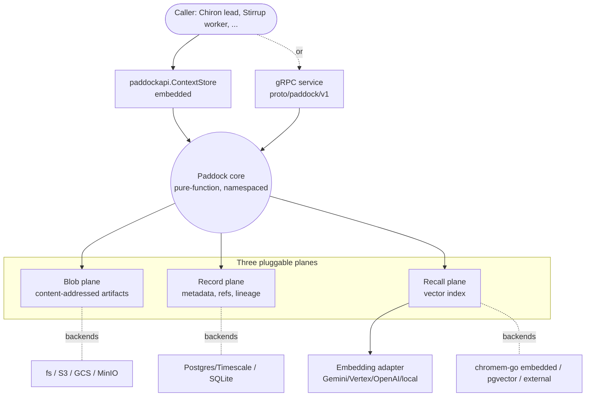
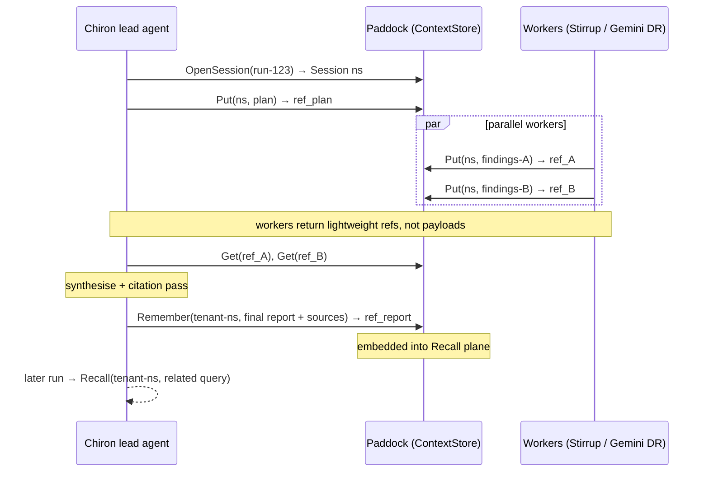

# Paddock — Project Proposal

## 1. What Paddock is

Paddock is the suite's **context and memory store**. Today the Equestrianism tools have
nowhere shared to keep working state or durable knowledge; Chiron's v2 orchestrator and
its Stirrup workers need exactly that. Rather than grow a store inside Chiron, Paddock
provides it as a standalone Go project — first to fulfil **Chiron's `ContextStore`
seam**, and beyond that as a primitive the whole suite can compose (Stirrup
offload-to-file targets, Stint cost-tagged artifacts, future tools).

It serves the two memory horizons Chiron specified:

- **Short-term (within-session) memory** — scoped to a single research run: the lead
  agent's plan, intermediate worker findings stored *by reference*, and a scratch
  namespace. Turned out to pasture and garbage-collected when the session ends, unless
  promoted.
- **Long-term (cross-session) memory** — durable, retrievable knowledge: prior reports,
  their sources and provenance, and embeddings for semantic recall.

One principle bounds the scope, mirroring Chiron's "research only":

> **Paddock stores; it does not reason.** It provides primitives — put, get, remember,
> recall — over content-addressed artifacts. *What* to remember, *when* to forget, and
> *how* to summarise are memory **policy**, and policy stays with the caller (Chiron's
> lead agent decides what to `Remember`). This keeps Paddock a substrate, not an agent.

This is also why Paddock is not a re-implementation of an agentic-memory product. The
frameworks you assessed (Mem0, Zep, Letta, Cognee) are prior art for the memory *model*
and candidate long-term-recall adapters — not the core. A SaaS-first dependency would
break the suite's air-gapped and minimal-dependency posture.

## 2. Design philosophy (suite-consistent)

The same small set of tenets Stirrup and Chiron share:

| Tenet | What it means for Paddock |
| --- | --- |
| **Pure-function core, pluggable backends.** | One core, injected backends from a single declarative `PaddockConfig`. The embedded single-binary mode and the multi-tenant service share the same core; only the bound backends differ. |
| **Minimal, auditable dependency surface.** | Backend clients (object store, embeddings) are hand-rolled HTTP against documented REST APIs where practical, matching Stirrup's adapters. |
| **Short-lived callers, durable store.** | Callers are stateless short-lived jobs; durability and continuity live here. Paddock is the suite's stateful tier so the tools needn't be. |
| **Content-addressed, immutable artifacts.** | Findings are written once, addressed by content hash. This gives the findings-by-reference handle for free, plus integrity and provenance (aligned with your SLSA/attestation interests). |
| **Multi-tenancy is first-class.** | Every operation is namespaced by tenant; isolation is enforced in the core, not bolted on — so Paddock can back multi-tenant SaaS as readily as a single CLI. |
| **Secrets never live in config; logs are scrubbed.** | `secret://` references and a credential-pattern scrubber, as elsewhere in the suite. |
| **OTel-native observability.** | Spans and metrics to the suite's Langfuse/Grafana backend. |

## 3. Architecture — three planes

Paddock decomposes storage into three independently swappable planes behind one
interface. A consumer never names a backend; it names a `PaddockConfig`.



| Plane | Holds | Embedded backend (CLI / air-gapped) | Service backend (SaaS / single-tenant) |
| --- | --- | --- | --- |
| **Blob** | Large artifacts: full findings, reports, chart images, raw tool outputs. Content-addressed, immutable. | filesystem | S3 / GCS / MinIO (S3-compatible) |
| **Record** | Structured metadata: sessions, artifacts, references, tags, lineage/provenance, TTLs. | SQLite | Postgres / TimescaleDB (already in the suite) |
| **Recall** | Vector index over long-term memory for semantic retrieval. | `chromem-go` (pure-Go, embeddable) | pgvector (when Postgres is present) or an external vector DB via adapter |

Long-term recall needs embeddings: a small set of hand-rolled embedding adapters
(Gemini / Vertex, OpenAI), plus a **local** option served on the suite's existing
vLLM/Granite infrastructure for air-gapped deployments.

## 4. The contract — `ContextStore`

The canonical interface lives in `paddockapi` and is the **interlock with Chiron**:
Chiron's `internal/memory` seam binds to this exact type. The whole surface is small.

```go
// paddockapi.ContextStore — the seam Chiron defines and Paddock fulfils.
type ContextStore interface {
    // Short-term: open a session-scoped, TTL'd namespace for one research run.
    OpenSession(ctx context.Context, ref SessionRef) (Session, error)

    // Artifacts: content-addressed write returns a lightweight, serialisable Reference;
    // read fetches by that Reference. This is the findings-by-reference handle.
    Put(ctx context.Context, ns Namespace, body io.Reader, meta ArtifactMeta) (Reference, error)
    Get(ctx context.Context, ref Reference) (io.ReadCloser, ArtifactMeta, error)

    // Long-term: store durable memory (embedded on write) and recall it semantically.
    Remember(ctx context.Context, ns Namespace, m Memory) (Reference, error)
    Recall(ctx context.Context, ns Namespace, q Query) ([]Recalled, error)
}
```

- `Reference` is a hash + namespace + locator: small enough to pass between agents
  instead of full payloads.
- `Session` is a scoped `Namespace` with a TTL; closing it triggers GC (or promotion of
  selected artifacts to long-term).
- `Namespace` carries the tenant, enforcing isolation on every call.

How the planes serve the contract: `Put`/`Get` use Blob + Record; `OpenSession` uses
Record (+ TTL/GC); `Remember` writes Blob + Record + Recall (embed); `Recall` queries
Recall then hydrates from Blob.

## 5. How Paddock fulfils Chiron's seam



- **v1.** Chiron uses a **no-op** `ContextStore`; Paddock is not required. A single Gemini
  task holds its own context server-side.
- **v2.** Chiron binds `paddockapi.ContextStore` to a Paddock instance (embedded for a
  single-tenant deployment, or the gRPC service for SaaS). The lead persists its plan,
  workers write findings by reference, and the final report is remembered for cross-run
  recall.

Beyond Chiron, the same contract lets Stirrup's `offload-to-file` context strategy target
Paddock's blob plane, and lets Stint tag artifacts with cost metadata via `ArtifactMeta`.

## 6. Deployment shapes

Paddock matches the suite's deployment posture, from one binary to
multi-tenant SaaS, including air-gapped.

| Shape | Transport | Blob | Record | Recall | Embeddings |
| --- | --- | --- | --- | --- | --- |
| **Embedded** (in `chiron` CLI / dev) | in-process Go | filesystem | SQLite | chromem-go | local or remote |
| **Single-tenant service** | gRPC | MinIO / cloud bucket | Postgres | pgvector | provider or local |
| **Multi-tenant SaaS** | gRPC | cloud bucket per-tenant prefix | Postgres (tenant-scoped) | pgvector / external | provider |
| **Air-gapped** | gRPC | MinIO | Postgres | chromem-go / pgvector | local (vLLM/Granite) |

## 7. Repository layout

Go, mirroring Stirrup/Chiron conventions:

```
paddock/
  go.mod                         # module github.com/rxbynerd/paddock
  cmd/paddock/main.go            # service entrypoint (cobra)
  paddockapi/                    # public Go surface — the canonical ContextStore contract
  internal/
    config/                      # PaddockConfig (declarative; pluggable backends)
    service/                     # gRPC service (control-plane facing)
    session/                     # short-term session memory + TTL/GC
    blob/                        # blob plane: fs, s3/gcs/minio (content-addressed)
    record/                      # record plane: postgres/timescale, sqlite
    recall/                      # recall plane: chromem-go, pgvector, external adapters
    embed/                       # embedding adapters (hand-rolled HTTP; Gemini/Vertex/OpenAI/local)
    tenant/                      # namespace + tenant isolation
    trace/  secret/              # OTel + secret hygiene (shared patterns)
    types/                       # Reference, ArtifactMeta, Memory, Query, Recalled, Session
  proto/paddock/v1/              # gRPC contract (Buf), mirrors harness.proto conventions
  examples/  Justfile  Dockerfile  README.md  AGENTS.md  CLAUDE.md  SECURITY.md
```

## 8. Decisions to confirm

1. **Build vs adopt for long-term recall.** Recommendation: build the thin Go substrate
   with pluggable backends; treat Mem0/Zep/Letta/Cognee as candidate Recall-plane
   adapters or model prior-art, not the core (air-gapped + minimal-deps + suite-ownership
   argue against a SaaS dependency). Confirm.
2. **Embedding strategy for air-gapped.** Which local embedding model on the
   vLLM/Granite infra, and is a single embedding space acceptable across tenants
   (vs. per-tenant)?
3. **Durable log.** Whether to put NATS JetStream in front of
   the record plane as a write-ahead/event-sourcing layer, or keep writes synchronous to
   Postgres for v1.
4. **Contract ownership.** Confirm `paddockapi.ContextStore` is the canonical type and
   that Chiron imports it directly (vs. Chiron declaring a structurally-identical local
   interface). Direct import couples versioning; a local interface keeps Chiron
   buildable without Paddock. Recommendation: Chiron declares its own minimal interface
   and Paddock satisfies it structurally, so neither project hard-depends on the other.
5. **Forgetting / retention.** Default TTLs and GC policy for short-term sessions, and
   whether long-term memory supports redaction/deletion (relevant for multi-tenant SaaS
   and data-protection).

## 9. Milestones for Claude Code

| # | Milestone | Deliverable |
| --- | --- | --- |
| M0 | Scaffold | Go module, cobra service skeleton, `Justfile`, CI, `AGENTS.md`/`CLAUDE.md`, `paddockapi.ContextStore` + core types. |
| M1 | Blob + Record (embedded) | Content-addressed `Put`/`Get` over filesystem + SQLite; namespaces; `ArtifactMeta`. |
| M2 | Sessions | `OpenSession` with TTL + GC; promotion to long-term. |
| M3 | Recall (embedded) | `Remember`/`Recall` with chromem-go + one embedding adapter. |
| M4 | gRPC service | `proto/paddock/v1`, the service wrapping the core, tenant isolation, secret + OTel wiring. |
| M5 | Service backends | S3/GCS/MinIO blob, Postgres record, pgvector recall; deployment-shape configs. |
| M6 | Chiron interlock | Wire Paddock behind Chiron's `ContextStore` seam (embedded first), validate the lead/worker findings-by-reference flow end-to-end. |

## 10. References

- Anthropic. *How we built our multi-agent research system* (2025-06-13) — the
  findings-by-reference / external-memory and plan-persistence patterns Paddock
  supports. https://www.anthropic.com/engineering/multi-agent-research-system
- rxbynerd. *Stirrup* — `docs/philosophy.md`, `docs/architecture.md` (context strategies
  incl. offload-to-file; the suite ethos Paddock inherits). https://github.com/rxbynerd/stirrup
- Companion: *Chiron — Project Proposal* (`chiron-proposal.md`), §5 (the `ContextStore`
  seam Paddock fulfils).
