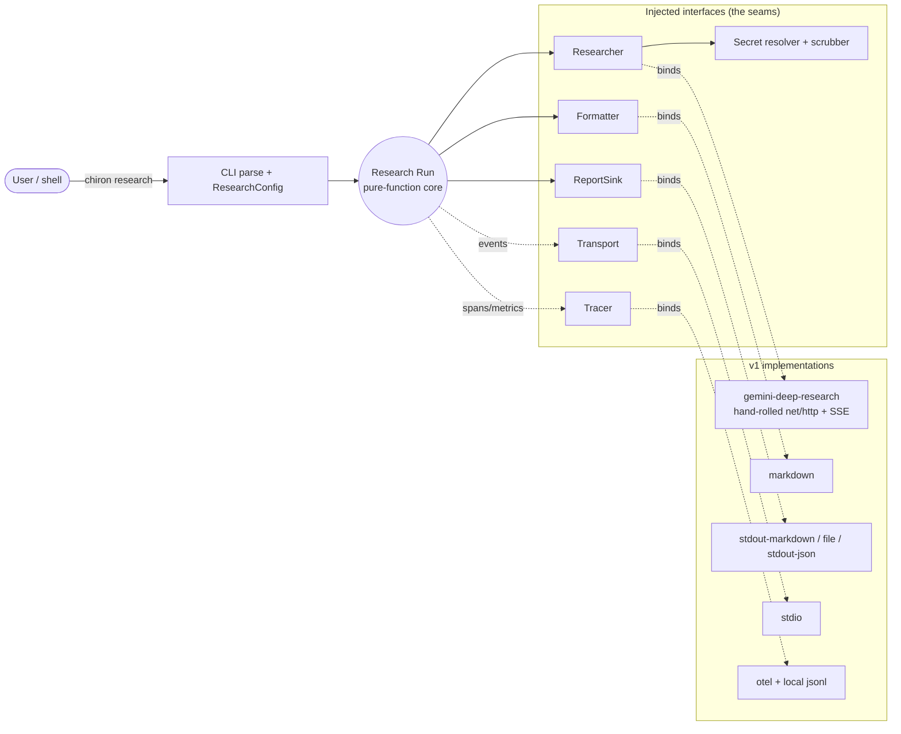
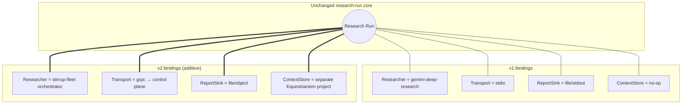
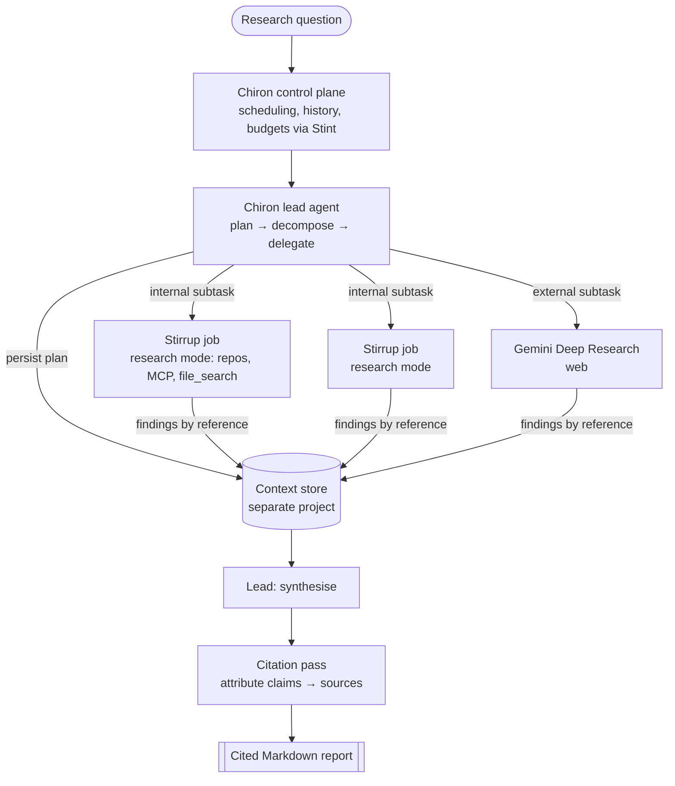

# Chiron — Project Proposal

## 1. What Chiron is

Chiron is the **researcher** of the Equestrianism suite — the wise centaur to Stirrup's
tack. Where Stirrup *changes* code under a harness, Chiron *investigates* topics and
returns a cited, structured Markdown report. Like the rest of the suite, it is written
in **Go**. It ships in two phases:

- **v1 — `chiron` CLI.** A self-contained Go binary that starts a Google Gemini Deep
  Research agent, waits for the long-running task to complete (background polling or
  streaming), retrieves the result, and formats it as Markdown. No Stirrup dependency.
- **v2 — Chiron service (GKE).** A multi-agent research service. A Chiron *lead agent*
  plans and decomposes a question, then delegates to **Stirrup** worker jobs (internal
  sources, repos, MCP) and Gemini Deep Research tasks (external web) running in
  parallel, synthesises the findings, and runs a citation pass. Modelled on Anthropic's
  orchestrator-worker Research architecture.

Two principles bound the whole design:

- **Research only.** Chiron is read-only by nature. It never mutates a workspace, runs
  no shell, applies no edits. Its only capabilities are *research* tools (web search,
  URL reading, code execution for analysis, read-only MCP, corpus search). This is why
  it inherits none of Stirrup's executor / permission / edit / safety-ring machinery —
  those subsystems guard write access Chiron does not have.
- **The v1 core loop and the v2 core loop are the same loop.** Only the injected
  components differ. We achieve that by inheriting a deliberately small subset of
  Stirrup's design ethos.

## 2. Design philosophy (a light subset of Stirrup's)

Stirrup is a Go harness whose tenets are sound and suite-native. Chiron adopts the few
that fit a research-only tool and deliberately leaves the rest to Stirrup. In
particular, **Chiron ships no eval framework, no safety rings, no executors, and no
permission engine** — evaluation rides on Stirrup's own eval system, and the other
subsystems govern write access Chiron does not exercise.

| Adopted tenet | What it means for Chiron |
| --- | --- |
| **Pure-function core.** The loop depends only on interfaces; every concrete type is injected from one declarative config. | Chiron's research run depends only on interfaces (`Researcher`, `Formatter`, `ReportSink`, `Transport`, `Tracer`, `Secret`). All are injected from a single declarative `ResearchConfig`. Swapping the Gemini researcher for the v2 Stirrup-fleet orchestrator does **not** touch the loop. |
| **Use the LLM only when judgement is needed.** The loop is a deterministic state machine with model calls at decision points. | Chiron's loop (start → await → retrieve → format → emit) is deterministic Go. The only model work is *inside* the `Researcher` (the Gemini agent in v1; the orchestrator's planning/synthesis in v2). |
| **Short-lived, stateless job.** No persistent state across tasks. | A `chiron research` invocation is one task that runs to completion and exits, holding no state of its own. v2's control plane owns scheduling and continuity; session and cross-session memory live in a separate project (§5). |
| **Minimal, auditable dependency surface.** Adapters are hand-rolled HTTP against documented REST APIs — no vendor SDKs. | There is no first-party Go path for the Deep Research agent, which suits us: the `gemini-deep-research` adapter is a few-hundred-line hand-rolled `net/http`+SSE client over the Interactions REST API, matching Stirrup's `gemini` adapter. Every line is auditable. |
| **Secrets never live in config.** Keys are `secret://` references; logs are scrubbed before any handler sees them. | `ResearchConfig` carries `api_key_ref: secret://GEMINI_API_KEY`, never a literal. A credential-pattern scrubber wraps the logger (and the trace payload) so key leakage is structurally impossible. |
| **Cost is a suite concern.** Track tokens for budgets; hold no pricing tables. | Chiron records per-run cost signals (search count, token usage, agent tier) and enforces a budget cap, deferring pricing and attribution to **Stint**. A single Deep Research task costs roughly **£0.80–£5.50**, so the cheap CLI path and explicit cost levers matter. |

## 3. The Gemini Deep Research agent (v1 dependency)

Verified against the Gemini API docs (last updated 2026-04-28). Key facts that shape the
design:

- **Interactions API only.** The agent is reached via `POST /v1beta/interactions` and
  `GET /v1beta/interactions/{id}` on `generativelanguage.googleapis.com`. It is **not**
  available through `generateContent`. Auth is the `x-goog-api-key` header. Status:
  public **beta/preview** — schemas may change, so it sits behind an adapter with a
  `last_verified` marker (Stirrup's provider-quirks pattern).
- **Long-running and asynchronous.** Tasks take minutes (max 60, most under 20). You
  **must** set `background=true` (which requires `store=true`), then poll `status`
  (`in_progress` → `completed` | `failed`) or stream.
- **Two tiers.** `deep-research-preview-04-2026` (faster) and
  `deep-research-max-preview-04-2026` (more comprehensive, ~2× the cost).
- **`agent_config`.** `type: "deep-research"`, plus `thinking_summaries`
  (`auto`/`none`), `visualization` (`auto`/`off`), and `collaborative_planning`
  (`true`/`false`).
- **Result shape.** `result.outputs` is an array; the final report is the last `text`
  output. `image` outputs (base64) carry agent-generated charts. The response includes
  **citations** to verify sources.
- **Collaborative planning.** A three-step flow (request plan → refine via
  `previous_interaction_id` → approve with `collaborative_planning:false`) lets us
  review the plan *before* spending money.
- **Streaming + resumability.** With `stream=true`, events are `interaction.start`,
  `content.delta` (`thought_summary` | `text` | `image`), `interaction.complete`,
  `error`. Connections can drop; reconnect with the saved `last_event_id`. Because
  `store=true`, a crashed CLI can re-attach to an interaction by `id` — no local store
  required.
- **Tools.** Defaults are `google_search`, `url_context`, `code_execution`. Also
  `mcp_server` (remote MCP) and `file_search` (your own corpora). Custom function tools
  are **not** supported; structured output is **not** supported.
- **Steerability.** Output format is steered by the prompt (sections, tables, tone), so
  Chiron's prompt template is a first-class, swappable input.

## 4. v1 architecture — the `chiron` CLI

### 4.1 Component model and seams



The interfaces (the seams that v2 will reuse):

| Interface | Responsibility | v1 implementations | v2 additions |
| --- | --- | --- | --- |
| `Researcher` | Run a research task → `Interaction`. The **only** model-bearing component. | `gemini-deep-research` | `stirrup-fleet` (lead-agent orchestrator) |
| `Formatter` | `Interaction` → Markdown report (body, citations, embedded charts, front matter). | `markdown` | `markdown` (citation-pass aware) |
| `ReportSink` | Where the **final report** goes. | `stdout-markdown`, `file`, `stdout-json` | (unchanged shape) |
| `Transport` | Carry run events. | `stdio` (NDJSON) | + `grpc` (outbound bidi to control plane) |
| `Tracer` | Spans + metrics. | `otel` (Langfuse/Grafana), `jsonl` for local debug | (unchanged) |
| `Secret` | Resolve `secret://` refs; scrub logs. | `env`, `file` | + GCP Secret Manager / Workload Identity |

`Transport`, `ReportSink` and `Researcher` are the three seams that carry the entire
CLI→service evolution. They exist in v1 even though v1 only needs `stdio` and a single
researcher. A fourth seam — **agentic memory** — is defined but intentionally
out of scope (§5).

### 4.2 The research lifecycle

```mermaid
sequenceDiagram
  participant U as User
  participant C as chiron (Run)
  participant G as Gemini Interactions API
  participant K as ReportSink

  U->>C: chiron research --query "..." [--plan] [--out report.md]
  Note over C: Resolve ResearchConfig + secret:// key

  opt Collaborative planning (--plan)
    C->>G: create(collaborative_planning=true, background=true)
    G-->>C: plan (poll until completed)
    C-->>U: show plan; refine via previous_interaction_id
    U->>C: approve
  end

  C->>G: create(agent, agent_config, tools, background=true, store=true)
  G-->>C: interaction.id (in_progress)
  C-->>U: emit interaction.id (resume handle)

  loop until completed/failed
    alt --stream
      G-->>C: content.delta (thought_summary | text | image)
      Note over C: render progress; track last_event_id; reconnect on drop
    else poll
      C->>G: get(interaction.id)
      G-->>C: status
    end
  end

  C->>G: get(interaction.id) final
  G-->>C: outputs[] (text report, image charts, citations)
  Note over C: Formatter → Markdown (front matter + body + charts + sources)
  C->>K: write report
  C-->>U: report.md + cost summary
```

Resume is stateless: the interaction id is emitted at start and held server-side by
Gemini (`store=true`), so a crashed run is recovered with `chiron get <id>` — Chiron
keeps no local state.

### 4.3 CLI surface

`chiron research` is the primary verb. There is no `planning`/`execution` mode split
(Chiron is read-only); the prominent levers are about **cost**.

| Command | Purpose |
| --- | --- |
| `chiron research --query "..."` | Start, await, format, emit. The main path. |
| `chiron research-config [flags]` | Emit the resolved `ResearchConfig` JSON without running. Composable in a pipeline (mirrors `stirrup run-config`). |
| `chiron get <interaction-id>` | Re-fetch and format a completed/in-progress interaction (resume after a crash). |
| `chiron follow-up <interaction-id> --query "..."` | Ask a follow-up against a completed interaction via `previous_interaction_id`. |

Key flags on `research`:

| Flag | Default | Notes |
| --- | --- | --- |
| `--query` / positional | — | The research question. |
| `--agent` | `deep-research` | or `deep-research-max`. |
| `--plan` | off | Collaborative planning: review/refine before spending. |
| `--visualise` | off | `visualization: auto` + prompt nudge for charts. |
| `--stream` / `--quiet` | `--stream` | Stream thought summaries vs poll silently. |
| `--tools` | API defaults | e.g. `google_search,url_context,code_execution`. |
| `--mcp name=url` | — | Repeatable; attach a remote MCP server. |
| `--file-search <store>` | — | Search an internal corpus (an early internal-research seam). |
| `--input <path-or-url>` | — | Repeatable; multimodal document/image grounding. |
| `--template <path>` | built-in | Output-format prompt template (sections/tone/tables). |
| `-o, --output` | `text` | `text` \| `json` \| `none` (mirrors Stirrup's output surface). |
| `--out <path>` | stdout | Write Markdown to a file (`file` sink). |
| `--config <path>` | — | Base `ResearchConfig`; reads stdin for pipeline composition. |
| `--api-key-ref` | `secret://GEMINI_API_KEY` | Never a literal key. |
| `--budget <gbp>` | unset | Warn/abort if estimated cost exceeds the cap. |
| `--timeout <dur>` | `30m` | Wall-clock; hard cap 60m (the agent's own limit). |

Pipeline composition, exactly like Stirrup:

```sh
chiron research-config --agent deep-research-max \
  | chiron research-config --visualise \
  | chiron research --query "Competitive landscape of 10BASE-T1L PHY vendors" --out report.md
```

`--output json` plus the side-effect-free core means Stirrup's eval system can drive and
judge Chiron directly — Chiron itself ships no eval tooling.

### 4.4 Markdown output

The `markdown` Formatter produces a single portable document:

1. **YAML front matter** — query, agent tier, interaction id, started/completed
   timestamps, estimated cost, tool set, and a deduplicated **sources** list from the
   response citations.
2. **Body** — `outputs[-1].text` (the agent already returns structured Markdown,
   steered by the prompt template).
3. **Charts** — each `image` output is written next to the report and referenced as a
   relative Markdown image link.
4. **Sources** — a numbered citations section at the foot for verification.

### 4.5 Observability & secrets

- **Tracing.** A root `research` span with child spans for `plan`, `start`, `await`
  (per poll / per reconnect), `format`, `emit`, emitted via OpenTelemetry to the suite's
  Langfuse/Grafana backend, with newline-delimited JSON to a file for local debugging.
  Metrics: task duration, poll count, search count, input/output tokens, estimated cost,
  reconnect count, failures.
- **Secrets.** `secret://` resolution (`env`, `file`) and a logger that runs every
  record through a credential-pattern scrubber before any handler — including the trace
  payload — so a key cannot leak via logs.

## 5. Out of scope — agentic memory (a seam to a separate project)

Chiron is research-only and the suite currently has **no object/context store**. Rather
than grow one inside Chiron, we define a clean seam and leave it to a **separate
Equestrianism project** (name TBD) to fulfil. That project owns:

- **Short-term (within-session) memory** — the lead agent's plan, and worker findings
  written *by reference* (Anthropic's "subagent-output-to-filesystem" pattern that
  avoids the multi-stage *game of telephone*), including blob storage for large outputs.
- **Long-term (cross-session) memory** — retrievable prior research and its sources.

In Chiron this is a single `ContextStore` interface. It is a **no-op in v1** (a single
Gemini task needs no Chiron-side memory; Gemini holds context server-side), present only
so v2 can bind the external implementation without touching the core. Defining the
interface now — and *not* implementing it — is the deliberate decision.

## 6. The CLI→service seams and the v2 vision

Nothing in v1's core changes for v2. The evolution is entirely additive at the seams.



The load-bearing seams:

1. **`Researcher`.** v2's orchestrator is *just another `Researcher`*. The core still
   calls start / await / result; the orchestration complexity is encapsulated. Being Go,
   it drives Stirrup `job`s over the shared gRPC control-plane contract and, where
   useful, embeds Stirrup's `harnessapi` in-process.
2. **`Transport`.** v1 prints to stdout via `stdio`. v2 adds `grpc`: the run connects
   **outbound** to a control plane and streams events — the identical pattern Stirrup
   uses (`stirrup job` → `CONTROL_PLANE_ADDR`). The contract lives in `proto/chiron/v1/`,
   generated with Buf, mirroring `proto/harness/v1/harness.proto`.
3. **`ContextStore`.** Fulfilled by the separate memory project (§5).

### v2 — multi-agent research service

Modelled on Anthropic's orchestrator-worker Research system. Their findings justify the
architecture: a multi-agent system (Opus lead + Sonnet subagents) beat a single agent by
~90% on their internal research eval, and token usage alone explained ~80% of
performance variance on the BrowseComp benchmark — multi-agent systems win by *spending
enough tokens* across parallel context windows. The cost: such systems burn roughly
**15× the tokens** of a chat, so they pay off only on high-value, parallelisable tasks.
That economics is why Chiron keeps the cheap single-agent CLI path **and** treats cost
control as first-class.



Design points carried over from the article:

- **Orchestrator-worker.** The Chiron lead plans, then spawns 3–5 workers in parallel,
  each issuing several tool calls in parallel — the change that cut Anthropic's research
  time by up to 90%. **Internal** topics route to Stirrup `research`-mode jobs (repos via
  the `api`/`local` executor, internal MCP, `file_search`); **external** topics route to
  Gemini Deep Research.
- **Delegation discipline.** Each worker gets an objective, an output format, source
  guidance, and clear boundaries — vague briefs cause workers to duplicate or miss work.
  Effort scales with complexity (the lead decides worker count and call budget).
- **Reliability.** Agents are stateful and errors compound: checkpoint and **resume**
  rather than restart (v1 already emits a resume handle). On GKE, use durable execution
  and **rainbow deployments** so in-flight runs survive a rollout. Start with
  **synchronous** worker execution and move to async only when the payoff justifies the
  coordination cost.
- **Cost & attribution.** **Stint** enforces per-run/per-tenant budgets and attributes
  spend; collaborative planning and budget caps keep the bill down.
- **Evaluation** is delegated to **Stirrup's eval system**, not rebuilt in Chiron.

## 7. Stack & repository layout

**Go**, consistent with the rest of the Equestrianism suite. This makes the v2 Stirrup
integration native (shared toolchain, proto, OTel conventions, credential patterns;
`harnessapi` embeddable in-process) and ships a single static binary for the CLI. The
`gemini-deep-research` researcher is a hand-rolled `net/http`+SSE client over the
Interactions REST API, matching Stirrup's auditable-adapter approach.

Suggested layout (mirrors Stirrup's idiom):

```
chiron/
  go.mod                         # module github.com/rxbynerd/chiron
  cmd/chiron/main.go             # cobra entrypoint
  chironapi/                     # public embedding surface (mirrors harnessapi)
  internal/
    cli/                         # cobra commands + flag→ResearchConfig binding
    config/                      # ResearchConfig (declarative; JSON/YAML + flags; composable)
    run/                         # pure-function core: start→await→format→emit
    researcher/
      researcher.go              # Researcher interface
      gemini/                    # gemini-deep-research adapter (hand-rolled net/http + SSE)
      fleet/                     # v2 seam: stirrup-fleet orchestrator (placeholder)
    interactions/                # thin Interactions API client + poller/streamer (last_event_id)
    planner/                     # collaborative planning (3-step flow)
    formatter/                   # Interaction → Markdown
    sink/                        # ReportSink: stdout-markdown, file, stdout-json
    transport/                   # stdio (v1); grpc (v2)
    trace/                       # otel emitter (+ local jsonl debug)
    secret/                      # secret:// resolver + log scrubber
    memory/                      # ContextStore interface ONLY — no-op; satisfied by separate project
    types/                       # Interaction, Output, Citation, RunResult
  proto/chiron/v1/               # v2 control-plane contract (Buf), mirrors harness.proto
  examples/researchconfig/
  Justfile  Dockerfile  README.md  AGENTS.md  CLAUDE.md  SECURITY.md
```

`AGENTS.md` / `CLAUDE.md` orient future agentic sessions (per-package map), matching the
Stirrup convention so this repo is itself Claude-Code-friendly.

## 8. Decisions to confirm

1. **Auth path for v2.** v1 uses an API key on `generativelanguage.googleapis.com`. For
   GKE, evaluate whether the Deep Research agent is reachable via **Vertex AI** so we can
   use GCP Workload Identity / ADC and hold **no** static keys (Stirrup's `gemini`
   adapter already uses the Vertex path). Confirm before v2.
2. **The memory/context-store project.** Stand it up separately and define its
   contract: short-term session memory keyed by run, long-term retrieval, and blob
   storage for findings-by-reference. Chiron's `ContextStore` interface should be shaped
   to match. Likely backed by the suite's existing choices (object store + a durable
   log such as NATS JetStream).
3. **Internal-source strategy.** For internal research, prefer Stirrup `research`-mode
   workers (repo + MCP + `file_search`) over Gemini's `file_search`, or run both? Affects
   the v2 router.
4. **Orchestration durability.** Mechanism for v2 run durability on GKE (e.g. NATS
   JetStream, vs. a workflow engine).

## 9. Milestones for Claude Code

| # | Milestone | Deliverable |
| --- | --- | --- |
| M0 | Scaffold | Go module, cobra CLI, `Justfile`, CI, `AGENTS.md`/`CLAUDE.md`, the interface stubs. |
| M1 | Interactions client | Hand-rolled `internal/interactions`: create (background), get, poll-to-completion, SSE streamer, error handling, bounded reads, timeouts. |
| M2 | Core run + Gemini researcher | `internal/run`, `researcher/gemini`, `secret/`, `stdout-markdown` sink — `chiron research --query` works end-to-end. |
| M3 | Markdown formatter | Front matter, body, citation section, chart extraction → `file` sink + `--out`. |
| M4 | Cost & planning levers | `--plan` (collaborative planning), `--budget`, tier selection, `research-config` + pipeline composition, `chiron get` (resume). |
| M5 | Streaming | `--stream` thought summaries with `last_event_id` reconnect. |
| M6 | Observability & secrets | OTel tracer + run metrics; verify the credential scrubber. |
| M7 | v2 seams | Finalise `proto/chiron/v1/`, `transport/grpc` stub, `memory.ContextStore` interface (no-op), `researcher/fleet` interface — no behaviour change to the core. |

## 10. References

- Google. *Gemini Deep Research Agent* (Gemini API docs, updated 2026-04-28). https://ai.google.dev/gemini-api/docs/deep-research — and the *Interactions API* it depends on: https://ai.google.dev/gemini-api/docs/interactions
- rxbynerd. *Stirrup* — README, `docs/philosophy.md`, `docs/architecture.md`. https://github.com/rxbynerd/stirrup
- Anthropic. *How we built our multi-agent research system* (2025-06-13). https://www.anthropic.com/engineering/multi-agent-research-system
