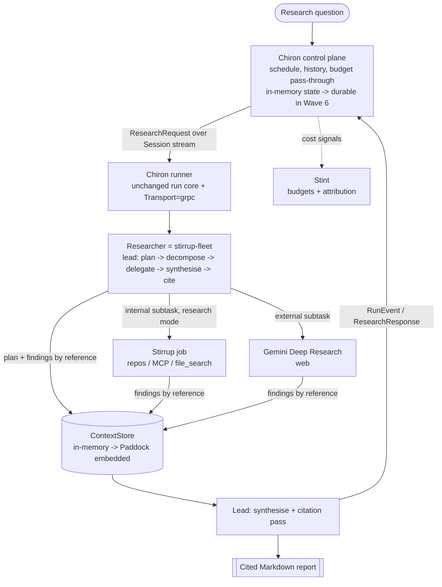

# Chiron v2 — Implementation Plan

## 0. How to read this plan

This is the working plan for the `v2` branch. It assumes v1 is complete
(`docs/DECISIONS.md`, "v1 complete", 2026-06-07) and that the v2 seams already
exist as tested stubs: `internal/researcher/fleet`, `internal/transport/grpc.go`,
`internal/memory` (`ContextStore` declared locally), and
`proto/chiron/v1/chiron.proto` (committed; generated Go not yet committed).

Precedence is unchanged: `docs/INTERACTIONS-API.md` > `docs/DECISIONS.md` >
`docs/PROPOSAL.md`. This plan sits below all three — where it conflicts with a
normative document, the normative document wins, and this plan is corrected.

Each wave below carries: **goal**, **deliverables**, **key tasks**, **new packages /
files**, **dependencies + required `DECISIONS.md` entries**, **acceptance criteria**,
and **risks**. Waves are gated: do not start a wave until the previous wave's
acceptance criteria are met and its `DECISIONS.md` entries are written.

## 1. Decisions taken for this plan (2026-06-14)

These four forks were settled at planning time. They resolve the open questions in
`PROPOSAL §8` / `PADDOCK §8` for the purpose of sequencing. Each graduates to a dated
`docs/DECISIONS.md` entry in the wave that first depends on it — this section is the
provenance, `DECISIONS.md` is the record once code lands.

| # | Fork | Decision | Consequence |
| --- | --- | --- | --- |
| D1 | Plan scope (`§8` framing) | **Full v2 roadmap, phased** into six waves. | This document; gated delivery rather than one slice. |
| D2 | v2 auth path (`§8.1`) | **Vertex AI + Workload Identity** on GKE; hold no static keys. | A Vertex-reachability spike precedes commitment (Spike S1). Local dev keeps the API-key path; the Vertex binding and a GCP-Secret-Manager / Workload-Identity `Secret` backend land in Wave 6. |
| D3 | Memory / Paddock (`§5`, `PADDOCK §8`) | **In-memory `ContextStore` first**, swapped for Paddock (embedded) later. | Wave 2 ships an in-process findings-by-reference store so the orchestrator works without the Paddock project existing; Wave 4 replaces it structurally. |
| D4 | Run durability (`§8.4`) | **Deferred** — in-memory control-plane state plus the existing resume handle first. | Waves 1–5 run on in-memory state; the durable substrate (NATS JetStream is the leading candidate, per `§8.4`) and rainbow deployments land in Wave 6. In-flight runs do not survive a control-plane restart until then; the interaction-id resume handle is the only recovery path meanwhile, and that limitation is documented, not hidden. |

## 2. Non-negotiables carried into v2

These hold in every wave. They are the v1 ground rules (`AGENTS.md`, `CLAUDE.md`)
restated for a multi-agent, networked context.

- **Research-only, structurally.** Chiron never gains write/execute capability.
  Stirrup workers are dispatched in **research mode only**; the orchestrator must not
  expose, and must be unable to reach, Stirrup's executor / edit / permission surface.
  This is the single most important invariant to defend in review as the Stirrup
  integration lands.
- **The core depends only on seams.** `internal/run` does not change. The orchestrator
  is *just another `Researcher`*; the control plane talks to the run via the
  `Transport` seam. If a wave needs to touch `internal/run`, stop and re-examine the
  design.
- **No vendor AI SDKs.** The lead agent's planning/synthesis model calls, the Vertex
  path, and any embedding calls are hand-rolled `net/http`. Justify every new
  dependency in `DECISIONS.md` before adding it.
- **Money safety scales to N workers** (see §4).
- **Secrets are `secret://` end to end**, scrubbed on every output path including gRPC
  payloads and trace spans.
- **stdout belongs to the report**; events, prompts, diagnostics go to stderr (CLI) or
  the control-plane stream (service).
- **en-GB spelling, no emojis**, logical commits with rationale in the body, one
  `DECISIONS.md` entry per material choice per wave.

## 3. Target architecture (where the six waves arrive)



The runner side of this diagram is v1 with two seams rebound (`Researcher = fleet`,
`Transport = grpc`) and one added (`ContextStore` non-noop). Everything left of the
runner is new and built in Waves 3, 5, 6.

## 4. Money safety for a multi-agent run

v1's rules (`AGENTS.md`, "Money safety") were written for one interaction per run. A
fleet run creates many. The rules generalise as follows, and this is acceptance
criteria for Wave 2:

- **One budget gate before the whole fleet**, *and* a per-worker allocation derived
  from it. The gate precedes the lead's planning model calls too (planning spends).
- **No create is ever auto-retried** — not the lead's planning calls, not any worker's
  `POST /interactions`. An ambiguous 5xx may already be billing. GETs retry freely.
  This is inherited from the gemini adapter and must be preserved per worker.
- **Every worker emits its interaction id the moment `Start` returns**, up the event
  stream, before anything else can fail — so a crashed fleet run is recoverable
  worker-by-worker, not just as a whole.
- **A broken event stream never aborts a paid run.** Transport emission stays best
  effort; a worker whose SSE drops falls back to polling. The control plane losing a
  runner mid-run must not strand spend silently — the resume handle is the floor.
- **The lead enforces a hard worker-count and call-budget ceiling** scaled to
  complexity, so "effort scales with complexity" cannot run away into unbounded spend.

## 5. Spikes (do these before the waves they gate)

| Spike | Question | Gates | Output |
| --- | --- | --- | --- |
| **S1** | Is the Deep Research agent reachable via **Vertex AI** (so Workload Identity / ADC works), or only via `generativelanguage.googleapis.com` with `x-goog-api-key`? (`PROPOSAL §8.1`) | Wave 6 auth binding | A short finding in `DECISIONS.md`. If unreachable via Vertex, fall back to GCP Secret Manager + API key and record the deviation from D2. |
| **S2** | What is Stirrup's **research-mode** contract? Does the runner dispatch Stirrup `job`s over the shared harness gRPC control plane, or embed `harnessapi` in-process? Confirm research mode exposes *no* executor/edit surface. | Wave 2 router | A binding decision + the research-only proof obligation for review. |
| **S3** | Internal-source strategy (`PROPOSAL §8.3`): Stirrup `research`-mode workers vs Gemini `file_search` vs both, and the routing rule. Recommendation: **Stirrup workers primary** for internal (repos/MCP), Gemini for external web; revisit `file_search` if Stirrup coverage is thin. | Wave 2 router | The router's routing table. |
| **S4** | Paddock readiness: are Paddock M1–M3 (blob/record/recall, embedded) available to bind in Wave 4? | Wave 4 | Go/no-go for Wave 4; if not ready, the in-memory store from Wave 2 holds and Wave 4 slips without blocking 1–3, 5. |

S1 and S2 should run in parallel at the start; both are research/reading tasks with no
spend.

## 6. The waves

### Wave 1 — proto + gRPC transport

**Goal.** Bind the `Transport=grpc` seam for real: a runner dials a control plane and
streams the v1 run lifecycle over `proto/chiron/v1`. No orchestration yet — this can be
proven end-to-end with the existing single Gemini researcher behind the runner.

**Deliverables.**
- Generated Go committed: `proto/chiron/v1/chiron.pb.go`, `chiron_grpc.pb.go`.
- `internal/transport/grpc.go` implemented (replacing the `ErrNotImplemented` stub):
  outbound dial, `RunnerHello`, event mapping, `ResearchResponse`, `CancelRequest`
  handling, reconnect/backoff, best-effort emission.

**Key tasks.**
1. Run `just proto` and commit the output. Add `google.golang.org/protobuf` and
   `google.golang.org/grpc` as **direct** dependencies (they already arrive transitively
   via the OTLP HTTP exporter — see the OTel `DECISIONS.md` entry — so the module-graph
   cost is near zero; promote them to direct with justification).
2. Implement `GRPC.Emit` mapping each `transport.Event` kind to its `RunEvent` payload
   one-to-one (`events.go` ↔ `chiron.proto`): `run_started`→`RunStarted`,
   `interaction_created`→`InteractionCreated`, `status_changed`→`StatusChanged`,
   `delta`→`Delta`, `run_completed`→`RunCompleted`, `cost_summary`→`CostSummary`.
3. Hold one `Session` stream per runner lifetime; send `RunnerHello` with `runner_id`,
   `version`, and advertised `researchers` (`["gemini-deep-research"]` this wave).
4. Map terminal completion to `ResearchResponse` (interaction id, status, `Report`,
   `Usage`, `Citation`s) — reusing the domain→wire mapping the formatter/types already
   define.
5. Validate `CONTROL_PLANE_ADDR` at the composition root with the same rigour as
   `CHIRON_GEMINI_BASE_URL`: require TLS off-loopback; admit plaintext for loopback only;
   reject otherwise before any dial.
6. Route every string payload through `secret.Scrub` before it crosses the wire.
7. Best-effort: a failed send/dial logs and continues; it never returns an error that
   could abort a paid run (money safety).

**New packages / files.** `proto/chiron/v1/*.pb.go` (generated); changes confined to
`internal/transport`, plus CLI composition-root wiring to select `grpc` transport and
read/validate `CONTROL_PLANE_ADDR`.

**Dependencies + `DECISIONS.md`.** Promote `google.golang.org/grpc` and
`google.golang.org/protobuf` to direct deps; write the "v2 wave binds gRPC transport"
entry the existing proto decision anticipates (it explicitly says this wave "runs
`just proto`, commits the output, and justifies the runtime dependencies"). Record the
`CONTROL_PLANE_ADDR` validation policy.

**Acceptance criteria.**
- A runner with `Transport=grpc` completes a real (faked-API) research run, and a test
  control plane built on `bufconn` receives hello → ordered run events → response.
- Stream failure mid-run does not fail the run (best-effort proven by test).
- No new lint/CI regressions; actions stay SHA-pinned.

**Risks.** gRPC/protobuf surface widens the audited dependency tree (already linked via
OTel, so contained). Keep the runner the *client*; the control plane never dials in.

---

### Wave 2 — stirrup-fleet orchestrator (lead + workers)

**Goal.** Implement the `Researcher=fleet` seam: a lead agent that plans, decomposes,
delegates to parallel workers, synthesises, and runs a citation pass — returning a
`*types.Interaction` exactly as the gemini researcher does, so the run core is unchanged.
Ship the **in-memory `ContextStore`** (D3) that this wave needs for findings-by-reference.

**Deliverables.**
- `internal/researcher/fleet` implemented: lead planner, router, bounded worker pool,
  synthesiser, citation pass — behind `Start`/`Await`/`Result`.
- `internal/memory` gains an in-process binding (`memory.InMemory` or similar) fulfilling
  `ContextStore`: `Put`/`Get` content-addressed, `OpenSession` with TTL/GC in-process;
  `Remember`/`Recall` either a simple in-memory index or an explicit stub returning
  `ErrNotImplemented` (decide in-wave; recall is not load-bearing until Paddock).
- A hand-rolled model adapter for the lead's planning/synthesis reasoning (separate from
  the Deep Research workers), `net/http`, no SDK.

**Key tasks.**
1. **Lead planning.** Decompose the question into 3–5 worker subtasks, each with the
   four fields Anthropic's article makes mandatory: *objective*, *output format*, *source
   guidance*, *boundaries*. Persist the plan to the `ContextStore` by reference.
2. **Router** (per S3): internal subtasks → Stirrup research-mode workers; external →
   Gemini Deep Research workers (reusing `researcher/gemini`). Encode the routing table.
3. **Worker pool.** Synchronous-first execution (`PROPOSAL §6`: move to async only when
   payoff justifies coordination cost). Bounded concurrency; each worker writes findings
   **by reference** into the `ContextStore`, returning a lightweight `Reference`, not the
   payload (avoids the multi-stage "game of telephone").
4. **Synthesis + citation pass.** Lead reads worker refs back, synthesises, then a
   citation pass attributes each claim to a source and produces the deduplicated
   `Citation` list the formatter already expects.
5. **Money safety (acceptance — see §4).** Budget gate before planning; per-worker
   allocation; no create auto-retry per worker; per-worker interaction ids emitted early
   up the `Transport`; hard worker-count/call ceiling.
6. **Observability.** Extend `internal/trace/names.go` with fleet spans
   (`SpanDecompose`, `SpanDelegate`/per-worker, `SpanSynthesise`, `SpanCite`) and
   per-worker metrics (worker count, per-worker tokens/cost). Keep names stable and
   documented.
7. **Research-only proof.** Demonstrate in tests that the Stirrup worker path cannot
   reach an executor/edit/permission surface (S2 obligation).

**New packages / files.** `internal/researcher/fleet/{lead,router,worker,synthesise,
cite}.go` (shape to taste); `internal/memory/inmemory.go`; possibly
`internal/researcher/fleet/model` for the planning adapter (or reuse a shared gemini
client). The Stirrup client lives behind a small interface so it is faked in tests.

**Dependencies + `DECISIONS.md`.** Likely a Stirrup client dependency
(`github.com/rxbynerd/stirrup` `harnessapi`, or a hand-rolled gRPC client against the
harness proto — decide per S2 and justify). Entries: the fleet orchestration design;
the in-memory `ContextStore` (D3) and why recall is deferred; the planning-model choice;
the multi-worker money-safety generalisation; the routing table (S3); the research-only
enforcement mechanism (S2).

**Acceptance criteria.**
- `chiron research --agent stirrup-fleet --query "..."` (faked Stirrup + faked Gemini)
  produces a synthesised, cited Markdown report through the **unchanged** run core.
- Workers run in parallel; findings pass by reference; the synthesised report cites
  sources from all workers.
- Every money-safety rule in §4 is enforced and tested.
- The research-only invariant is demonstrably unbreakable from the worker path.

**Risks.** This is the largest wave. Delegation-brief quality directly drives result
quality (vague briefs cause duplicated/missed work — the article's central caution).
Token cost is ~15× a single chat; the cheap single-agent CLI path **must remain** the
default, with the fleet opt-in.

---

### Wave 3 — control plane service

**Goal.** Build the server the runner dials: it accepts research questions, schedules
them onto connected runners over the `Session` stream, relays run events, stores results,
and serves history/get. In-memory state (D4).

**Deliverables.**
- `internal/controlplane` (core, pure-ish, in-memory store) + `cmd/chiron-control` (the
  service entrypoint, mirroring `cmd/chiron`'s thinness).
- The `ControlPlaneService` server side of `proto/chiron/v1`: accept `RunnerHello`,
  dispatch `ResearchRequest`, consume `RunEvent`/`ResearchResponse`, issue
  `CancelRequest`.
- An ingress for questions (CLI subcommand and/or thin gRPC/REST — decide in-wave;
  smallest surface that lets a question reach a runner and a report come back).

**Key tasks.**
1. Runner registry keyed by `runner_id`, tracking advertised `researchers` so scheduling
   can match a request to a capable runner.
2. Scheduling: assign a `run_id`, send `ResearchRequest` down the stream, fan run events
   to subscribers, persist the terminal `ResearchResponse` in the in-memory store.
3. History/get: re-serve a completed run by `run_id`, and surface the underlying
   interaction id so `chiron get <id>` remains the cross-process recovery path while
   durability is deferred.
4. Budget pass-through: carry `Budget` on the `ResearchRequest`; the runner enforces it
   (Stint attribution arrives in Wave 5).
5. Tenancy scaffolding: thread `namespace` end-to-end (it is already on
   `ResearchRequest`) so Wave 4's `ContextStore` isolation and Wave 5's per-tenant
   budgets have it.
6. Security: server-side TLS, runner authentication (how a runner proves identity to the
   control plane — decide and record); scrub all logged payloads.

**New packages / files.** `internal/controlplane/*`, `cmd/chiron-control/main.go`,
possibly `internal/controlplane/store` (in-memory; the seam where Wave 6 durability
swaps in).

**Dependencies + `DECISIONS.md`.** No new heavy deps beyond Wave 1's grpc. Entries: the
control-plane component boundary; in-memory state and the explicit durability deferral
(D4) with its recovery-story caveat; the runner-authentication mechanism; the ingress
surface chosen.

**Acceptance criteria.**
- End-to-end in-process test: control plane + one runner (`Researcher=fleet`, faked
  workers) complete a question → report round-trip over the real `Session` stream.
- Cancel works; a runner disconnect is handled without crashing the control plane (the
  run is marked recoverable by interaction id, not lost silently).

**Risks.** Scope creep toward a full scheduler. Keep it minimal: register, dispatch,
relay, store, get. Anything more is a later concern.

---

### Wave 4 — Paddock interlock

**Goal.** Replace the in-memory `ContextStore` with **Paddock embedded** (`PADDOCK §6`,
"Embedded" shape), binding structurally to the local `memory.ContextStore` (no hard
dependency, per the 2026-06-07 decision). Gated by S4.

**Deliverables.**
- A Chiron-side adapter binding `paddockapi.ContextStore` to `internal/memory`'s
  interface (structural satisfaction — neither project imports the other's types as a
  hard dependency).
- `ResearchConfig` wiring to select `memory: inmemory | paddock-embedded`.
- Validation of the lead/worker findings-by-reference flow against real Paddock
  (this is Paddock's own M6 from the other side).

**Key tasks.**
1. Confirm the local `memory.ContextStore` and `paddockapi.ContextStore` are structurally
   identical; reconcile any drift in the seam (the local interface is the contract Chiron
   defends).
2. Bind Paddock embedded (filesystem blob + SQLite record + chromem-go recall, per
   `PADDOCK §3`); `Remember`/`Recall` now become real.
3. Thread tenant `namespace` into Paddock isolation on every call.
4. `secret://` for any Paddock backend credentials; scrub.
5. Keep `inmemory` as a fallback binding for tests and air-gapped dev so Chiron stays
   buildable and testable without Paddock.

**New packages / files.** `internal/memory/paddock` (the adapter); config plumbing.

**Dependencies + `DECISIONS.md`.** `github.com/rxbynerd/paddock` (embedded) — justify.
Entry: the Paddock binding, the structural-satisfaction confirmation, and the
recall-now-real change.

**Acceptance criteria.**
- A fleet run uses Paddock embedded for plan + findings-by-reference + final-report
  `Remember`; a subsequent run can `Recall` related prior memory.
- `inmemory` remains a working binding; the swap is config-only, core untouched.

**Risks.** Couples the v2 timeline to Paddock delivery. If S4 is no-go, this wave slips;
Waves 1–3 and 5 do not depend on it (they run on `inmemory`).

---

### Wave 5 — Stint budgets and attribution

**Goal.** Hand per-run/per-tenant budget enforcement and cost attribution to **Stint**,
replacing Chiron's local tier-table estimate as the source of truth for spend (Chiron's
estimate stays a *planning* figure, per the existing decision; Stint owns *attribution*).

**Deliverables.**
- A Stint client (hand-rolled) wired into the budget gate and the end-of-run cost report.
- Per-tenant budget enforcement keyed by the `namespace` already threaded in Wave 3.

**Key tasks.**
1. Pre-spend gate consults Stint for remaining budget (per run and per tenant) before any
   create — preserving "budget gate before any create".
2. Emit `Usage` cost signals to Stint at run end for attribution; keep the local estimate
   for the user-facing summary.
3. Reconcile with `Budget` on `ResearchRequest`: control-plane budget is a ceiling, Stint
   is the ledger.

**New packages / files.** `internal/cost/stint` (or similar) behind a small interface so
it is faked in tests; CLI/control-plane wiring.

**Dependencies + `DECISIONS.md`.** A Stint client dependency — justify. Entry: the
Stint integration, the estimate-vs-attribution split, per-tenant enforcement.

**Acceptance criteria.**
- A run blocked by Stint budget exits before spend with the existing "blocked before
  spend" exit semantics (v1 exit 4); a permitted run reports attributed cost to Stint.

**Risks.** Depends on Stint's contract being available; if not, keep the v1 local budget
gate and slip Stint — the money-safety floor (local gate) already exists.

---

### Wave 6 — GKE deployment, Vertex auth, durability, rainbow

**Goal.** Run the control plane and runners on GKE with keyless auth, surviving rollouts,
with in-flight runs durable. This is where D2 (Vertex) and the deferred D4 (durability)
are paid down.

**Deliverables.**
- Container images and GKE manifests for `chiron-control` and the runner.
- The **Vertex AI** path for the model/Deep-Research calls (per S1) and a GCP Secret
  Manager / Workload Identity `Secret` backend — no static keys in the cluster.
- A durable substrate behind the control-plane store (NATS JetStream is the leading
  candidate per `§8.4`; confirm at this wave) and **rainbow deployments** so in-flight
  runs survive a rollout.
- Release-build hardening of the security-sensitive env vars.

**Key tasks.**
1. Implement the Vertex adapter (hand-rolled `net/http`, ADC/Workload Identity) gated on
   S1; if Vertex cannot reach Deep Research, fall back to Secret Manager + API key and
   record the deviation from D2.
2. New `Secret` backend: GCP Secret Manager via Workload Identity, fulfilling the
   `secret://` resolver seam.
3. Swap the Wave-3 in-memory control-plane store for the durable substrate; add
   checkpoint/resume so a run survives control-plane restart, not just the runner's
   interaction-id handle.
4. Rainbow deployment strategy (`§6`, reliability): in-flight runs drain across a rollout
   rather than restart (errors compound in stateful agents — resume, don't restart).
5. Disable `CHIRON_GEMINI_BASE_URL` (and lock the OTLP endpoints to operator Secrets) in
   release builds — `AGENTS.md` flags both; consider a build tag for the base-URL
   override as that doc suggests.

**New packages / files.** `internal/secret` gains the GCP backend; `internal/researcher/
gemini` (or a sibling) gains the Vertex path; `deploy/` manifests; `Dockerfile`(s);
durability binding behind the Wave-3 store seam.

**Dependencies + `DECISIONS.md`.** Possibly a GCP auth/metadata client and a NATS client
— justify each. Entries: the Vertex binding (closing S1 and D2), the Secret Manager
backend, the durability substrate (closing D4), the release-build hardening.

**Acceptance criteria.**
- The service runs on GKE with no static API key; a rollout does not abort in-flight
  runs; a control-plane restart resumes (not restarts) running work.
- The base-URL override is absent from release builds.

**Risks.** The heaviest infra wave and the most external unknowns (Vertex reachability,
NATS-vs-engine, rainbow mechanics). Each is isolated behind a seam so a setback here does
not reach back into the run core or the orchestrator.

## 7. Cross-cutting concerns (every wave)

- **Security review** each wave touching the wire, auth, or the Stirrup boundary:
  research-only enforcement, control-plane address/identity validation, TLS, redirect
  policy parity with v1, scrubbing across gRPC and traces, tenant isolation.
- **Testing posture (unchanged from v1).** No real network: `bufconn` for gRPC, fakes
  for Stirrup/Gemini/Paddock/Stint, golden files for synthesised reports. Server
  lifecycle owned at the call site; table loops named `tt`; SSE tests use the
  `sseWrite`/`Flush` helper.
- **Observability.** Extend `trace/names.go` once for the whole fleet vocabulary; keep
  names stable. Per-worker metrics roll up to a run; the control plane gets its own span
  for scheduling.
- **Docs discipline.** Each wave updates `AGENTS.md`'s per-package map, adds its
  `DECISIONS.md` entries, and keeps `INTERACTIONS-API.md` normative for anything touching
  the Gemini API.

## 8. Sequencing summary

```
Spikes S1, S2 (parallel, no spend) ──┐
                                     ▼
Wave 1 (proto + grpc) ──► Wave 2 (fleet + in-mem ContextStore) ──► Wave 3 (control plane)
                                     │                                   │
                              S3 gates W2 router                  S4 gates W4
                                     ▼                                   ▼
                          Wave 4 (Paddock) ◄── independent of ──► Wave 5 (Stint)
                                     └───────────────┬───────────────────┘
                                                     ▼
                                       Wave 6 (GKE + Vertex + durability)
```

Waves 1→2→3 are the critical path to a running multi-agent service on in-memory state.
Waves 4 and 5 are independent of each other and can interleave once 3 lands. Wave 6
depends on everything and closes the two deferred decisions (D2 Vertex, D4 durability).

## 9. What this plan deliberately does not do

- It does not modify `internal/run`. If a wave seems to require it, the design is wrong.
- It does not build an eval framework (Stirrup's), a permission engine, executors, or
  safety rings (Chiron is research-only).
- It does not commit to async workers, a workflow engine, or `file_search`-over-Stirrup
  before the spikes (S2/S3) and the synchronous-first baseline justify them.
- It does not hold pricing tables (Stint's job) — Chiron keeps a planning estimate only.

## 10. References

- `docs/PROPOSAL.md` §6 (the v2 vision and the load-bearing seams), §8 (the four open
  decisions this plan settles), §9 (M7, the seams already in place).
- `docs/PADDOCK.md` — the `ContextStore`-fulfilling companion project (D3, Wave 4).
- `docs/DECISIONS.md` — 2026-06-07 "proto/chiron/v1 is committed; generated Go is not"
  (Wave 1's mandate), "ContextStore is declared locally" (Wave 4's structural binding),
  "v1 complete" (the baseline).
- `proto/chiron/v1/chiron.proto` — the outbound-dial control-plane contract Waves 1 and 3
  implement.
- Anthropic, *How we built our multi-agent research system* (2025-06-13) — the
  orchestrator-worker pattern, delegation discipline, findings-by-reference, and the
  resume-don't-restart reliability stance Waves 2–6 follow.
