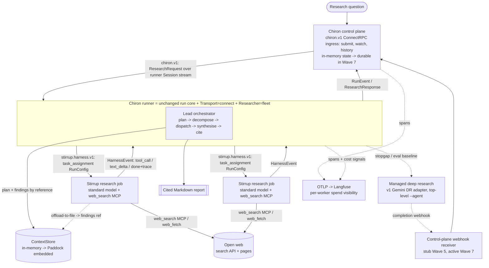

# Chiron v2 — Implementation Plan

## 0. How to read this plan

This is the working plan for the `v2` branch. It assumes v1 is complete
(`docs/DECISIONS.md`, "v1 complete", 2026-06-07) and that the v2 seams already
exist as tested stubs: `internal/researcher/fleet`, `internal/transport/grpc.go`,
`internal/memory` (`ContextStore` declared locally), and
`proto/chiron/v1/chiron.proto` (committed; generated Go not yet committed).

The researcher core — what the fleet actually runs — is designed in
`docs/V2-RESEARCH-AGENT.md` (2026-06-22). This plan re-seats its Wave 3–4 researcher
waves and spikes onto that design (the fleet is a lead orchestrator driving Stirrup
research-mode jobs on standard frontier models; see §1 D2/D5 and §5) while keeping the
service scaffolding (Waves 1, 2, 5, 6, 7) intact.

This revision applies `docs/V2-AMENDS.md` in full and, in a second pass (2026-06-22),
re-seats the researcher core on `docs/V2-RESEARCH-AGENT.md`. The amendments reshape the
plan, not just its sections: the research backend becomes Chiron's **own** research-agent
fleet — a lead orchestrator driving **Stirrup research-mode jobs on standard frontier
models** equipped with a web-search tool — with managed deep research kept only as a
top-level stopgap and the eval baseline (amends 1, 6); standard-model auth is keyless via
Stirrup credential federation, the OpenAI path being Azure OpenAI + `azure-workload-identity`
(amend 1); budgeting is deferred (amend 2); the await model is background-create + poll for
the managed stopgap, and the `stirrup.harness.v1` event stream for workers, with webhooks
later (amend 3); proto clients are Buf-generated, now for **two** targets — `chiron.v1` and
`stirrup.harness.v1` (amend 4); the control-plane surface is ConnectRPC (amend 5); v2 is
external-research-only (amend 6); and observability is elevated to a first-class concern
(amend 7). Where an amendment and an older normative statement disagree, this revision
threads the amendment through and flags the consequence rather than hiding it.

Precedence is unchanged: `docs/INTERACTIONS-API.md` > `docs/DECISIONS.md` >
`docs/PROPOSAL.md`. This plan sits below all three — where it conflicts with a
normative document, the normative document wins, and this plan is corrected.
`docs/INTERACTIONS-API.md` stays normative for the Gemini path (now the stopgap + eval
baseline). v2 adds **no** `docs/RESPONSES-API.md`: Chiron does not hand-roll an OpenAI
adapter — Stirrup owns the `openai-responses` provider — so the OpenAI standard-model
contract lives in Stirrup, and the worker-facing `stirrup.harness.v1` contract is
confirmed by spike (SP-A/SP-B, §5) before code rather than restated here as normative.

The committed `proto/chiron/v1/chiron.proto`, `proto/buf.yaml`, and `proto/buf.gen.yaml`
are the v1 baseline (call it Wave 0). Every proto, plugin, or generated-code item in a
wave's deliverables is an **addition to** that baseline — never a claim that it already
exists. In particular, the committed proto today defines only the runner-facing `Session`
stream; the submission/history RPCs (D8) are added in Wave 1.

Each wave below carries: **goal**, **deliverables**, **key tasks**, **new packages /
files**, **dependencies + required `DECISIONS.md` entries**, **acceptance criteria**,
and **risks**. Waves are gated: do not start a wave until the previous wave's
acceptance criteria are met and its `DECISIONS.md` entries are written.

## 1. Decisions taken for this plan (amended 2026-06-21)

These forks were settled at planning time and then revised by `docs/V2-AMENDS.md`.
They resolve the open questions in `PROPOSAL §8` / `PADDOCK §8` for the purpose of
sequencing. Each graduates to a dated `docs/DECISIONS.md` entry in the wave that first
depends on it — this section is the provenance, `DECISIONS.md` is the record once code
lands. The "Source" column traces each decision to the amendment (or planning fork)
that drove it.

| # | Source | Decision | Consequence |
| --- | --- | --- | --- |
| D1 | Planning fork (`§8` framing) | **Full v2 roadmap, phased** into seven gated waves, external-research-only. | This document; gated delivery rather than one slice. The wave set is restructured from the prior six (see §6 preamble). |
| D2 | Amend 1 + V2-RESEARCH-AGENT.md | **The `Researcher` is Chiron's homegrown research-agent fleet.** A Chiron lead orchestrator decomposes a question and dispatches **Stirrup research-mode jobs on standard frontier models** (GPT-5.4/5.5 via Stirrup's `openai-responses`, Claude via `anthropic`, Gemini-Pro via `gemini`), each equipped with a **web-search tool**, then synthesises and cites. The runner is the **`stirrup.harness.v1` `HarnessService` server**. **Managed deep research** (the v1 Gemini DR adapter) is **retained as a top-level stopgap researcher + the eval baseline**, never the production backend. **Vertex AI is ruled out as an auth path**; standard-model auth is keyless via Stirrup credential federation. | Chiron builds **no** OpenAI adapter and **no** `docs/RESPONSES-API.md` — Stirrup owns the `openai-responses` provider. The drifted `o3`/`o4-mini-deep-research` bindings are **dropped**. The OpenAI standard-model path is **Azure OpenAI / Foundry Responses + `azure-workload-identity`** (available in Stirrup today; SP-D), with OpenAI-direct + `openai-wif` a recorded future alternative; Anthropic uses `anthropic-wif`; Gemini-Pro uses `gcp-workload-identity` on Vertex. The managed Gemini DR stopgap still holds its `generativelanguage.googleapis.com` key in a GCP Secret Manager backend (no Workload-Identity path), landing in Wave 7. The web-search tool is the central spike, SP-A. See `docs/V2-RESEARCH-AGENT.md` §3–§6. |
| D3 | Amend 3 + V2-RESEARCH-AGENT.md | **Await is split by path.** The **managed stopgap** (Gemini DR) and any future managed backend use **background-create + poll** (replacing v1's SSE-with-poll-fallback); **research workers** are awaited over the **`stirrup.harness.v1` event stream** (`done`/`error`), not provider polling. **Webhook-driven completion** for the managed stopgap is a future enhancement that lands with the public control-plane ingress (Wave 7). | A managed background create returns an interaction id **immediately**, then the adapter polls `GET` until terminal — *not* a held-open socket (the "long requests" of amend 3 means long-running background *tasks*). For workers, the runner (as `HarnessService` server) holds a live harness stream per worker and consumes `HarnessEvent`s to terminal; the worker's `run_id` is the per-worker resume handle. The §4 "a broken event stream never aborts a paid run" rule therefore extends to the worker stream. v1's Gemini SSE path is untouched; the control plane is the natural webhook receiver for the managed stopgap (Wave 7). |
| D4 | Amend 6 + Q2 | **In-memory `ContextStore` first**, Paddock embedded later. Findings-by-reference still applies to the external multi-worker fleet. | Wave 4 ships the in-process store; Wave 6 swaps Paddock (gated by S2). |
| D5 | Amend 6 + V2-RESEARCH-AGENT.md | **External (internet) research only — but Stirrup is *in*.** The prior draft's conflation is corrected: Stirrup is the **harness the fleet's workers run on** (un-deferred), not an internal-source feature. What defers is only the **internal *source tools*** — Stirrup `file_search`, repo-scoped MCP, Gemini `file_search` — i.e. *where* a worker reads, not *that* workers exist. v2 workers read the **open web** (web-search MCP + `web_fetch`). | The router is external-web-only and its internal branch defers (encoded so it slots in later). This **re-affirms `PROPOSAL §6`'s `Researcher = stirrup-fleet`**, which the prior revision wrongly marked superseded; the transport is still ConnectRPC (D8). The Stirrup research-mode contract and web-search spikes are **un-deferred** (SP-A/SP-B, §5). |
| D6 | Amend 2 | **Defer all finance/budgeting fixes** (token and financial). No Stint in v2; the broken hard-coded cost estimate and the v1 `--budget` gate are left **as-is** — not fixed, not extended. | Spend is made **visible** (Langfuse, D7), not capped. The non-budget spend-safety invariants (§4) remain and generalise to N workers. Budget enforcement and attribution return in a future release. |
| D7 | Amend 7 | **Observability is a first-class, early wave** (Wave 2) because v2 can spend a lot of real money it cannot yet cap. Explicit CLI flags forward OTLP telemetry to **Langfuse**; per-worker / per-run spend signals are traced. | Langfuse visibility is the **interim spend control**, standing in for the deferred budget enforcement. It lands before the expensive backends (Stirrup workers, fleet) so the first real spend is fully visible. |
| D8 | Amends 4, 5 + V2-RESEARCH-AGENT.md | **ConnectRPC + Buf, two targets.** The control-plane surface is ConnectRPC, generated with Buf (adds the `connect-go` plugin). The runner outbound-dial `Session` stream stays bidi over HTTP/2; a new browser-friendly submission/history surface specifies the previously-underspecified research-submission API, anticipating a future Chiron UI. Buf now also generates a **second target, `stirrup.harness.v1`**, from Stirrup's proto — the `HarnessService` **server** stubs the runner implements to drive workers. **Proto clients/servers are Buf-generated from each contract's `.proto`; we never `go get` another repo's generated types** (so Stirrup is *not* a `go mod` dependency for its wire types). | Wave 1 commits the Buf+Connect output for **both** targets (`chiron.v1` served/dialled; `stirrup.harness.v1` server stubs, implemented in Wave 3); Wave 5 serves both `chiron.v1` surfaces. The local-`ContextStore` decision (DECISIONS.md, 2026-06-07) is reaffirmed by the same principle. |

## 2. Non-negotiables carried into v2

These hold in every wave. They are the v1 ground rules (`AGENTS.md`, `CLAUDE.md`)
restated for a multi-agent, networked context.

- **Research-only, structurally.** Chiron never gains write/execute capability. v2's
  Stirrup workers run in `mode:"research"` with `permission_policy:"deny-side-effects"`, a
  `built_in` tool list free of write/exec tools, no write `executor`, and the Rule of Two
  — Stirrup *rejects* a read-only config that violates this (`ValidateRunConfig`), so the
  invariant is enforced **upstream**, not merely asserted. Chiron never sends
  `permission_response{allowed:true}` to a research worker; a worker `permission_request`
  is a **defect** that fails the run in test (see `V2-RESEARCH-AGENT.md` §5.3).
- **The core depends only on seams.** `internal/run` does not change. The fleet is *just
  another `Researcher`*, and so is the managed Gemini DR stopgap — both are `Researcher`
  bindings behind Start/Await/Result; the per-provider model adapters (OpenAI, Anthropic,
  Gemini) live **inside Stirrup**, reached over `stirrup.harness.v1`, not as Chiron
  `Researcher`s. The control plane talks to the run via the `Transport` seam. If a wave
  needs to touch `internal/run`, stop and re-examine the design.
- **No vendor AI SDKs.** Chiron hand-rolls no provider adapter for the workers — Stirrup
  owns those (themselves SDK-free). What Chiron writes is the lead orchestrator's control
  flow plus, at most, one thin `net/http` adapter for the lead's own planning/synthesis
  calls *if* SP-C chooses a hand-rolled lead over a Stirrup `planning` job; the retained
  v1 Gemini DR stopgap is already hand-rolled. Any embedding calls stay `net/http`.
  Justify every new dependency in `DECISIONS.md` before adding it.
- **Spend safety scales to N workers** (see §4). Budget *enforcement* is deferred (D6),
  but the spend-safety invariants that prevent waste, double-billing, and lost
  recoverability are not — they generalise to a fleet.
- **Secrets are `secret://` end to end**, scrubbed on every output path including
  ConnectRPC payloads and trace spans.
- **stdout belongs to the report**; events, prompts, diagnostics go to stderr (CLI) or
  the control-plane stream (service).
- **en-GB spelling, no emojis**, logical commits with rationale in the body, one
  `DECISIONS.md` entry per material choice per wave.

## 3. Target architecture (where the seven waves arrive)



The runner side is v1 with two seams rebound (`Researcher = fleet`, `Transport =
connect`) and one added (`ContextStore` non-noop). The fleet's workers are **Stirrup
research-mode jobs on standard frontier models**, dispatched over a second proto contract,
`stirrup.harness.v1`, on which **the runner is the `HarnessService` server** (the Stirrup
harness dials in). Everything left of the runner — the control plane — is new and built in
Waves 1 and 5. **Managed deep research** (Gemini DR) is a **top-level stopgap researcher +
the eval baseline** (D2), selected as its own `--agent`, *outside* the fleet — it is the
only path that uses the webhook receiver. Internal-*source* tools (Stirrup `file_search`,
repo-MCP, Gemini `file_search`) are deliberately **out of v2** (D5) and route in once
Paddock lands; the web-search tool workers *do* use is external (SP-A). Where v1 sent spans
to a generic OTLP collector, v2 forwards them explicitly to Langfuse (D7), the
spend-visibility substitute for deferred budget enforcement.

## 4. Spend safety for a multi-agent run (budgeting deferred)

v1's money-safety rules (`AGENTS.md`, "Money safety") were written for one paid
interaction per run. A fleet run creates many, and v2 may spend a lot (amend 7). v2
**defers budget enforcement and cost attribution** (D6): the current estimate is broken
(hard-coded per-session costs), and fixing it — plus standing up Stint — is a future
release. What remains, and is acceptance criteria for Wave 4, is the part of "money
safety" that is about *not wasting* money and *staying recoverable*, not about *capping*
it:

- **No create is ever auto-retried** — not the lead's planning calls, not a worker
  dispatch (a Stirrup job, once assigned, may already be spending on model calls), not the
  managed stopgap's background create. An ambiguous 5xx may already be billing. GETs
  (polls) and idempotent stream reconnects retry freely. This is inherited from the gemini
  adapter (DECISIONS.md, "Create is never retried") and must be preserved per worker and
  per provider.
- **Per-job structural caps come from Stirrup, for free.** Each research `RunConfig`
  carries `max_turns` (≤100), `max_token_budget` (≤50M), `max_cost_budget` USD (≤100), and
  `timeout` (≤3600s); a runaway worker self-terminates (`stop_reason:
  budget_exceeded`/`timeout`). Bounded fan-out × these per-job caps is a hard, if coarse,
  ceiling — without Chiron building any budgeting (D6).
- **Every worker emits its Stirrup `run_id` the moment the job is assigned**, up the event
  stream, before anything else can fail — so a crashed fleet run is recoverable
  worker-by-worker (the `run_id` is the per-worker resume handle), not just as a whole.
- **A broken event stream never aborts a paid run.** Transport emission stays best effort;
  the managed stopgap's await is poll-based, and a worker's harness stream, if it drops,
  leaves the Stirrup `run_id` as the recovery floor (D3). The control plane losing a runner
  mid-run must not strand spend silently.
- **Bounded fan-out is a structural cap, not a budget.** The lead enforces a hard
  worker-count and per-worker call ceiling scaled to complexity, so "effort scales with
  complexity" cannot run away into unbounded spend. This guard is independent of any
  financial figure and remains even though budgeting is deferred.
- **Spend visibility replaces enforcement (D7).** Because v2 cannot yet *cap* spend, it
  must *see* it: every model call — the lead's planning, each worker, the synthesis pass —
  is traced to Langfuse with token and search cost signals, per worker and rolled up per
  run; Stirrup emits its own OTel trace per job, so the per-worker rollup is richer.
  Observability is the interim control.

The v1 client-side `--budget` gate and its exit-4 ("blocked before spend") semantics are
left in place unchanged; they are not load-bearing in v2 and are superseded when
budgeting returns.

## 5. Spikes (do these before the waves they gate)

The researcher-core spikes are defined in `docs/V2-RESEARCH-AGENT.md` §10 and reproduced
here with the waves they gate. They revive the Stirrup research-mode / routing spikes the
drifted plan wrongly deferred; the prior `S1` (OpenAI deep-research contract + WIF) is
**retired** — Chiron hand-rolls no OpenAI adapter, and the auth is the Azure path SP-D
confirms.

| Spike | Question | Gates | Output |
| --- | --- | --- | --- |
| **SP-A** (the crux) | **Web-search tool — RESOLVED (`V2-RESEARCH-AGENT.md` §3):** pluggable backend. **MCP search server** (Tavily/Exa/Brave/SearxNG) is the **portable default** and works against Stirrup's contract today; **OpenAI provider built-in `web_search`** is an OpenAI-path option **gated on a Stirrup enablement** (a `ToolsConfig` provider-built-in surface + un-excluding `web_search` in the `openai-responses` adapter + `web_search_call`→`HarnessEvent` mapping); **native discounted** (datacentre CAPTCHAs). Remaining before Wave 3: prove the MCP loop reaches Gemini-DR grade and pick the search API; scope the Stirrup enablement. | Waves 3, 4 | The worker `ToolsConfig` (MCP default) + research prompt; the Stirrup enablement work-item; recorded in `DECISIONS.md` when Wave 3 lands. |
| **SP-B** | **Stirrup dispatch.** The runner as `HarnessService` server (Buf, amend 4) driving Stirrup jobs that dial in: the `task_assignment`/`HarnessEvent` mapping, and GKE job provisioning (pre-warmed pool vs per-run Job, and the Stirrup worker image). | Waves 3, 4, 7 | The runner↔worker integration shape; a **faked Stirrup harness** for tests. |
| **SP-C** | **Lead substrate.** Lead judgement calls (decompose/synthesise/cite) as Stirrup `planning`/`research` jobs (zero Chiron model adapters) vs a thin hand-rolled adapter; and Chiron-level fan-out vs Stirrup `spawn_agent`. | Wave 4 | The lead implementation decision. |
| **SP-D** | **OpenAI auth (Azure path, chosen).** Confirm the project can register the Azure OpenAI/Foundry resource + Entra-ID workload-identity mapping, and that Stirrup's `azure-workload-identity` source binds it keylessly. OpenAI-direct + `openai-wif` is a recorded future alternative only. No spend. | Wave 7 | The (configuration) auth binding for the OpenAI standard-model path; closes amend 1. |
| **SP-E** | **Findings-by-reference interop.** Stirrup `offload-to-file` target → the in-memory `ContextStore` first, Paddock blob plane later. | Waves 4, 6 | The `ContextStore`↔Stirrup offload binding. |
| **SP-F** | **Eval judge.** Does `stirrup-eval` offer an LLM-judge for report-quality-vs-baseline, or must one be added upstream? Fallback: a Chiron-side judge so the gate is never blocked on a Stirrup PR. | Wave 4 (eval gate) | The baseline eval suite + judge. |
| **S2** | Paddock readiness: are Paddock M1–M3 (blob/record/recall, embedded) available to bind in Wave 6? (`PADDOCK §9`) | Wave 6 | Go/no-go for Wave 6; if not ready, the in-memory store from Wave 4 holds and Wave 6 slips without blocking 1–5. |

**Sequencing.** SP-A, SP-B, SP-C have no spend and run first — they define the worker, the
dispatch, and the lead, and gate Waves 3–4. SP-D (no spend) gates Wave 7; SP-E gates the
findings flow in Waves 4 and 6; SP-F gates the Wave 4 eval. **Cross-repo rule:** where a
spike's resolution would need a change in Stirrup (a provider-built-in/native `web_search`, an
`openai-wif` source, an llm-judge), prefer the Chiron-only option (a search MCP, the Azure
path, a Chiron-side judge) for the critical path so v2 is never blocked on an upstream Stirrup
release — the Stirrup change rides alongside as a parallel track (e.g. the OpenAI `web_search`
enablement for SP-A).
The Langfuse OTLP ingestion path (endpoint, auth) is verified inside Wave 2 against
Langfuse's docs rather than as a standalone spike.

## 6. The waves

This revision restructures the prior six waves: the Stint budgets wave is **removed**
(D6); an **observability wave** (Wave 2) and a **standard-model + Stirrup-harness
integration wave** (Wave 3) are **added** ahead of the fleet so the first real spend is
both visible and on the chosen backend; the old Wave 1 transport becomes ConnectRPC and
gains the second Buf target `stirrup.harness.v1` (D8); and the final GKE wave's Vertex
auth becomes Azure-OpenAI-via-`azure-workload-identity` through Stirrup credential
federation (D2). The result is seven waves.

### Wave 1 — proto + ConnectRPC transport

**Goal.** Bind the `Transport=connect` seam for real: a runner dials a control plane and
streams the v1 run lifecycle over `proto/chiron/v1` using ConnectRPC. No orchestration
yet — this can be proven end-to-end with the existing single Gemini researcher behind the
runner.

**Deliverables.**
- Generated Go committed: `proto/chiron/v1/chiron.pb.go` plus the ConnectRPC service
  code (`chiron.connect.go`) — the `buf.build/connectrpc/go` plugin **added to**
  `buf.gen.yaml` at a pinned version (e.g. `v1.18.1`; pin whatever version is used and
  record it), and the existing `buf.build/grpc/go` plugin **removed** (v2 serves the
  `Session` bidi stream over ConnectRPC, not plain gRPC, so its stubs are redundant; the
  `google.golang.org/grpc` module itself stays in `go.mod` as a direct runtime dependency of
  ConnectRPC's gRPC interop — only the Buf *plugin* is removed). (D8, amend 4.)
- **Second Buf target — `stirrup.harness.v1`:** add Stirrup's `proto/harness/v1` as an
  input to `buf.gen.yaml` and commit the generated **`HarnessService` server** stubs the
  runner implements in Wave 3 (the runner is the server; the Stirrup harness dials in).
  Generated from the `.proto`, never `go get` of Stirrup's types (D8). Generation only this
  wave; no implementation.
- `internal/transport/connect.go` implemented (replacing the `ErrNotImplemented` stub):
  outbound dial, `RunnerHello`, event mapping, `ResearchResponse`, `CancelRequest`
  handling, reconnect/backoff, best-effort emission.
- **Extend** `proto/chiron/v1/chiron.proto` with the previously-underspecified
  **submission/history surface** (D8): `SubmitResearch` (unary), `WatchRun`
  (server-stream), `GetRun`, `ListRuns` — browser-friendly RPCs. They are **defined in
  this wave** (added to the proto) but **served in Wave 5**; only the runner-facing
  `Session` stream is exercised this wave.

**Key tasks.**
1. Add the `buf.build/connectrpc/go` plugin (pinned) to `buf.gen.yaml`, remove the
   `buf.build/grpc/go` plugin, run `just proto`, and commit the output. Promote
   `google.golang.org/protobuf` and `google.golang.org/grpc` to **direct** dependencies
   (they already arrive transitively via the OTLP HTTP exporter — see the OTel
   `DECISIONS.md` entry — so the module-graph cost is near zero; `grpc` stays a runtime
   dependency of ConnectRPC's gRPC interop) and add `connectrpc.com/connect` with
   justification. Also add Stirrup's `proto/harness/v1` as a **second Buf input** and
   commit the generated `HarnessService` server stubs (generation only; implemented in
   Wave 3).
2. Implement `Connect.Emit` mapping each `transport.Event` kind to its `RunEvent` payload
   one-to-one (`events.go` ↔ `chiron.proto`): `run_started`→`RunStarted`,
   `interaction_created`→`InteractionCreated`, `status_changed`→`StatusChanged`,
   `delta`→`Delta`, `run_completed`→`RunCompleted`, `cost_summary`→`CostSummary`.
3. Hold one `Session` stream per runner lifetime (bidi over HTTP/2); send `RunnerHello`
   with `runner_id`, `version`, and advertised `researchers`
   (`["gemini-deep-research"]` this wave; `["research","fleet","gemini-deep-research"]` later).
4. Map terminal completion to `ResearchResponse` (interaction id, status, `Report`,
   `Usage`, `Citation`s) — reusing the domain→wire mapping the formatter/types already
   define.
5. Validate `CONTROL_PLANE_ADDR` at the composition root with the same rigour as
   `CHIRON_GEMINI_BASE_URL`: require TLS off-loopback; admit plaintext for loopback only;
   reject otherwise before any dial.
6. Route every string payload through `secret.Scrub` before it crosses the wire.
7. Best-effort: a failed send/dial logs and continues; it never returns an error that
   could abort a paid run (spend safety).

**New packages / files.** `proto/chiron/v1/*.pb.go` and `*.connect.go` (generated);
changes confined to `internal/transport`, plus CLI composition-root wiring to select the
`connect` transport and read/validate `CONTROL_PLANE_ADDR`.

**Dependencies + `DECISIONS.md`.** Promote `google.golang.org/grpc` and
`google.golang.org/protobuf` to direct deps; add `connectrpc.com/connect`. Write the "v2
wave binds the ConnectRPC transport" entry the existing proto decision anticipates (it
explicitly says this wave "runs `just proto`, commits the output, and justifies the
runtime dependencies"). Record: the ConnectRPC choice and why (UI-readiness, amend 5);
the Buf-generated-client principle (no `go get` of generated types, amend 4); the
two-surface split (bidi `Session` over HTTP/2 for runners; unary + server-stream for the
UI/submission API); the `CONTROL_PLANE_ADDR` validation policy; the pinned `connect-go`
plugin version and the **removal** of the `grpc/go` plugin (an update to the 2026-06-07
proto entry, which recorded `buf.build/grpc/go:v1.5.1`); and that `ResearchRequest.budget`
is **reserved for a future release and ignored by v2 runners** (D6) — add a proto comment
saying so; and that Buf now generates a **second target**, `stirrup.harness.v1`, from
Stirrup's proto (server stubs the runner implements in Wave 3), reaffirming the
no-`go get`-of-generated-types principle for Stirrup as well.

**Acceptance criteria.**
- A runner with `Transport=connect` completes a real (faked-API) research run, and a test
  control plane (ConnectRPC over an in-memory / `httptest` pipe) receives hello → ordered
  run events → response.
- Stream failure mid-run does not fail the run (best-effort proven by test).
- The `stirrup.harness.v1` `HarnessService` server stubs are generated and compile (no
  implementation yet).
- No new lint/CI regressions; actions stay SHA-pinned.

**Risks.** Connect/grpc/protobuf widen the audited dependency tree (already linked via
OTel, so contained). Keep the runner the *client*; the control plane never dials in.
ConnectRPC bidi streaming requires HTTP/2 and is not browser-reachable — which is why the
UI surface is deliberately unary + server-stream, not the `Session` stream.

---

### Wave 2 — observability and spend visibility (Langfuse)

**Goal.** Make spend visible *before* the expensive backends land. v2 cannot yet cap
spend (D6), so it must see it (D7): explicit CLI flags forward OTLP telemetry to Langfuse,
per-run cost signals are complete, and the fleet's span/metric vocabulary is reserved
ahead of the fleet that will populate it. Harden this on the existing Gemini path so the
first Stirrup-worker and fleet spend (Waves 3–4) is fully instrumented from the first call.

**Deliverables.**
- Explicit CLI flags forwarding OTLP to Langfuse, layered over the existing
  `OTEL_EXPORTER_OTLP_*` env path so neither replaces the other: `--otlp-endpoint <url>`
  (generic), `--langfuse-endpoint <url>` (default
  `https://cloud.langfuse.com/api/public/otel`),
  `--langfuse-public-key secret://LANGFUSE_PUBLIC_KEY`, and
  `--langfuse-secret-key secret://LANGFUSE_SECRET_KEY`. Keys resolve via `secret://` and
  are scrubbed on every output path.
- Completed per-run cost-signal instrumentation (tokens in/out/cached/tool/thought,
  search count) on every model call, ready to roll up per worker.
- `internal/trace/names.go` extended to **reserve** the fleet and control-plane
  vocabulary (`SpanDecompose`, `SpanDelegate`/per-worker, `SpanSynthesise`, `SpanCite`,
  plus the control-plane scheduling span) — names fixed now, populated in Waves 4–5.

**Key tasks.**
1. Add the forwarding flags at the composition root (the only place env is read), so a
   run can be pointed at Langfuse without setting environment variables; validate the
   endpoint with the same posture as the other security-sensitive vars (treat the
   collector address as deployment config).
2. Wire the Langfuse OTLP ingestion path: OTLP/**HTTP** (Langfuse does not accept
   OTLP/gRPC — the existing HTTP exporter is correct) to `<host>/api/public/otel`, with
   `Authorization: Basic <base64(public_key:secret_key)>` and the
   `x-langfuse-ingestion-version: 4` header for real-time display. Keys never appear in
   config, logs, or spans.
3. Confirm `secret.Scrub` covers ConnectRPC payloads and every trace attribute (parity
   with v1's guarantee for logs and SSE deltas) — add a scrub test that asserts no
   credential transits a span on the Connect path.
4. Reserve the fleet/control-plane span and metric names and document the conventions in
   `AGENTS.md` so the later waves emit a stable vocabulary.

**New packages / files.** Changes confined to `internal/cli` (flags), `internal/trace`
(Langfuse endpoint + reserved names); no new packages.

**Dependencies + `DECISIONS.md`.** No new heavy deps (the OTel SDK is already direct).
Entry: the Langfuse forwarding flags and the spend-visibility-as-interim-control stance
(amends 2 + 7); the reserved fleet/control-plane vocabulary; the Langfuse key handling.

**Acceptance criteria.**
- A real (faked-API) run forwards spans and complete cost signals to a fake
  OTLP/Langfuse collector; a scrub test proves the API key (and Langfuse keys) never
  appear in any span.
- The flags augment or override the env path without conflict; absent both, the no-op
  tracer still applies (an exporter with nowhere to send must not buffer and drop).
- The reserved fleet vocabulary is exercised by at least one synthetic test — a fake
  fleet of a single worker that emits `SpanDelegate` with a worker id — proving the
  per-worker rollup path before the real fleet exists; changing a reserved name later
  breaks this test.

**Risks.** Langfuse OTLP specifics (endpoint path, auth header) are external detail —
stated above and re-checked in-wave, kept env-compatible. The per-worker rollup cannot be
*fully* exercised until the fleet exists (Wave 4); this wave proves the pipeline with the
synthetic single-worker fleet (see acceptance) and reserves the names, with full
multi-worker validation in Wave 4.

---

### Wave 3 — standard-model + Stirrup-harness integration

**Goal.** Build the homegrown worker path: make the runner the **`stirrup.harness.v1`
`HarnessService` server**, dispatch a single Stirrup **research-mode job** on a standard
frontier model equipped with a **web-search tool**, and return the same
`*types.Interaction` the run core already consumes. This is one worker end-to-end — the
fleet that fans out several is Wave 4. The v1 Gemini DR adapter is retained unchanged as
the top-level stopgap + eval baseline; Chiron builds **no** OpenAI adapter.

**Gate (from Wave 2).** Do not begin this wave — which makes real, paid standard-model
calls (inside Stirrup) in integration tests — until Wave 2's acceptance holds: a run
forwards spans and complete cost signals to a Langfuse collector. Spend must be visible
before it scales.

**Spike gate.** SP-A (web-search backend), SP-B (Stirrup dispatch), and SP-C (lead
substrate) are resolved before code — they define the worker `ToolsConfig`/prompt, the
dispatch shape, and whether the lead is a Stirrup job or a thin adapter.

**Deliverables.**
- The runner implemented as the **`HarnessService` server** (the Wave 1 generated stubs):
  accept a worker's dial + `ready`, send a `task_assignment` carrying the research
  `RunConfig`, consume `HarnessEvent`s (`text_delta`/`tool_call`/`tool_result`/`done`+
  `RunTrace`), map the result to the domain types (`Interaction`, `Output`, `Citation`,
  `Usage`).
- A **pluggable web-search backend** wired into the worker `RunConfig` (SP-A, resolved): the
  **default is a Streamable-HTTP MCP search server** attached via `ToolsConfig.mcp_servers`
  (portable across every model; works against Stirrup today), paired with `web_fetch` and a
  Chiron-authored research `system_prompt_override` / `composed` prompt. The `RunConfig`
  builder takes a `search_backend` selector so **OpenAI provider built-in `web_search`** can
  be chosen on `openai-responses` workers once its Stirrup enablement lands (parallel
  work-item, below). Native scraping is excluded (datacentre CAPTCHAs).
- (Parallel, **Stirrup-side**) the **`web_search` enablement work-item**, pursued for the
  provider-built-in path: a `ToolsConfig` provider-built-in surface, un-excluding
  `web_search` in the `openai-responses` adapter, and `web_search_call`→`HarnessEvent`
  mapping. Tracked in Stirrup (our repo); the MCP default means Wave 3 does **not** block on
  it.
- A single-worker `--agent` selectable alongside the Gemini stopgap (e.g. `--agent
  research` for one Stirrup research job); the composition root binds the standard model
  (`provider.type` = `openai-responses` | `anthropic` | `gemini`) and the search backend.
- A **faked Stirrup harness** — an in-process fake implementing the worker side of
  `stirrup.harness.v1` (dial, `ready`, scripted `HarnessEvent`s) — so the path runs in CI
  with no real network or cluster, parallel to the v1 faked Gemini client.
- The standard-model provider config wired with a **static-key path for local dev** via
  `secret://`; the keyless binding (Azure OpenAI + `azure-workload-identity` for the OpenAI
  path, `anthropic-wif`, Gemini Vertex `gcp-workload-identity`) is confirmed in SP-D and
  **lands in Wave 7** — this wave does not require SP-D.
- `AGENTS.md` updated: the per-package map gains the harness-server package (e.g.
  `internal/harness`), and the **security-sensitive environment variables** section gains
  any worker / search-MCP endpoint and key overrides (same loopback-only posture as
  `CHIRON_GEMINI_BASE_URL`).

**Key tasks.**
1. Implement the `HarnessService` server: lifecycle (worker dial → `ready` →
   `task_assignment` → event consumption → terminal `HarnessEvent`). On a terminal
   `done`/`error` the worker half-closes and the runner finalises and stops the
   `ControlEvent` stream (exact teardown confirmed in SP-B). **No auto-retry on dispatch**
   (a Stirrup job, once assigned, may already be spending — spend safety, §4): idempotent
   stream reconnects are fine; re-dispatch is not.
2. Build the research `RunConfig`: `mode:"research"`,
   `permission_policy:"deny-side-effects"`, a `built_in` list of `web_fetch` only (no
   write/exec tools), no write `executor` (`executor:"api"` read-only or absent), the chosen
   search backend (MCP server by default, via `mcp_servers`), `context_strategy:"offload-to-file"`, the per-job caps
   (`max_turns`/`max_token_budget`/`max_cost_budget`/`timeout`), and the Chiron research
   prompt. Assert the config is research-only (V2-RESEARCH-AGENT.md §5.3).
3. Map `HarnessEvent`s to `transport.Event`s and the terminal `done`+`RunTrace` to the
   domain `Interaction`/`Usage`, so worker tokens/cost forward to Langfuse (Wave 2). The
   worker's cited URLs become `Citation`s.
4. Bind the search-MCP key and any provider key as `secret://...`, scrubbed on every output
   path; refuse cross-host redirects on any Chiron-side HTTP client (parity with the gemini
   adapter's C1-SEC-2 policy — a bearer/api-key must not leak across a redirect).
5. Resolve the standard-model auth via Stirrup credential federation (SP-D Azure path); the
   keyless binding lands fully in Wave 7, local dev uses static keys.

**New packages / files.** `internal/harness/*` (the `HarnessService` server and event
mapping); the worker `RunConfig` builder and research prompt; the faked Stirrup harness
(test). The retained `internal/researcher/gemini` is untouched. **No**
`internal/researcher/openai`, **no** `docs/RESPONSES-API.md`.

**Dependencies + `DECISIONS.md`.** No new heavy deps (the harness wire is the Wave 1 Buf
output; the search MCP is reached over HTTP). Entries: the runner-as-`HarnessService`-
server design and the worker `RunConfig` (D2); the web-search backend chosen in SP-A; the
research-only-by-construction proof; the credential-federation auth binding (SP-D); the
faked-harness testing approach; and that **no OpenAI adapter / `RESPONSES-API.md` is built**
(superseding the prior plan's Wave 3), with a note that the OpenAI standard-model contract
lives in Stirrup's `openai-responses` provider.

**Acceptance criteria.**
- `chiron research --agent research --query "..."` (faked Stirrup harness, faked search
  MCP) drives one Stirrup research job and produces a cited Markdown report through the
  **unchanged** run core.
- The worker `RunConfig` is research-only by construction; a worker `permission_request` in
  test fails the run (no `permission_response{allowed:true}` is ever sent).
- A dispatch failure yields exactly one dispatch attempt (no auto-retry; pinned by test).
- The Gemini stopgap path still works unchanged; worker tokens/cost forward to Langfuse.

**Risks.** The web-search backend (SP-A) is resolved to a pluggable MCP-default with an
OpenAI-built-in option; quality still hinges on the search loop reaching Gemini-DR grade
(proven in SP-A and the Wave 4 eval). The MCP default keeps the critical path Chiron-only (no
Stirrup change); the provider-built-in track adds a bounded Stirrup work-item that must not
gate Wave 3. Stirrup is a separate evolving project; pin the `stirrup.harness.v1` contract by
spike and the faked harness, and treat real Stirrup integration behind the fake. Output-shape
differences between providers are normalised **inside Stirrup**, not in Chiron's core or
formatter.

---

### Wave 4 — Stirrup-worker fleet orchestrator (+ in-memory ContextStore)

**Goal.** Implement the `Researcher=fleet` seam, **external-web-only** (D5): a lead agent
that plans, decomposes, dispatches several **Stirrup research workers** in parallel (Wave
3's single worker, fanned out), synthesises, and runs a citation pass — returning a
`*types.Interaction` exactly as a single researcher does, so the run core is unchanged.
Ship the **in-memory `ContextStore`** (D4) for findings-by-reference.

**Spike gate.** SP-A (web-search backend), SP-B (dispatch shape), SP-C (lead substrate),
SP-E (findings offload → `ContextStore` binding), and SP-F (eval judge) are resolved before
code — together they define the fleet shape, the findings flow, and the quality gate.

**Deliverables.**
- `internal/researcher/fleet` implemented: lead planner, external-web-only router, bounded
  worker pool over Stirrup research jobs (the Wave 3 harness server), synthesiser, citation
  pass — behind `Start`/`Await`/`Result`.
- `internal/memory` gains an in-process binding (`memory.InMemory` or similar) fulfilling
  `ContextStore`: `Put`/`Get` content-addressed, `OpenSession` with TTL/GC in-process;
  `Remember`/`Recall` either a simple in-memory index or an explicit stub returning
  `ErrNotImplemented` (decide in-wave; recall is not load-bearing until Paddock).
- The lead's planning/synthesis substrate per SP-C: a Stirrup `planning`/`research` job
  with a Chiron prompt (zero Chiron model adapters; the lean) or, if SP-C chooses, one thin
  hand-rolled `net/http` adapter — no SDK either way.
- The **eval-vs-baseline harness** (`V2-RESEARCH-AGENT.md` §8; SP-F): runs `--agent fleet`
  against the `--agent gemini-deep-research` baseline on a suite, judged for coverage /
  citations / faithfulness.
- `AGENTS.md` updated: the per-package map gains `internal/researcher/fleet/*`,
  `internal/memory/inmemory.go`, and the eval suite/judge.

**Key tasks.**
1. **Lead planning.** Decompose the question into 3–5 worker briefs, each with the four
   fields Anthropic's article makes mandatory: *objective*, *output format*, *source
   guidance*, *boundaries*. Persist the plan to the `ContextStore` by reference.
2. **Router (external-web-only).** Every subtask routes to a **Stirrup research worker**
   (Wave 3's worker, on a standard model + web-search). The managed Gemini DR stopgap is
   **not** a routing target — it is a top-level `--agent`, never mixed into a fleet run
   (D2/§3). The internal-*source* branch (Stirrup `file_search`, repo-MCP, Gemini
   `file_search`) is deliberately absent (D5); encode the table so it slots in later
   without restructuring.
3. **Worker pool.** Synchronous-first execution (`PROPOSAL §6`: async only when payoff
   justifies coordination cost). Bounded concurrency under the §4 fan-out ceiling; each
   worker writes findings **by reference** — Stirrup's `offload-to-file` target mapped to
   the `ContextStore` (SP-E) — returning a lightweight `Reference`, not the payload (avoids
   the multi-stage "game of telephone").
4. **Synthesis + citation pass.** Lead reads worker refs back, synthesises, then a citation
   pass attributes each claim to a source and produces the deduplicated `Citation` list the
   formatter already expects.
5. **Spend safety (acceptance — see §4).** No dispatch auto-retry per worker; each worker's
   Stirrup `run_id` emitted early up the `Transport`; the per-job Stirrup caps
   (`max_turns`/`token`/`cost`/`timeout`) active; hard bounded fan-out; stream-based,
   `run_id`-resilient await.
6. **Observability.** Populate the fleet spans reserved in Wave 2 (`SpanDecompose`,
   `SpanDelegate`/per-worker, `SpanSynthesise`, `SpanCite`) and per-worker metrics (worker
   count, per-worker tokens/cost, drawn from each job's `RunTrace`), rolled up per run to
   Langfuse.
7. **Research-only proof.** Each worker `RunConfig` is research-only by construction
   (`mode:"research"` + `deny-side-effects` + no write/exec `built_in` + no write
   `executor` + Rule of Two); a worker `permission_request` fails the run in test, and the
   fleet exposes no executor/edit/permission surface of its own.
8. **Eval gate (SP-F).** Run `--agent fleet` against the `--agent gemini-deep-research`
   baseline; until the fleet meets or beats it, the cheap single-call path (one Stirrup
   research job, or the managed stopgap) stays default and the fleet is opt-in.

**New packages / files.** `internal/researcher/fleet/{lead,router,worker,synthesise,
cite}.go` (shape to taste; `worker.go` dispatches Stirrup jobs via the Wave 3
`internal/harness` server); `internal/memory/inmemory.go`; the lead substrate per SP-C (a
Stirrup job + prompt, or `internal/researcher/fleet/model` for a thin adapter); an eval
suite + judge (SP-F; Chiron-side judge if `stirrup-eval` lacks one).

**Dependencies + `DECISIONS.md`.** No `go mod` dependency on Stirrup (its wire types are
Buf-generated, Wave 1; its binary is a runtime worker image, Wave 7). Entries: the fleet
orchestration design over Stirrup workers; the in-memory `ContextStore` (D4) and why recall
is deferred; the lead substrate (SP-C); the multi-worker spend-safety generalisation; the
external-web-only routing table and the stopgap-stays-top-level rule (D2/D5); the
eval-vs-baseline gate and the single-call default (SP-F, §8).

**Acceptance criteria.**
- `chiron research --agent fleet --query "..."` (faked Stirrup harness for every worker,
  faked search MCP) produces a synthesised, cited Markdown report through the **unchanged**
  run core.
- Workers run in parallel; findings pass by reference; the synthesised report cites sources
  from all workers.
- Every spend-safety rule in §4 is enforced and tested; per-worker spend is visible in
  Langfuse.
- Each worker is research-only by construction and the fleet has no write/execute surface
  (asserted by test).
- The eval harness runs `--agent fleet` vs the Gemini-DR baseline; the fleet is **not** made
  default until it meets or beats the baseline (single-call stays default until then).

**Risks.** This is the largest wave. Delegation-brief quality directly drives result
quality (vague briefs cause duplicated/missed work — the article's central caution). Token
cost is ~15× a single chat; the cheap single-call path (one Stirrup research job, or the
managed stopgap) **must remain the default**, with the fleet opt-in. A multi-worker fleet
on standard models must demonstrably beat a single Stirrup research job *and* the Gemini-DR
baseline (§8) before it is ever made default — otherwise it is only added cost. Keep the
single-call default until the eval (SP-F) justifies otherwise.

---

### Wave 5 — control plane service (ConnectRPC ingress)

**Goal.** Build the server the runner dials: it accepts research questions over the
ConnectRPC submission API, schedules them onto connected runners over the `Session`
stream, relays run events, stores results, and serves history/get/watch. In-memory state
(durability deferred to Wave 7).

**Deliverables.**
- `internal/controlplane` (core, pure-ish, in-memory store) + `cmd/chiron-control` (the
  service entrypoint, mirroring `cmd/chiron`'s thinness).
- The `ControlPlaneService` server side of `proto/chiron/v1`: accept `RunnerHello`,
  dispatch `ResearchRequest`, consume `RunEvent`/`ResearchResponse`, issue
  `CancelRequest`.
- The **submission/history surface** served over ConnectRPC (D8): `SubmitResearch`
  (unary), `WatchRun` (server-stream), `GetRun`, `ListRuns` — the UI-ready surface
  specified in Wave 1.
- A **webhook receiver stub** in the control-plane ingress (managed Gemini DR completion
  only; activated in Wave 7 when the service is publicly reachable). Workers complete over
  the `stirrup.harness.v1` stream, not webhooks.

**Key tasks.**
1. Runner registry keyed by `runner_id`, tracking advertised `researchers` so scheduling
   can match a request to a capable runner.
2. Scheduling: assign a `run_id`, **match the request only to a runner whose advertised
   `researchers` list includes the required capability** (the rule `RunnerHello.researchers`
   from Wave 1 enables — a test asserts a request needing `fleet` is not dispatched to a
   runner advertising only `gemini-deep-research`), send `ResearchRequest` down the stream,
   fan run events to `WatchRun` subscribers, and persist the terminal `ResearchResponse` in
   the in-memory store. Leave `ResearchRequest.budget` unset — it is reserved and ignored in
   v2 (D6).
3. History/get: `GetRun`/`ListRuns` re-serve a completed run by `run_id`, and surface the
   underlying interaction id so `chiron get <id>` remains the cross-process recovery path
   while durability is deferred.
4. Tenancy scaffolding: thread `namespace` end-to-end (it is already on
   `ResearchRequest`) so Wave 6's `ContextStore` isolation has it.
5. Security: server-side TLS, runner authentication (how a runner proves identity to the
   control plane — decide and record); scrub all logged payloads.
6. Webhook receiver stub: the ingress is the natural place to receive the **managed
   stopgap's** completion webhooks (D3); stub it here, activate it in Wave 7 when the
   service is publicly reachable. Research **workers complete over the `stirrup.harness.v1`
   stream**, not webhooks, so the webhook path is Gemini-DR-only and updates just
   `INTERACTIONS-API.md` (Gemini's `interaction.completed`/`failed`/`cancelled`/
   `requires_action` events, the `webhook-timestamp` replay-protection header, static vs
   dynamic configuration) — so Wave 7 implements against a normative reference, not memory.

**New packages / files.** `internal/controlplane/*`, `cmd/chiron-control/main.go`,
`internal/controlplane/store` (in-memory; the seam where Wave 7 durability swaps in).

**Dependencies + `DECISIONS.md`.** No new heavy deps beyond Wave 1's Connect. Entries: the
control-plane component boundary; in-memory state and the explicit durability deferral
(Wave 7) with its recovery-story caveat; the runner-authentication mechanism; the
ConnectRPC submission surface (amend 5) and its browser-friendly shape.

**Acceptance criteria.**
- End-to-end in-process test: control plane + one runner (`Researcher=fleet`, faked
  workers) complete a question → report round-trip over the real `Session` stream.
- A UI-style client submits via `SubmitResearch` and follows progress via `WatchRun`.
- Cancel works; a runner disconnect is handled without crashing the control plane (the
  run is marked recoverable by interaction id, not lost silently).

**Risks.** Scope creep toward a full scheduler. Keep it minimal: register, dispatch,
relay, store, get, watch. Anything more is a later concern.

---

### Wave 6 — Paddock interlock

**Goal.** Replace the in-memory `ContextStore` with **Paddock embedded** (`PADDOCK §6`,
"Embedded" shape), binding structurally to the local `memory.ContextStore` (no hard
dependency, per the 2026-06-07 decision and reaffirmed by D8). Gated by S2.

**Deliverables.**
- A Chiron-side adapter in `internal/memory/paddock` that constructs a Paddock embedded
  store and satisfies `internal/memory.ContextStore` by Go **structural typing** — Chiron
  imports Paddock's concrete embedded implementation package, never `paddockapi`'s
  interface types, so neither project hard-depends on the other's contract (the 2026-06-07
  decision, reaffirmed by D8). Any Paddock *gRPC* surface would be a Buf-generated client;
  embedded (in-process) needs none.
- `ResearchConfig` wiring to select `memory: inmemory | paddock-embedded`.
- Validation of the lead/worker findings-by-reference flow against real Paddock (this is
  Paddock's own M6 from the other side).

**Key tasks.**
1. Confirm the local `memory.ContextStore` and `paddockapi.ContextStore` are structurally
   identical; reconcile any drift in the seam (the local interface is the contract Chiron
   defends).
2. Bind Paddock embedded (filesystem blob + SQLite record + chromem-go recall, per
   `PADDOCK §3`); `Remember`/`Recall` now become real.
3. Thread tenant `namespace` into Paddock isolation on every call.
4. `secret://` for any Paddock backend credentials; scrub.
5. Keep `inmemory` as a fallback binding for tests and air-gapped dev so Chiron stays
   buildable and testable without Paddock.

**New packages / files.** `internal/memory/paddock` (the adapter); config plumbing.

**Dependencies + `DECISIONS.md`.** Paddock embedded behind the structural seam — justify.
Entry: the Paddock binding, the structural-satisfaction confirmation, and the
recall-now-real change.

**Acceptance criteria.**
- A fleet run uses Paddock embedded for plan + findings-by-reference + final-report
  `Remember`; a subsequent run can `Recall` related prior memory.
- `inmemory` remains a working binding; the swap is config-only, core untouched.

**Risks.** Couples the v2 timeline to Paddock delivery. If S2 is no-go, this wave slips;
Waves 1–5 do not depend on it (they run on `inmemory`).

---

### Wave 7 — GKE deployment, keyless auth, Stirrup worker image, durability, rainbow

**Goal.** Run the control plane, runners, and Stirrup research workers on GKE with keyless
auth, surviving rollouts, with in-flight runs durable. This is where D2's keyless
standard-model auth (Azure OpenAI + `azure-workload-identity`, `anthropic-wif`, Gemini
Vertex), the Stirrup worker provisioning (SP-B), the deferred D3 webhook completion (managed
stopgap), and D4/durability are paid down.

**Deliverables.**
- Container images and GKE manifests for `chiron-control`, the runner, and the **Stirrup
  worker image** the runner dispatches research jobs to (versioned with the
  `stirrup.harness.v1` contract Chiron generates against).
- The standard-model paths **keyless via Stirrup credential federation**: Azure OpenAI +
  `azure-workload-identity` (SP-D), `anthropic-wif`, Gemini Vertex `gcp-workload-identity`
  — no static keys in the cluster. The managed Gemini DR stopgap holds its
  `generativelanguage.googleapis.com` key in a GCP Secret Manager / Workload Identity
  `Secret` backend (no Workload-Identity path for that endpoint).
- Stirrup worker **provisioning** per SP-B: a pre-warmed pool or per-run Job that dials the
  runner's `HarnessService`, and the search-MCP endpoint reachable from the worker.
- **Webhook-driven completion for the managed stopgap**: the control plane (now publicly
  reachable) receives Gemini DR completion webhooks and releases the awaiting run; poll
  remains the fallback (D3). Workers complete over the harness stream, not webhooks.
- A durable substrate behind the control-plane store — an **open decision settled at this
  wave's start and recorded in `DECISIONS.md`** (NATS JetStream is the leading candidate per
  `PROPOSAL §8`); its choice determines which new `go mod` deps land. Plus **rainbow
  deployments** so in-flight runs survive a rollout.
- Release-build hardening of the security-sensitive env vars.

**Key tasks.**
1. Bind the standard-model auth keylessly through Stirrup credential federation: configure
   the **Azure OpenAI / Foundry resource + Entra-ID workload-identity** mapping (SP-D) so
   Stirrup's `azure-workload-identity` source resolves a short-lived Entra bearer; likewise
   `anthropic-wif` and Gemini Vertex `gcp-workload-identity`. No static provider key in the
   cluster. Only if the org blocks the Azure registration does the OpenAI-direct +
   `openai-wif` alternative (a Stirrup addition) or a Secret-Manager fallback apply, as a
   recorded deviation from D2.
2. New `Secret` backend: GCP Secret Manager via Workload Identity, fulfilling the
   `secret://gcp/...` resolver seam (the grammar already anticipates it) — the keyless
   mechanism for the managed Gemini DR stopgap and the search-MCP API key.
3. Provision the Stirrup worker image and its dial-in to the runner's `HarnessService`
   (SP-B); confirm research-mode `RunConfig`s reach workers and `HarnessEvent`s return
   under real (non-faked) Stirrup. Version the worker image against the `stirrup.harness.v1`
   contract.
4. Activate the webhook receiver stubbed in Wave 5 for the managed stopgap: first extend
   `INTERACTIONS-API.md` with the Gemini DR webhook event schema
   (`interaction.completed`/`failed`/`cancelled`/`requires_action`, the `webhook-timestamp`
   replay-protection header, static vs dynamic configuration) so this implements against a
   normative reference; then verify Gemini webhook signatures, correlate to the awaiting
   run, release it; fall back to poll if a webhook is missed.
5. Swap the Wave-5 in-memory control-plane store for the durable substrate; add
   checkpoint/resume so a run survives control-plane restart, not just the runner's /
   worker's resume handle.
6. Rainbow deployment strategy (`PROPOSAL §6`, reliability): in-flight runs drain across a
   rollout rather than restart (errors compound in stateful agents — resume, don't
   restart); a worker's Stirrup `run_id` is the per-worker drain handle.
7. Disable the base-URL/endpoint overrides (`CHIRON_GEMINI_BASE_URL`, any worker /
   search-MCP endpoint override) and lock the OTLP/Langfuse endpoints to operator Secrets in
   release builds — `AGENTS.md` flags the Gemini one; add the worker/search-MCP siblings and
   consider a build tag for the overrides.

**New packages / files.** `internal/secret` gains the GCP backend; the credential-federation
auth binding lands in the worker `RunConfig`/harness path (Stirrup-side) and the managed
gemini adapter; `deploy/` manifests (incl. the Stirrup worker image); `Dockerfile`(s);
durability binding behind the Wave-5 store seam; the control-plane webhook handler.

**Dependencies + `DECISIONS.md`.** Possibly a GCP auth/metadata client and a NATS client —
justify each. Entries: the keyless standard-model auth binding via Stirrup credential
federation (Azure OpenAI + `azure-workload-identity`; closing SP-D and D2); the Secret
Manager backend; the Stirrup worker image + provisioning (SP-B); the webhook completion path
for the managed stopgap (closing the D3 future-work); the durability substrate; the
release-build hardening; and a note that Gemini's `generativelanguage.googleapis.com`
endpoint has no Workload-Identity/ADC path, so Secret Manager is its keyless mechanism.

**Acceptance criteria.**
- The service runs on GKE with **no static provider key**: the OpenAI standard-model path is
  Azure OpenAI + `azure-workload-identity` (SP-D/D2), `anthropic-wif` / Gemini Vertex are
  keyless, and the managed Gemini DR stopgap holds its key in GCP Secret Manager (the
  `secret://gcp/...` backend), never in a container image or plain env var.
- The Stirrup worker image dials the runner and runs real research jobs end-to-end. A
  rollout does not abort in-flight runs; a control-plane restart resumes (not restarts)
  running work.
- The managed-stopgap webhook completion path is exercised end-to-end; poll fallback covers
  a missed webhook.
- The base-URL/endpoint overrides are absent from release builds.

**Risks.** The heaviest infra wave and the most external unknowns: the Azure OpenAI
workload-identity registration (SP-D, no spend, run early), Stirrup worker provisioning on
GKE (SP-B), webhook signature verification and replay safety (managed stopgap),
NATS-vs-engine, and rainbow mechanics. Each is isolated behind a seam so a setback here does
not reach back into the run core or the orchestrator.

## 7. Cross-cutting concerns (every wave)

- **Security review** each wave touching the wire, auth, or the provider/worker boundary:
  research-only enforcement (the worker `RunConfig` is research-only by construction —
  `V2-RESEARCH-AGENT.md` §5.3), control-plane address/identity validation, the
  runner↔worker (`HarnessService`) boundary and how a worker proves identity, TLS, redirect
  policy parity with v1 (bearer/api-key must not leak across redirects, on the gemini
  stopgap and the search-MCP client), webhook signature verification (Wave 7, managed
  stopgap), scrubbing across ConnectRPC, the harness stream, and traces, tenant isolation.
- **Observability is a pillar, not a footnote (D7).** v2 spends real money it cannot yet
  cap, so every model call is traced to Langfuse with per-worker and per-run cost signals;
  the vocabulary is fixed once in `trace/names.go` (reserved in Wave 2, populated in Waves
  4–5) and kept stable. This is the interim spend control until budgeting returns.
- **Testing posture (unchanged from v1, plus a faked harness).** No real network: ConnectRPC
  over an in-memory / `httptest` pipe, a **faked Stirrup harness** and a faked search MCP for
  the worker path, the gemini fake for the stopgap, fakes for Paddock, golden files for
  synthesised reports. Server lifecycle owned at the call site; table loops named `tt`; any
  remaining SSE tests use the `sseWrite`/`Flush` helper. (No Stint fake — it stays deferred.)
- **Docs discipline.** Each wave updates `AGENTS.md`'s per-package map, adds its
  `DECISIONS.md` entries, and keeps `INTERACTIONS-API.md` normative for the Gemini path (the
  stopgap + baseline). The OpenAI standard-model contract is **not** restated in a Chiron doc
  — it lives in Stirrup's `openai-responses` provider — and the `stirrup.harness.v1` contract
  is pinned by spike + the faked harness.

## 8. Sequencing summary

```
Spikes SP-A/SP-B/SP-C (web-search, dispatch, lead — no spend) ── gate W3, W4
Spike SP-D (Azure OpenAI workload-identity, no spend) ── gates W7
Spikes SP-E (offload->ContextStore), SP-F (eval judge) ── gate W4 (SP-E also W6)
Spike S2 (Paddock readiness) ── gates W6

Wave 1 (proto + ConnectRPC transport + stirrup.harness.v1 Buf target)
   └─► Wave 2 (observability + Langfuse) ── gates the expensive waves below
          └─► Wave 3 (standard-model + Stirrup-harness integration: one worker)
                 └─► Wave 4 (Stirrup-worker fleet + in-memory ContextStore + eval gate)
                        └─► Wave 5 (control plane, ConnectRPC ingress)
                               ├─► Wave 6 (Paddock interlock) ◄── S2 gates
                               └─► Wave 7 (GKE + Azure-OpenAI workload-identity + Stirrup worker image + webhooks + durability)
```

Waves 1→2→3→4→5 are the critical path to a running external-research service on in-memory
state, with spend visible from Wave 2 onward. Wave 2 gates the waves that spend real money
(do not run a Stirrup worker or the fleet without the telemetry to see the spend). SP-A/B/C
gate the worker and the fleet (Waves 3–4); the fleet is not made default until SP-F's eval
gate is met. Wave 6 (Paddock) depends only on the Wave-4 `ContextStore` seam and is gated by
S2; it can interleave after Wave 5. Wave 7 depends on the control plane (for the
managed-stopgap webhook) and on SP-B/SP-D (worker provisioning, auth), and closes the
deferred decisions.

## 9. What this plan deliberately does not do

- It does not modify `internal/run`. If a wave seems to require it, the design is wrong.
- It does not build a **new eval framework** — it uses `stirrup-eval` (with at most a
  Chiron-side judge as an SP-F fallback) — nor a permission engine, executors, or safety
  rings: Chiron is research-only and Stirrup's write/exec surfaces are structurally off in
  `mode:"research"`.
- It does not **hand-roll a provider adapter** for the workers or write a
  `docs/RESPONSES-API.md` — Stirrup owns the `openai-responses`/`anthropic`/`gemini`
  adapters; Chiron writes the orchestration and prompts (D2).
- It does not build **internal-source tools** (Stirrup `file_search`, repo-scoped MCP,
  Gemini `file_search`) in v2 — deferred until Paddock is online (D5, amend 6). Note this
  is *source tools*, not Stirrup itself: Stirrup `research` mode on the open web is **in**.
- It does not fix or build out **budgeting / cost attribution** in v2 — no Stint, no
  cost-estimate fixes (D6, amend 2). Spend is made visible (Langfuse), not capped, though
  Stirrup's per-job caps give a free structural ceiling (§4).
- It does not use **Vertex AI for the OpenAI path** — that is Azure OpenAI via
  `azure-workload-identity` through Stirrup (D2, amend 1). (Gemini-Pro workers do use
  Stirrup's Vertex `gemini` adapter, keyless via `gcp-workload-identity`.)
- It does not rely on **SSE** for v2 await — background create + poll for the managed
  stopgap, the `stirrup.harness.v1` stream for workers, webhooks later for the stopgap (D3,
  amend 3). v1's SSE path is untouched.
- It does not commit to async workers or a workflow engine before the synchronous-first
  baseline justifies them.
- It does not hold pricing tables; Chiron keeps a (currently broken, deferred) planning
  estimate only until budgeting returns as a suite concern.

## 10. References

- `docs/V2-RESEARCH-AGENT.md` — the research-agent core design this plan's researcher waves
  (D2/D3/D5, Waves 3–4, SP-A…SP-F) re-seat onto.
- `docs/V2-AMENDS.md` — the seven amendments the 2026-06-21 revision applies.
- `github.com/rxbynerd/stirrup` (`proto/harness/v1/harness.proto`, `docs/providers.md`,
  `docs/credential-federation.md`, `docs/eval.md`) — the harness the workers run on:
  `HarnessService`, the research `RunConfig`, the provider adapters
  (`openai-responses`/`anthropic`/`gemini`), credential federation, and `stirrup-eval`. Its
  wire types are Buf-generated into Chiron (D8), never `go get`.
- `docs/PROPOSAL.md` §6 (the v2 vision and the load-bearing seams) — its `Researcher =
  stirrup-fleet` label is **re-affirmed** here (the drifted revision wrongly marked it
  superseded); only its `Transport = grpc` is superseded, by ConnectRPC (D8); §8 (the open
  decisions this plan settles), §9 (M7, the seams already in place).
- `docs/INTERACTIONS-API.md` — normative for the Gemini path (the stopgap + eval baseline,
  D2).
- `docs/PADDOCK.md` — the `ContextStore`-fulfilling companion project (D4, Wave 6).
- `docs/DECISIONS.md` — 2026-06-07 "proto/chiron/v1 is committed; generated Go is not"
  (Wave 1's mandate), "ContextStore is declared locally" (Wave 6's structural binding),
  "v1 complete" (the baseline).
- `proto/chiron/v1/chiron.proto` — the outbound-dial control-plane contract Waves 1 and 5
  implement, extended with the ConnectRPC submission surface (D8).
- ConnectRPC + Buf — the transport and codegen toolchain, now two targets `chiron.v1` and
  `stirrup.harness.v1` (D8, amends 4–5).
- Langfuse — OTLP trace ingestion, the spend-visibility backend (D7, amend 7).
- Anthropic, *How we built our multi-agent research system* (2025-06-13),
  https://www.anthropic.com/engineering/multi-agent-research-system — the orchestrator-
  worker pattern (itself web-only, on standard models), delegation discipline,
  findings-by-reference, and the resume-don't-restart reliability stance Waves 4–7 follow.
