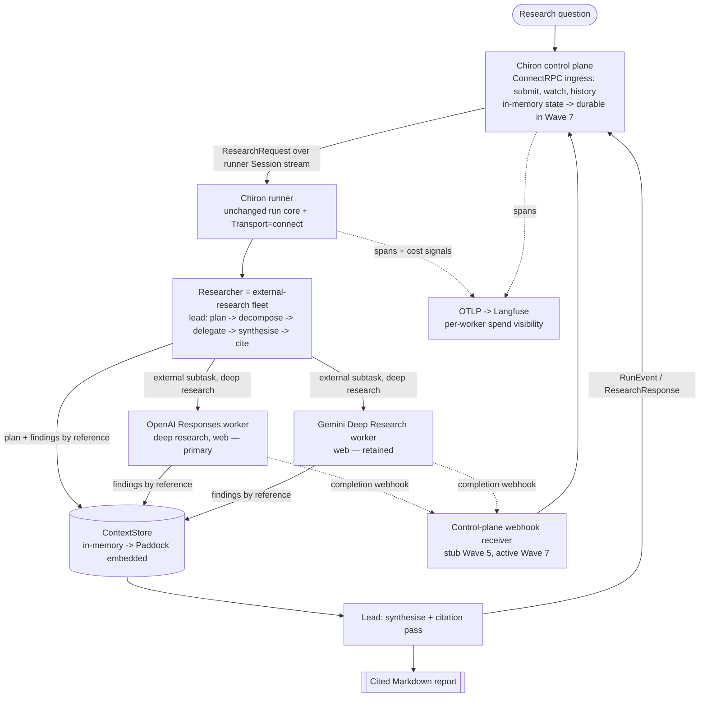

# Chiron v2 — Implementation Plan

## 0. How to read this plan

This is the working plan for the `v2` branch. It assumes v1 is complete
(`docs/DECISIONS.md`, "v1 complete", 2026-06-07) and that the v2 seams already
exist as tested stubs: `internal/researcher/fleet`, `internal/transport/grpc.go`,
`internal/memory` (`ContextStore` declared locally), and
`proto/chiron/v1/chiron.proto` (committed; generated Go not yet committed).

This revision applies `docs/V2-AMENDS.md` in full. The amendments reshape the plan,
not just its sections: the research backend moves off Vertex/Gemini onto a
provider-agnostic seam with OpenAI's Responses API primary (amend 1); budgeting is
deferred (amend 2); the await model becomes background-create + poll, with webhooks
later (amend 3); proto clients are Buf-generated (amend 4); the control-plane surface is
ConnectRPC (amend 5); v2 is external-research-only (amend 6); and observability is
elevated to a first-class concern (amend 7). Where an amendment and an older normative
statement disagree, this revision threads the amendment through and flags the
consequence rather than hiding it.

Precedence is unchanged: `docs/INTERACTIONS-API.md` > `docs/DECISIONS.md` >
`docs/PROPOSAL.md`. This plan sits below all three — where it conflicts with a
normative document, the normative document wins, and this plan is corrected. One
addition: because OpenAI's Responses API becomes the primary backend, it needs the
same normative treatment Gemini has — a new `docs/RESPONSES-API.md` with a
`last_verified` marker, created in Wave 3, sits at the same level as
`INTERACTIONS-API.md` for anything touching the OpenAI path.

The committed `proto/chiron/v1/chiron.proto`, `proto/buf.yaml`, and `proto/buf.gen.yaml`
are the v1 baseline (call it Wave 0). Every proto, plugin, or generated-code item in a
wave's deliverables is an **addition to** that baseline — never a claim that it already
exists. In particular, the committed proto today defines only the runner-facing `Session`
stream; the submission/history RPCs (D8) are added in Wave 1.

Each wave below carries: **goal**, **deliverables**, **key tasks**, **new packages /
files**, **dependencies + required `DECISIONS.md` entries**, **acceptance criteria**,
and **risks**. Waves are gated: do not start a wave until the previous wave's
acceptance criteria are met and its `DECISIONS.md` entries are written.

## 1. Decisions taken for this plan (amended 2026-06-21)

These forks were settled at planning time and then revised by `docs/V2-AMENDS.md`.
They resolve the open questions in `PROPOSAL §8` / `PADDOCK §8` for the purpose of
sequencing. Each graduates to a dated `docs/DECISIONS.md` entry in the wave that first
depends on it — this section is the provenance, `DECISIONS.md` is the record once code
lands. The "Source" column traces each decision to the amendment (or planning fork)
that drove it.

| # | Source | Decision | Consequence |
| --- | --- | --- | --- |
| D1 | Planning fork (`§8` framing) | **Full v2 roadmap, phased** into seven gated waves, external-research-only. | This document; gated delivery rather than one slice. The wave set is restructured from the prior six (see §6 preamble). |
| D2 | Amend 1 | **Provider-agnostic `Researcher` seam.** OpenAI's Responses API (deep research) is the **primary** v2 binding, authenticated via **Workload Identity Federation** on GKE; the v1 Gemini Interactions adapter is **retained** as an alternative binding; Anthropic's Messages API is a future sibling. **Vertex AI is ruled out.** | A new normative `docs/RESPONSES-API.md` (mirroring `INTERACTIONS-API.md`) — skeletoned by S1, finalised in Wave 3. Primary model bindings: `o3-deep-research-2025-06-26` (comprehensive; the `deep-research-max` equivalent, the `--agent openai-deep-research` default) and `o4-mini-deep-research-2025-06-26` (faster/cheaper, `--agent openai-deep-research-mini`), over `POST /v1/responses`. WIF→OpenAI is a **documented direct OIDC token exchange** (OpenAI's GKE guide), not an open question — S1 is a lightweight confirmation the project/org can register the OpenAI Workload Identity provider. Local dev keeps the API-key path; the WIF binding lands in Wave 7. Gemini in GKE has no Workload-Identity path for `generativelanguage.googleapis.com`, so it holds its key in a GCP-Secret-Manager backend (also Wave 7). |
| D3 | Amend 3 | **Await is background-create + poll**, replacing v1's SSE-with-poll-fallback for v2 backends; **webhook-driven completion is a future enhancement** that lands with the control-plane ingress (it needs a public endpoint). | A background create returns an interaction/response id **immediately**, then the adapter polls a GET endpoint until terminal status — it is *not* a single HTTP connection held open (the "long requests" of amend 3 means long-running background *tasks*, not held-open sockets). The pattern is identical for OpenAI (`POST /v1/responses` → poll `GET /v1/responses/{id}`) and Gemini (`POST /v1beta/interactions` → poll `GET /v1beta/interactions/{id}`); both, plus future Anthropic Messages, also support webhooks. v1's Gemini SSE path is untouched. The control plane is the natural webhook receiver (Wave 7). |
| D4 | Amend 6 + Q2 | **In-memory `ContextStore` first**, Paddock embedded later. Findings-by-reference still applies to the external multi-worker fleet. | Wave 4 ships the in-process store; Wave 6 swaps Paddock (gated by S2). |
| D5 | Amend 6 + Q2 | **External (internet) research only.** Internal sources (Stirrup research-mode workers, Gemini `file_search`, MCP) are **deferred** to a future version, once Paddock is online to enable internal context. The fleet is **retained but external-only** (Anthropic's own system is web-only). | The router's internal branch, the Stirrup client, and the spikes about Stirrup's research-mode contract / internal-source strategy all defer. |
| D6 | Amend 2 | **Defer all finance/budgeting fixes** (token and financial). No Stint in v2; the broken hard-coded cost estimate and the v1 `--budget` gate are left **as-is** — not fixed, not extended. | Spend is made **visible** (Langfuse, D7), not capped. The non-budget spend-safety invariants (§4) remain and generalise to N workers. Budget enforcement and attribution return in a future release. |
| D7 | Amend 7 | **Observability is a first-class, early wave** (Wave 2) because v2 can spend a lot of real money it cannot yet cap. Explicit CLI flags forward OTLP telemetry to **Langfuse**; per-worker / per-run spend signals are traced. | Langfuse visibility is the **interim spend control**, standing in for the deferred budget enforcement. It lands before the expensive backends (OpenAI adapter, fleet) so the first real spend is fully visible. |
| D8 | Amends 4, 5 | **ConnectRPC + Buf.** The control-plane surface is ConnectRPC, generated with Buf (adds the `connect-go` plugin). The runner outbound-dial `Session` stream stays bidi over HTTP/2; a new browser-friendly submission/history surface specifies the previously-underspecified research-submission API, anticipating a future Chiron UI. **Proto clients are Buf-generated; we never `go get` another repo's generated types.** | Wave 1 commits the Buf+Connect output; Wave 5 serves both surfaces. The local-`ContextStore` decision (DECISIONS.md, 2026-06-07) is reaffirmed by the same principle. |

## 2. Non-negotiables carried into v2

These hold in every wave. They are the v1 ground rules (`AGENTS.md`, `CLAUDE.md`)
restated for a multi-agent, networked context.

- **Research-only, structurally.** Chiron never gains write/execute capability. With
  internal sources deferred (D5) there is no Stirrup executor surface in v2 at all, so
  the invariant holds trivially this version; tests still assert the fleet exposes no
  write/edit/permission surface, so it stays unbreakable when internal workers arrive.
- **The core depends only on seams.** `internal/run` does not change. The orchestrator
  is *just another `Researcher`*, and so is each provider backend (OpenAI, Gemini,
  Anthropic) — all are `Researcher` bindings behind Start/Await/Result. The control
  plane talks to the run via the `Transport` seam. If a wave needs to touch
  `internal/run`, stop and re-examine the design.
- **No vendor AI SDKs.** The lead agent's planning/synthesis calls, the OpenAI Responses
  adapter, the (future) Anthropic Messages adapter, and any embedding calls are
  hand-rolled `net/http`. Justify every new dependency in `DECISIONS.md` before adding
  it.
- **Spend safety scales to N workers** (see §4). Budget *enforcement* is deferred (D6),
  but the spend-safety invariants that prevent waste, double-billing, and lost
  recoverability are not — they generalise to a fleet.
- **Secrets are `secret://` end to end**, scrubbed on every output path including
  ConnectRPC payloads and trace spans.
- **stdout belongs to the report**; events, prompts, diagnostics go to stderr (CLI) or
  the control-plane stream (service).
- **en-GB spelling, no emojis**, logical commits with rationale in the body, one
  `DECISIONS.md` entry per material choice per wave.

## 3. Target architecture (where the seven waves arrive)



The runner side of this diagram is v1 with two seams rebound (`Researcher = external
fleet`, `Transport = connect`) and one added (`ContextStore` non-noop). Everything left
of the runner — the control plane — is new and built in Waves 1 and 5. Internal-source
workers (Stirrup `research` mode, `file_search`, MCP) are deliberately **out of v2**
(D5) and route in once Paddock and the internal-source strategy land. Where v1 sent
spans to a generic OTLP collector, v2 forwards them explicitly to Langfuse (D7), which
is the spend-visibility substitute for the deferred budget enforcement.

## 4. Spend safety for a multi-agent run (budgeting deferred)

v1's money-safety rules (`AGENTS.md`, "Money safety") were written for one paid
interaction per run. A fleet run creates many, and v2 may spend a lot (amend 7). v2
**defers budget enforcement and cost attribution** (D6): the current estimate is broken
(hard-coded per-session costs), and fixing it — plus standing up Stint — is a future
release. What remains, and is acceptance criteria for Wave 4, is the part of "money
safety" that is about *not wasting* money and *staying recoverable*, not about *capping*
it:

- **No create is ever auto-retried** — not the lead's planning calls, not any worker's
  background create against OpenAI or Gemini. An ambiguous 5xx may already be billing.
  GETs (polls) retry freely. This is inherited from the gemini adapter (DECISIONS.md,
  "Create is never retried") and must be preserved per worker and per provider.
- **Every worker emits its interaction/response id the moment `Start` returns**, up the
  event stream, before anything else can fail — so a crashed fleet run is recoverable
  worker-by-worker, not just as a whole.
- **A broken event stream never aborts a paid run.** Transport emission stays best
  effort; await is poll-based and resilient (D3). The control plane losing a runner
  mid-run must not strand spend silently — the resume handle is the floor.
- **Bounded fan-out is a structural cap, not a budget.** The lead enforces a hard
  worker-count and per-worker call ceiling scaled to complexity, so "effort scales with
  complexity" cannot run away into unbounded spend. This guard is independent of any
  financial figure and remains even though budgeting is deferred — it is the only hard
  cap v2 has.
- **Spend visibility replaces enforcement (D7).** Because v2 cannot yet *cap* spend, it
  must *see* it: every model call — the lead's planning, each worker, the synthesis pass
  — is traced to Langfuse with token and search cost signals, per worker and rolled up
  per run. Observability is the interim control.

The v1 client-side `--budget` gate and its exit-4 ("blocked before spend") semantics are
left in place unchanged; they are not load-bearing in v2 and are superseded when
budgeting returns.

## 5. Spikes (do these before the waves they gate)

| Spike | Question | Gates | Output |
| --- | --- | --- | --- |
| **S1** | **OpenAI Responses contract + WIF confirmation.** The auth mechanism is already documented (OpenAI's GKE Workload Identity Federation guide: a projected GKE OIDC token is exchanged at OpenAI's federation endpoint for a short-lived token — no static key, no Secret Manager). S1 is a lightweight confirmation that *this* project/org can register the OpenAI Workload Identity provider and service-account mappings, plus a read of the deep-research model ids, background-mode, webhook, and response/citation shapes. (amends 1, 3) | Wave 3 (researcher binding) and Wave 7 (auth) | The skeleton of `docs/RESPONSES-API.md` (model ids, `POST /v1/responses`, await + webhook contract) and a `DECISIONS.md` note recording the confirmed WIF provider config. Only if the org blocks WIF registration does a WIF→Secret-Manager fallback apply, recorded as a deviation from D2. |
| **S2** | Paddock readiness: are Paddock M1–M3 (blob/record/recall, embedded) available to bind in Wave 6? (`PADDOCK §9`) | Wave 6 | Go/no-go for Wave 6; if not ready, the in-memory store from Wave 4 holds and Wave 6 slips without blocking 1–5. |

S1 has no spend and should run at the very start; with the WIF mechanism now documented
it is a short confirmation rather than open research, but the OpenAI deep-research
contract it captures gates Wave 3. The prior draft's S2 (Stirrup
research-mode contract) and S3 (internal-source strategy) are **deferred with internal
sources** (D5) and return when the internal-research version is planned. The Langfuse
OTLP ingestion path (endpoint, auth) is verified inside Wave 2 against Langfuse's docs
rather than as a standalone spike.

## 6. The waves

This revision restructures the prior six waves: the Stint budgets wave is **removed**
(D6); an **observability wave** (Wave 2) and a **provider-agnostic researcher / OpenAI
adapter wave** (Wave 3) are **added** ahead of the fleet so the first real spend is both
visible and on the chosen backend; the old Wave 1 transport becomes ConnectRPC (D8); and
the final GKE wave's Vertex auth becomes OpenAI-via-WIF (D2). The result is seven waves.

### Wave 1 — proto + ConnectRPC transport

**Goal.** Bind the `Transport=connect` seam for real: a runner dials a control plane and
streams the v1 run lifecycle over `proto/chiron/v1` using ConnectRPC. No orchestration
yet — this can be proven end-to-end with the existing single Gemini researcher behind the
runner.

**Deliverables.**
- Generated Go committed: `proto/chiron/v1/chiron.pb.go` plus the ConnectRPC service
  code (`chiron.connect.go`) — the `buf.build/connectrpc/go` plugin **added to**
  `buf.gen.yaml` at a pinned version (e.g. `v1.18.1`; pin whatever version is used and
  record it), and the existing `buf.build/grpc/go` plugin **removed** (v2 serves the
  `Session` bidi stream over ConnectRPC, not plain gRPC, so its stubs are redundant).
  (D8, amend 4.)
- `internal/transport/connect.go` implemented (replacing the `ErrNotImplemented` stub):
  outbound dial, `RunnerHello`, event mapping, `ResearchResponse`, `CancelRequest`
  handling, reconnect/backoff, best-effort emission.
- **Extend** `proto/chiron/v1/chiron.proto` with the previously-underspecified
  **submission/history surface** (D8): `SubmitResearch` (unary), `WatchRun`
  (server-stream), `GetRun`, `ListRuns` — browser-friendly RPCs. They are **defined in
  this wave** (added to the proto) but **served in Wave 5**; only the runner-facing
  `Session` stream is exercised this wave.

**Key tasks.**
1. Add the `buf.build/connectrpc/go` plugin (pinned) to `buf.gen.yaml`, remove the
   `buf.build/grpc/go` plugin, run `just proto`, and commit the output. Promote
   `google.golang.org/protobuf` and `google.golang.org/grpc` to **direct** dependencies
   (they already arrive transitively via the OTLP HTTP exporter — see the OTel
   `DECISIONS.md` entry — so the module-graph cost is near zero; `grpc` stays a runtime
   dependency of ConnectRPC's gRPC interop) and add `connectrpc.com/connect` with
   justification.
2. Implement `Connect.Emit` mapping each `transport.Event` kind to its `RunEvent` payload
   one-to-one (`events.go` ↔ `chiron.proto`): `run_started`→`RunStarted`,
   `interaction_created`→`InteractionCreated`, `status_changed`→`StatusChanged`,
   `delta`→`Delta`, `run_completed`→`RunCompleted`, `cost_summary`→`CostSummary`.
3. Hold one `Session` stream per runner lifetime (bidi over HTTP/2); send `RunnerHello`
   with `runner_id`, `version`, and advertised `researchers`
   (`["gemini-deep-research"]` this wave; `["openai-deep-research","fleet",...]` later).
4. Map terminal completion to `ResearchResponse` (interaction id, status, `Report`,
   `Usage`, `Citation`s) — reusing the domain→wire mapping the formatter/types already
   define.
5. Validate `CONTROL_PLANE_ADDR` at the composition root with the same rigour as
   `CHIRON_GEMINI_BASE_URL`: require TLS off-loopback; admit plaintext for loopback only;
   reject otherwise before any dial.
6. Route every string payload through `secret.Scrub` before it crosses the wire.
7. Best-effort: a failed send/dial logs and continues; it never returns an error that
   could abort a paid run (spend safety).

**New packages / files.** `proto/chiron/v1/*.pb.go` and `*.connect.go` (generated);
changes confined to `internal/transport`, plus CLI composition-root wiring to select the
`connect` transport and read/validate `CONTROL_PLANE_ADDR`.

**Dependencies + `DECISIONS.md`.** Promote `google.golang.org/grpc` and
`google.golang.org/protobuf` to direct deps; add `connectrpc.com/connect`. Write the "v2
wave binds the ConnectRPC transport" entry the existing proto decision anticipates (it
explicitly says this wave "runs `just proto`, commits the output, and justifies the
runtime dependencies"). Record: the ConnectRPC choice and why (UI-readiness, amend 5);
the Buf-generated-client principle (no `go get` of generated types, amend 4); the
two-surface split (bidi `Session` over HTTP/2 for runners; unary + server-stream for the
UI/submission API); the `CONTROL_PLANE_ADDR` validation policy; the pinned `connect-go`
plugin version and the **removal** of the `grpc/go` plugin (an update to the 2026-06-07
proto entry, which recorded `buf.build/grpc/go:v1.5.1`); and that `ResearchRequest.budget`
is **reserved for a future release and ignored by v2 runners** (D6) — add a proto comment
saying so.

**Acceptance criteria.**
- A runner with `Transport=connect` completes a real (faked-API) research run, and a test
  control plane (ConnectRPC over an in-memory / `httptest` pipe) receives hello → ordered
  run events → response.
- Stream failure mid-run does not fail the run (best-effort proven by test).
- No new lint/CI regressions; actions stay SHA-pinned.

**Risks.** Connect/grpc/protobuf widen the audited dependency tree (already linked via
OTel, so contained). Keep the runner the *client*; the control plane never dials in.
ConnectRPC bidi streaming requires HTTP/2 and is not browser-reachable — which is why the
UI surface is deliberately unary + server-stream, not the `Session` stream.

---

### Wave 2 — observability and spend visibility (Langfuse)

**Goal.** Make spend visible *before* the expensive backends land. v2 cannot yet cap
spend (D6), so it must see it (D7): explicit CLI flags forward OTLP telemetry to Langfuse,
per-run cost signals are complete, and the fleet's span/metric vocabulary is reserved
ahead of the fleet that will populate it. Harden this on the existing Gemini path so the
first OpenAI and fleet spend (Waves 3–4) is fully instrumented from the first call.

**Deliverables.**
- Explicit CLI flags forwarding OTLP to Langfuse, layered over the existing
  `OTEL_EXPORTER_OTLP_*` env path so neither replaces the other: `--otlp-endpoint <url>`
  (generic), `--langfuse-endpoint <url>` (default
  `https://cloud.langfuse.com/api/public/otel`),
  `--langfuse-public-key secret://LANGFUSE_PUBLIC_KEY`, and
  `--langfuse-secret-key secret://LANGFUSE_SECRET_KEY`. Keys resolve via `secret://` and
  are scrubbed on every output path.
- Completed per-run cost-signal instrumentation (tokens in/out/cached/tool/thought,
  search count) on every model call, ready to roll up per worker.
- `internal/trace/names.go` extended to **reserve** the fleet and control-plane
  vocabulary (`SpanDecompose`, `SpanDelegate`/per-worker, `SpanSynthesise`, `SpanCite`,
  plus the control-plane scheduling span) — names fixed now, populated in Waves 4–5.

**Key tasks.**
1. Add the forwarding flags at the composition root (the only place env is read), so a
   run can be pointed at Langfuse without setting environment variables; validate the
   endpoint with the same posture as the other security-sensitive vars (treat the
   collector address as deployment config).
2. Wire the Langfuse OTLP ingestion path: OTLP/**HTTP** (Langfuse does not accept
   OTLP/gRPC — the existing HTTP exporter is correct) to `<host>/api/public/otel`, with
   `Authorization: Basic <base64(public_key:secret_key)>` and the
   `x-langfuse-ingestion-version: 4` header for real-time display. Keys never appear in
   config, logs, or spans.
3. Confirm `secret.Scrub` covers ConnectRPC payloads and every trace attribute (parity
   with v1's guarantee for logs and SSE deltas) — add a scrub test that asserts no
   credential transits a span on the Connect path.
4. Reserve the fleet/control-plane span and metric names and document the conventions in
   `AGENTS.md` so the later waves emit a stable vocabulary.

**New packages / files.** Changes confined to `internal/cli` (flags), `internal/trace`
(Langfuse endpoint + reserved names); no new packages.

**Dependencies + `DECISIONS.md`.** No new heavy deps (the OTel SDK is already direct).
Entry: the Langfuse forwarding flags and the spend-visibility-as-interim-control stance
(amends 2 + 7); the reserved fleet/control-plane vocabulary; the Langfuse key handling.

**Acceptance criteria.**
- A real (faked-API) run forwards spans and complete cost signals to a fake
  OTLP/Langfuse collector; a scrub test proves the API key (and Langfuse keys) never
  appear in any span.
- The flags augment or override the env path without conflict; absent both, the no-op
  tracer still applies (an exporter with nowhere to send must not buffer and drop).
- The reserved fleet vocabulary is exercised by at least one synthetic test — a fake
  fleet of a single worker that emits `SpanDelegate` with a worker id — proving the
  per-worker rollup path before the real fleet exists; changing a reserved name later
  breaks this test.

**Risks.** Langfuse OTLP specifics (endpoint path, auth header) are external detail —
stated above and re-checked in-wave, kept env-compatible. The per-worker rollup cannot be
*fully* exercised until the fleet exists (Wave 4); this wave proves the pipeline with the
synthetic single-worker fleet (see acceptance) and reserves the names, with full
multi-worker validation in Wave 4.

---

### Wave 3 — provider-agnostic Researcher + OpenAI Responses adapter

**Goal.** Generalise the `Researcher` seam to provider-agnostic deep research and build
the **primary v2 backend**: a hand-rolled OpenAI Responses adapter (D2) using background
mode and poll-based await (D3), returning the same `*types.Interaction` the gemini
adapter does, so the run core is unchanged. OpenAI becomes selectable alongside Gemini.

**Gate (from Wave 2).** Do not begin this wave — which makes real, paid OpenAI calls in
integration tests — until Wave 2's acceptance holds: a run forwards spans and complete
cost signals to a Langfuse collector. Spend must be visible before it scales.

**Deliverables.**
- `internal/researcher/openai` — a hand-rolled `net/http` client over the OpenAI
  Responses API in **background** mode (no SDK), mapping the OpenAI response/citation
  shape to the domain types (`Interaction`, `Output`, `Citation`, `Usage`).
- `--agent` accepts `openai-deep-research` (→ `o3-deep-research-2025-06-26`, the default,
  comprehensive) and `openai-deep-research-mini` (→ `o4-mini-deep-research-2025-06-26`,
  faster/cheaper) alongside the Gemini `deep-research` / `deep-research-max`; the
  composition root binds the chosen provider and model. Model ids carry the date-stamped
  suffix and are pinned behind the `RESPONSES-API.md` `last_verified` marker, exactly as
  the Gemini tier ids are.
- `docs/RESPONSES-API.md` — the normative reference for the OpenAI path, with a
  `last_verified` marker, mirroring `INTERACTIONS-API.md`.
- A future-webhook seam in the await path (stubbed; activated in Wave 7 when a public
  ingress exists).
- `AGENTS.md` updated: the **security-sensitive environment variables** section gains
  `OPENAI_BASE_URL` (same posture as `CHIRON_GEMINI_BASE_URL` — never set in production;
  candidate for a release-build disable), and the per-package map gains
  `internal/researcher/openai`.

**Key tasks.**
1. Implement Responses create (`background: true`) + poll-to-terminal, with bounded reads
   everywhere and **no auto-retry on create** (spend safety, §4): an ambiguous 5xx may
   already be billing a deep-research task. GETs retry with capped backoff.
2. Refuse cross-host redirects on the OpenAI client (parity with the gemini adapter's
   C1-SEC-2 policy — the bearer token must not leak across a redirect).
3. Map the deep-research output to the domain: report text, citations/annotations, any
   generated images, and token usage → `Usage` cost signals (forwarded to Langfuse per
   Wave 2).
4. Resolve the OpenAI key as `secret://OPENAI_API_KEY` for local dev; validate an
   `OPENAI_BASE_URL`-style override with the loopback-only-http posture so the httptest
   smoke tests drive the path without real network. WIF auth is deferred to Wave 7.
5. Capture the verified API shape in `docs/RESPONSES-API.md` (closing the contract half
   of S1); keep churn behind the adapter's `last_verified` marker exactly as the Gemini
   adapter does.

**New packages / files.** `internal/researcher/openai/*`; `docs/RESPONSES-API.md`;
minimal tidy of the `internal/researcher` seam if the generalisation needs it (the seam
is already Start/Await/Result, so the change should be small).

**Dependencies + `DECISIONS.md`.** No new deps (hand-rolled `net/http`). Entries: the
provider-agnostic backend and OpenAI-primary decision (D2, closing the contract part of
S1); the new normative `RESPONSES-API.md`; the no-vendor-SDK rule reaffirmed for OpenAI;
the background-create + poll await model (D3).

**Acceptance criteria.**
- `chiron research --agent openai-deep-research --query "..."` (faked OpenAI) produces a
  cited Markdown report through the **unchanged** run core.
- A 502 on create yields exactly one create attempt (pinned by test).
- The Gemini path still works unchanged; both providers forward complete cost signals to
  Langfuse.

**Risks.** The OpenAI deep-research surface is itself preview-grade and will drift — the
`last_verified` discipline contains it, as with Gemini. Output-shape differences between
OpenAI and Gemini must be normalised **in the adapter**, never in the core or formatter.

---

### Wave 4 — external-research fleet orchestrator (+ in-memory ContextStore)

**Goal.** Implement the `Researcher=fleet` seam, **external-only** (D5): a lead agent that
plans, decomposes, delegates to parallel external workers, synthesises, and runs a
citation pass — returning a `*types.Interaction` exactly as a single researcher does, so
the run core is unchanged. Ship the **in-memory `ContextStore`** (D4) for
findings-by-reference.

**Deliverables.**
- `internal/researcher/fleet` implemented: lead planner, external-only router, bounded
  worker pool, synthesiser, citation pass — behind `Start`/`Await`/`Result`.
- `internal/memory` gains an in-process binding (`memory.InMemory` or similar) fulfilling
  `ContextStore`: `Put`/`Get` content-addressed, `OpenSession` with TTL/GC in-process;
  `Remember`/`Recall` either a simple in-memory index or an explicit stub returning
  `ErrNotImplemented` (decide in-wave; recall is not load-bearing until Paddock).
- A hand-rolled model adapter for the lead's planning/synthesis reasoning (reuse the
  OpenAI or Gemini client; `net/http`, no SDK).

**Key tasks.**
1. **Lead planning.** Decompose the question into 3–5 worker subtasks, each with the four
   fields Anthropic's article makes mandatory: *objective*, *output format*, *source
   guidance*, *boundaries*. Persist the plan to the `ContextStore` by reference.
2. **Router (external-only).** Every subtask routes to an external deep-research worker:
   OpenAI Responses (primary) or Gemini Deep Research (retained). The internal branch
   (Stirrup `research` mode, `file_search`, MCP) is deliberately absent (D5); encode the
   table so the internal branch slots in later without restructuring.
3. **Worker pool.** Synchronous-first execution (`PROPOSAL §6`: async only when payoff
   justifies coordination cost). Bounded concurrency under the §4 fan-out ceiling; each
   worker writes findings **by reference** into the `ContextStore`, returning a
   lightweight `Reference`, not the payload (avoids the multi-stage "game of telephone").
4. **Synthesis + citation pass.** Lead reads worker refs back, synthesises, then a
   citation pass attributes each claim to a source and produces the deduplicated
   `Citation` list the formatter already expects.
5. **Spend safety (acceptance — see §4).** No create auto-retry per worker or per
   provider; per-worker interaction/response ids emitted early up the `Transport`; hard
   bounded fan-out; poll-based, resilient await.
6. **Observability.** Populate the fleet spans reserved in Wave 2
   (`SpanDecompose`, `SpanDelegate`/per-worker, `SpanSynthesise`, `SpanCite`) and
   per-worker metrics (worker count, per-worker tokens/cost), rolled up per run to
   Langfuse.
7. **Research-only proof.** Demonstrate in tests that the fleet exposes no
   executor/edit/permission surface — trivially true with internal sources deferred, but
   asserted so it stays true when they arrive.

**New packages / files.** `internal/researcher/fleet/{lead,router,worker,synthesise,
cite}.go` (shape to taste); `internal/memory/inmemory.go`; possibly
`internal/researcher/fleet/model` for the planning adapter (or reuse a shared client).

**Dependencies + `DECISIONS.md`.** No Stirrup dependency (deferred with internal
sources). Entries: the fleet orchestration design; the in-memory `ContextStore` (D4) and
why recall is deferred; the planning-model choice; the multi-worker spend-safety
generalisation; the external-only routing table (D5).

**Acceptance criteria.**
- `chiron research --agent fleet --query "..."` (faked OpenAI + faked Gemini) produces a
  synthesised, cited Markdown report through the **unchanged** run core.
- Workers run in parallel; findings pass by reference; the synthesised report cites
  sources from all workers.
- Every spend-safety rule in §4 is enforced and tested; per-worker spend is visible in
  Langfuse.
- The fleet has no write/execute surface (asserted by test).

**Risks.** This is the largest wave. Delegation-brief quality directly drives result
quality (vague briefs cause duplicated/missed work — the article's central caution).
Token cost is ~15× a single chat; the cheap single-call path (a single OpenAI/Gemini
deep-research call) **must remain the default**, with the fleet opt-in. With internal
sources removed, an external-only fleet must demonstrably beat a single deep-research
call (which is itself a multi-step web agent) before the fleet is ever made default —
otherwise it is only added cost. Keep the single-call default until an eval justifies
otherwise.

---

### Wave 5 — control plane service (ConnectRPC ingress)

**Goal.** Build the server the runner dials: it accepts research questions over the
ConnectRPC submission API, schedules them onto connected runners over the `Session`
stream, relays run events, stores results, and serves history/get/watch. In-memory state
(durability deferred to Wave 7).

**Deliverables.**
- `internal/controlplane` (core, pure-ish, in-memory store) + `cmd/chiron-control` (the
  service entrypoint, mirroring `cmd/chiron`'s thinness).
- The `ControlPlaneService` server side of `proto/chiron/v1`: accept `RunnerHello`,
  dispatch `ResearchRequest`, consume `RunEvent`/`ResearchResponse`, issue
  `CancelRequest`.
- The **submission/history surface** served over ConnectRPC (D8): `SubmitResearch`
  (unary), `WatchRun` (server-stream), `GetRun`, `ListRuns` — the UI-ready surface
  specified in Wave 1.

**Key tasks.**
1. Runner registry keyed by `runner_id`, tracking advertised `researchers` so scheduling
   can match a request to a capable runner.
2. Scheduling: assign a `run_id`, **match the request only to a runner whose advertised
   `researchers` list includes the required provider** (the rule `RunnerHello.researchers`
   from Wave 1 enables — a test asserts a request needing `openai-deep-research` is not
   dispatched to a runner advertising only `gemini-deep-research`), send `ResearchRequest`
   down the stream, fan run events to `WatchRun` subscribers, and persist the terminal
   `ResearchResponse` in the in-memory store. Leave `ResearchRequest.budget` unset — it is
   reserved and ignored in v2 (D6).
3. History/get: `GetRun`/`ListRuns` re-serve a completed run by `run_id`, and surface the
   underlying interaction id so `chiron get <id>` remains the cross-process recovery path
   while durability is deferred.
4. Tenancy scaffolding: thread `namespace` end-to-end (it is already on
   `ResearchRequest`) so Wave 6's `ContextStore` isolation has it.
5. Security: server-side TLS, runner authentication (how a runner proves identity to the
   control plane — decide and record); scrub all logged payloads.
6. Webhook receiver stub: the ingress is the natural place to receive provider completion
   webhooks (D3); stub it here, activate it in Wave 7 when the service is publicly
   reachable. The first wave that needs a provider webhook schema also updates the
   relevant normative doc — `INTERACTIONS-API.md` for Gemini's webhook events
   (`interaction.completed`/`failed`/`cancelled`/`requires_action`, the `webhook-timestamp`
   replay-protection header, static vs dynamic configuration) and `RESPONSES-API.md` for
   OpenAI's — so Wave 7 implements against a normative reference, not memory.

**New packages / files.** `internal/controlplane/*`, `cmd/chiron-control/main.go`,
`internal/controlplane/store` (in-memory; the seam where Wave 7 durability swaps in).

**Dependencies + `DECISIONS.md`.** No new heavy deps beyond Wave 1's Connect. Entries: the
control-plane component boundary; in-memory state and the explicit durability deferral
(Wave 7) with its recovery-story caveat; the runner-authentication mechanism; the
ConnectRPC submission surface (amend 5) and its browser-friendly shape.

**Acceptance criteria.**
- End-to-end in-process test: control plane + one runner (`Researcher=fleet`, faked
  workers) complete a question → report round-trip over the real `Session` stream.
- A UI-style client submits via `SubmitResearch` and follows progress via `WatchRun`.
- Cancel works; a runner disconnect is handled without crashing the control plane (the
  run is marked recoverable by interaction id, not lost silently).

**Risks.** Scope creep toward a full scheduler. Keep it minimal: register, dispatch,
relay, store, get, watch. Anything more is a later concern.

---

### Wave 6 — Paddock interlock

**Goal.** Replace the in-memory `ContextStore` with **Paddock embedded** (`PADDOCK §6`,
"Embedded" shape), binding structurally to the local `memory.ContextStore` (no hard
dependency, per the 2026-06-07 decision and reaffirmed by D8). Gated by S2.

**Deliverables.**
- A Chiron-side adapter in `internal/memory/paddock` that constructs a Paddock embedded
  store and satisfies `internal/memory.ContextStore` by Go **structural typing** — Chiron
  imports Paddock's concrete embedded implementation package, never `paddockapi`'s
  interface types, so neither project hard-depends on the other's contract (the 2026-06-07
  decision, reaffirmed by D8). Any Paddock *gRPC* surface would be a Buf-generated client;
  embedded (in-process) needs none.
- `ResearchConfig` wiring to select `memory: inmemory | paddock-embedded`.
- Validation of the lead/worker findings-by-reference flow against real Paddock (this is
  Paddock's own M6 from the other side).

**Key tasks.**
1. Confirm the local `memory.ContextStore` and `paddockapi.ContextStore` are structurally
   identical; reconcile any drift in the seam (the local interface is the contract Chiron
   defends).
2. Bind Paddock embedded (filesystem blob + SQLite record + chromem-go recall, per
   `PADDOCK §3`); `Remember`/`Recall` now become real.
3. Thread tenant `namespace` into Paddock isolation on every call.
4. `secret://` for any Paddock backend credentials; scrub.
5. Keep `inmemory` as a fallback binding for tests and air-gapped dev so Chiron stays
   buildable and testable without Paddock.

**New packages / files.** `internal/memory/paddock` (the adapter); config plumbing.

**Dependencies + `DECISIONS.md`.** Paddock embedded behind the structural seam — justify.
Entry: the Paddock binding, the structural-satisfaction confirmation, and the
recall-now-real change.

**Acceptance criteria.**
- A fleet run uses Paddock embedded for plan + findings-by-reference + final-report
  `Remember`; a subsequent run can `Recall` related prior memory.
- `inmemory` remains a working binding; the swap is config-only, core untouched.

**Risks.** Couples the v2 timeline to Paddock delivery. If S2 is no-go, this wave slips;
Waves 1–5 do not depend on it (they run on `inmemory`).

---

### Wave 7 — GKE deployment, OpenAI WIF auth, durability, rainbow

**Goal.** Run the control plane and runners on GKE with keyless auth, surviving rollouts,
with in-flight runs durable. This is where D2 (OpenAI via Workload Identity Federation)
and the deferred D3 webhook completion and D4/durability are paid down.

**Deliverables.**
- Container images and GKE manifests for `chiron-control` and the runner.
- The **OpenAI Responses path authenticated by Workload Identity Federation** (per S1)
  and a GCP Secret Manager / Workload Identity `Secret` backend — no static keys in the
  cluster.
- **Webhook-driven completion**: the control plane (now publicly reachable) receives
  provider completion webhooks and releases the awaiting run; poll remains the fallback
  (D3).
- A durable substrate behind the control-plane store (NATS JetStream is the leading
  candidate per `PROPOSAL §8`; confirm at this wave) and **rainbow deployments** so
  in-flight runs survive a rollout.
- Release-build hardening of the security-sensitive env vars.

**Key tasks.**
1. Implement OpenAI auth via Workload Identity Federation per OpenAI's GKE guide: register
   an OpenAI Workload Identity provider, configure the service-account mappings, mount the
   projected GKE OIDC token on the pod, and exchange it at OpenAI's federation endpoint for
   a short-lived token at runtime (hand-rolled `net/http`; no static key, no Secret Manager
   for OpenAI). Record the provider config. Only if the org blocks WIF registration does
   the WIF→Secret-Manager fallback apply, as a recorded deviation from D2.
2. New `Secret` backend: GCP Secret Manager via Workload Identity, fulfilling the
   `secret://gcp/...` resolver seam (the grammar already anticipates it).
3. Activate the webhook receiver stubbed in Wave 5: verify provider webhook signatures,
   correlate to the awaiting run, and release it; fall back to poll if a webhook is
   missed.
4. Swap the Wave-5 in-memory control-plane store for the durable substrate; add
   checkpoint/resume so a run survives control-plane restart, not just the runner's
   interaction-id handle.
5. Rainbow deployment strategy (`PROPOSAL §6`, reliability): in-flight runs drain across a
   rollout rather than restart (errors compound in stateful agents — resume, don't
   restart).
6. Disable the base-URL overrides for both providers (`CHIRON_GEMINI_BASE_URL`,
   `OPENAI_BASE_URL`) and lock the OTLP/Langfuse endpoints to operator Secrets in release
   builds — `AGENTS.md` flags the Gemini one; add the OpenAI sibling and consider a build
   tag for both overrides.

**New packages / files.** `internal/secret` gains the GCP backend; `internal/researcher/
openai` (and/or `gemini`) gains the WIF auth path; `deploy/` manifests; `Dockerfile`(s);
durability binding behind the Wave-5 store seam; the control-plane webhook handler.

**Dependencies + `DECISIONS.md`.** Possibly a GCP auth/metadata client and a NATS client
— justify each. Entries: the OpenAI WIF binding (closing S1 and D2), the Secret Manager
backend, the webhook completion path (closing the D3 future-work), the durability
substrate, the release-build hardening; and a note that Gemini's
`generativelanguage.googleapis.com` endpoint has no Workload-Identity/ADC path, so Secret
Manager is its keyless mechanism (the basis for D2's Gemini caveat).

**Acceptance criteria.**
- The service runs on GKE with **no static OpenAI key** (WIF token exchange per S1/D2);
  the Gemini path holds its key in GCP Secret Manager (the `secret://gcp/...` backend),
  never in a container image or plain env var. A rollout does not abort in-flight runs; a
  control-plane restart resumes (not restarts) running work.
- The webhook completion path is exercised end-to-end; poll fallback covers a missed
  webhook.
- The base-URL overrides are absent from release builds.

**Risks.** The heaviest infra wave and the most external unknowns: WIF→OpenAI feasibility
(the biggest, mitigated by running S1 first), webhook signature verification and replay
safety, NATS-vs-engine, and rainbow mechanics. Each is isolated behind a seam so a
setback here does not reach back into the run core or the orchestrator.

## 7. Cross-cutting concerns (every wave)

- **Security review** each wave touching the wire, auth, or the provider boundary:
  research-only enforcement, control-plane address/identity validation, TLS, redirect
  policy parity with v1 (bearer/api-key must not leak across redirects, both providers),
  webhook signature verification (Wave 7), scrubbing across ConnectRPC and traces, tenant
  isolation.
- **Observability is a pillar, not a footnote (D7).** v2 spends real money it cannot yet
  cap, so every model call is traced to Langfuse with per-worker and per-run cost
  signals; the vocabulary is fixed once in `trace/names.go` (reserved in Wave 2,
  populated in Waves 4–5) and kept stable. This is the interim spend control until
  budgeting returns.
- **Testing posture (unchanged from v1).** No real network: ConnectRPC over an in-memory
  / `httptest` pipe, fakes for OpenAI/Gemini/Paddock, golden files for synthesised
  reports. Server lifecycle owned at the call site; table loops named `tt`; any remaining
  SSE tests use the `sseWrite`/`Flush` helper. (Stirrup/Stint fakes are not needed in v2
  — both are deferred.)
- **Docs discipline.** Each wave updates `AGENTS.md`'s per-package map, adds its
  `DECISIONS.md` entries, keeps `INTERACTIONS-API.md` normative for the Gemini path, and
  keeps the new `RESPONSES-API.md` normative for the OpenAI path.

## 8. Sequencing summary

```
Spike S1 (OpenAI auth + deep-research contract, no spend) ── gates W3, W7

Wave 1 (proto + ConnectRPC transport)
   └─► Wave 2 (observability + Langfuse) ── gates the expensive waves below
          └─► Wave 3 (provider-agnostic Researcher + OpenAI Responses adapter)
                 └─► Wave 4 (external-research fleet + in-memory ContextStore)
                        └─► Wave 5 (control plane, ConnectRPC ingress)
                               ├─► Wave 6 (Paddock interlock) ◄── S2 gates
                               └─► Wave 7 (GKE + OpenAI WIF auth + webhooks + durability)
```

Waves 1→2→3→4→5 are the critical path to a running external-research service on
in-memory state, with spend visible from Wave 2 onward. Wave 2 gates the waves that
spend real money (do not run the OpenAI adapter or the fleet without the telemetry to see
the spend). Wave 6 (Paddock) depends only on the Wave-4 `ContextStore` seam and is gated
by S2; it can interleave after Wave 5. Wave 7 depends on the control plane (for webhooks)
and on S1 (for auth), and closes the deferred decisions.

## 9. What this plan deliberately does not do

- It does not modify `internal/run`. If a wave seems to require it, the design is wrong.
- It does not build an eval framework (Stirrup's), a permission engine, executors, or
  safety rings (Chiron is research-only).
- It does not build **internal-source research** (Stirrup `research` mode, Gemini
  `file_search`, MCP) in v2 — deferred to a future version once Paddock is online (D5,
  amend 6).
- It does not fix or build out **budgeting / cost attribution** in v2 — no Stint, no
  cost-estimate fixes (D6, amend 2). Spend is made visible (Langfuse), not capped.
- It does not use **Vertex AI** — the auth path is OpenAI Responses via Workload Identity
  Federation (D2, amend 1).
- It does not rely on **SSE** for v2 await — background create + poll now, webhooks later
  (D3, amend 3). v1's SSE path is untouched.
- It does not commit to async workers or a workflow engine before the synchronous-first
  baseline justifies them.
- It does not hold pricing tables; Chiron keeps a (currently broken, deferred) planning
  estimate only until budgeting returns as a suite concern.

## 10. References

- `docs/V2-AMENDS.md` — the seven amendments this 2026-06-21 revision applies.
- `docs/PROPOSAL.md` §6 (the v2 vision and the load-bearing seams) — note its diagram
  labels `Researcher = stirrup-fleet` and `Transport = grpc` are **superseded** here: the
  researcher is the external-research fleet (D5) and the transport is ConnectRPC (D8); §8
  (the open decisions this plan settles), §9 (M7, the seams already in place).
- `docs/INTERACTIONS-API.md` — normative for the Gemini path (retained backend, D2).
- `docs/RESPONSES-API.md` — to be created in Wave 3; normative for the OpenAI Responses
  path (primary backend, D2), with a `last_verified` marker mirroring INTERACTIONS-API.md.
- `docs/PADDOCK.md` — the `ContextStore`-fulfilling companion project (D4, Wave 6).
- `docs/DECISIONS.md` — 2026-06-07 "proto/chiron/v1 is committed; generated Go is not"
  (Wave 1's mandate), "ContextStore is declared locally" (Wave 6's structural binding),
  "v1 complete" (the baseline).
- `proto/chiron/v1/chiron.proto` — the outbound-dial control-plane contract Waves 1 and 5
  implement, extended with the ConnectRPC submission surface (D8).
- OpenAI — Responses API (deep research, background mode, webhooks). The verified shape is
  captured in `docs/RESPONSES-API.md`.
- Anthropic — Messages API (a future provider sibling under the generalised seam, D2).
- ConnectRPC + Buf — the transport and codegen toolchain (D8, amends 4–5).
- Langfuse — OTLP trace ingestion, the spend-visibility backend (D7, amend 7).
- Anthropic, *How we built our multi-agent research system* (2025-06-13),
  https://www.anthropic.com/engineering/multi-agent-research-system — the
  orchestrator-worker pattern (itself web-only), delegation discipline,
  findings-by-reference, and the resume-don't-restart reliability stance Waves 4–7 follow.
