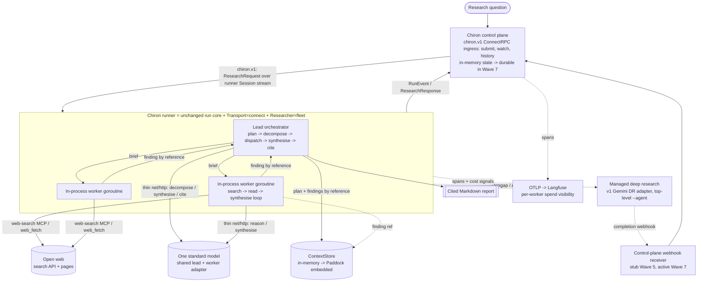

# Chiron v2 — Implementation Plan

## 0. How to read this plan

> **Direction update (2026-06-22) — read first.** After a build-vs-buy pressure-test of the
> Stirrup dependency, v2's **critical path is a lean, in-process, homegrown research loop on a
> single provider**, with Stirrup deferred to a later **embedded-engine** adoption (not a remote
> K8s-job harness). See `docs/V2-AMENDS.md` amend 8 and `docs/V2-RESEARCH-AGENT.md` §0 for the decision.
> The waves below have been **re-seated** onto that direction; the former Stirrup-remote content
> (`stirrup.harness.v1` / `HarnessService` server / K8s-Job provisioning, SP-B, SP-D) now lives
> in the **Scale-out track (deferred)** at the end of §6, pursued only after the Wave 4 eval
> gate. The "harness engine" refactor that scale-out would need is captured for Stirrup in
> `docs/STIRRUP-ENGINE-PROPOSAL.md` (a by-product; not assumed to be accepted).

This is the working plan for the `v2` branch. It assumes v1 is complete
(`docs/DECISIONS.md`, "v1 complete", 2026-06-07) and that the v2 seams already
exist as tested stubs: `internal/researcher/fleet`, `internal/transport/grpc.go`,
`internal/memory` (`ContextStore` declared locally), and
`proto/chiron/v1/chiron.proto` (committed; generated Go not yet committed).

The researcher core — what the fleet actually runs — is designed in
`docs/V2-RESEARCH-AGENT.md` (2026-07-01 revision, which assumes the prove-first pivot throughout). This plan
re-seats its Wave 3–4 researcher waves and spikes onto that design: the fleet is a lead
orchestrator whose workers are a **lean, in-process research loop on a single frontier
model** (see §1 D2/D9 and §5), while the service scaffolding (Waves 1, 2, 5, 6) stays
intact. The Stirrup-remote material (the `stirrup.harness.v1` `HarnessService` server, K8s
Jobs, the Wave 1 second Buf target, SP-B, SP-D) is **deferred to the scale-out track**
(end of §6) — Stirrup is adopted later as an *embedded engine*, not a remote harness.

This revision applies `docs/V2-AMENDS.md` in full (amends 1–7, then amend 8, the
prove-first pivot) and re-seats the researcher core on `docs/V2-RESEARCH-AGENT.md`. The
amendments reshape the plan, not just its sections: the research backend becomes Chiron's
**own** research-agent fleet — a lead orchestrator over a homegrown web-search loop — with
managed deep research kept only as a top-level stopgap and the eval baseline (amends 1, 6);
budgeting is deferred (amend 2); the await model is background-create + poll for the managed
stopgap, and in-process await for the homegrown workers (amend 3; the `stirrup.harness.v1`
event stream is the deferred scale-out path); the control-plane surface is ConnectRPC over
Buf-generated `chiron.v1` (amends 4, 5; the second `stirrup.harness.v1` target is deferred);
v2 is external-research-only (amend 6); observability is elevated to a first-class concern
(amend 7); and v2's critical path is the in-process loop, with Stirrup deferred to an
embedded-engine adoption (amend 8). Where an amendment and an older normative statement
disagree, this revision threads the amendment through and flags the consequence rather than
hiding it.

Precedence is unchanged: `docs/INTERACTIONS-API.md` > `docs/DECISIONS.md` >
`docs/PROPOSAL.md`. This plan sits below all three — where it conflicts with a
normative document, the normative document wins, and this plan is corrected.
`docs/INTERACTIONS-API.md` stays normative for the Gemini path (now the stopgap + eval
baseline). For v2's critical path Chiron hand-rolls a **thin `net/http` adapter to one
standard model** for both the lead and the in-process worker (SP-C, `V2-RESEARCH-AGENT.md`
§3) — SDK-free, like the v1 Gemini adapter; v2 adds **no** `docs/RESPONSES-API.md` (no
full OpenAI Responses adapter is built). When Stirrup is later adopted as an embedded engine
it owns the multi-provider adapters; that and the `stirrup.harness.v1` contract are the
deferred scale-out track (§6), confirmed by spike before code rather than restated here as
normative.

The committed `proto/chiron/v1/chiron.proto`, `proto/buf.yaml`, and `proto/buf.gen.yaml`
are the v1 baseline (call it Wave 0). Every proto, plugin, or generated-code item in a
wave's deliverables is an **addition to** that baseline — never a claim that it already
exists. In particular, the committed proto today defines only the runner-facing `Session`
stream; the submission/history RPCs (D8) are added in Wave 1.

Each wave below carries: **goal**, **deliverables**, **key tasks**, **new packages /
files**, **dependencies + required `DECISIONS.md` entries**, **acceptance criteria**,
and **risks**. Waves are gated: do not start a wave until the previous wave's
acceptance criteria are met and its `DECISIONS.md` entries are written.

## 1. Decisions taken for this plan (amended 2026-06-21)

These forks were settled at planning time and then revised by `docs/V2-AMENDS.md`.
They resolve the open questions in `PROPOSAL §8` / `PADDOCK §8` for the purpose of
sequencing. Each graduates to a dated `docs/DECISIONS.md` entry in the wave that first
depends on it — this section is the provenance, `DECISIONS.md` is the record once code
lands. The "Source" column traces each decision to the amendment (or planning fork)
that drove it.

| # | Source | Decision | Consequence |
| --- | --- | --- | --- |
| D1 | Planning fork (`§8` framing) | **Full v2 roadmap, phased** into seven gated waves, external-research-only. | This document; gated delivery rather than one slice. The wave set is restructured from the prior six (see §6 preamble). |
| D2 | Amends 1, 8 + V2-RESEARCH-AGENT.md §0 | **The `Researcher` is Chiron's homegrown research-agent fleet — workers are a lean in-process loop on one model (prove-first).** A Chiron lead orchestrator decomposes a question, dispatches several **in-process research workers** (a search→read→synthesise loop on a single standard frontier model + a web-search tool), then synthesises and cites. **Managed deep research** (the v1 Gemini DR adapter) is **retained as a top-level stopgap researcher + the eval baseline**, never the production backend. | Chiron hand-rolls a **thin `net/http` adapter to one model** (shared by the lead and the worker; SP-C/§3), SDK-free; it builds **no** full OpenAI Responses adapter and **no** `docs/RESPONSES-API.md`. The drifted `o3`/`o4-mini-deep-research` bindings are **dropped**. Multi-model + keyless credential federation (Azure OpenAI `azure-workload-identity`, `anthropic-wif`, Gemini Vertex) are **deferred to the scale-out track** with Stirrup (D9). The managed Gemini DR stopgap holds its `generativelanguage.googleapis.com` key in a GCP Secret Manager backend (Wave 7). The web-search loop is the central spike, SP-A. See `docs/V2-RESEARCH-AGENT.md` §0, §3, §5. |
| D3 | Amend 3 + V2-RESEARCH-AGENT.md | **Await is split by path.** The **managed stopgap** (Gemini DR) uses **background-create + poll** (replacing v1's SSE-with-poll-fallback); the **in-process homegrown workers** are awaited **in-process** (goroutines under the lead), not over a wire stream. **Webhook-driven completion** for the managed stopgap is a future enhancement that lands with the public control-plane ingress (Wave 7). | A managed background create returns an interaction id **immediately**, then the adapter polls `GET` until terminal — *not* a held-open socket. In-process workers need no harness stream; the §4 spend-safety rules apply per worker in-process. When Stirrup is later adopted (D9), worker await moves to the `stirrup.harness.v1` event stream and the "a broken event stream never aborts a paid run" rule extends to it. v1's Gemini SSE path is untouched; the control plane is the natural webhook receiver for the managed stopgap (Wave 7). |
| D4 | Amend 6 + Q2 | **In-memory `ContextStore` first**, Paddock embedded later. Findings-by-reference still applies to the multi-worker fleet. | Wave 4 ships the in-process store; Wave 6 swaps Paddock (gated by S2). |
| D5 | Amend 6 + V2-RESEARCH-AGENT.md | **External (internet) research only.** v2 workers read the **open web** (web-search MCP + `web_fetch`) via the in-process loop. What defers is the **internal *source tools*** — repo-scoped MCP, Gemini `file_search` — i.e. *where* a worker reads, not *that* workers exist; they route in once Paddock lands. | The router is external-web-only and its internal branch defers (encoded so it slots in later). `PROPOSAL §6`'s `Researcher = stirrup-fleet` becomes the **scale-out** target (D9), not the v2 critical-path researcher; the transport is still ConnectRPC (D8). The web-search spike (SP-A) is the crux of the in-process worker. |
| D6 | Amend 2 | **Defer all finance/budgeting fixes** (token and financial). No Stint in v2; the broken hard-coded cost estimate and the v1 `--budget` gate are left **as-is** — not fixed, not extended. | Spend is made **visible** (Langfuse, D7), not capped. The non-budget spend-safety invariants (§4) remain and generalise to N workers. Budget enforcement and attribution return in a future release. |
| D7 | Amend 7 | **Observability is a first-class, early wave** (Wave 2) because v2 can spend a lot of real money it cannot yet cap. Explicit CLI flags forward OTLP telemetry to **Langfuse**; per-worker / per-run spend signals are traced. | Langfuse visibility is the **interim spend control**, standing in for the deferred budget enforcement. It lands before the expensive backend (the worker fleet) so the first real spend is fully visible. |
| D8 | Amends 4, 5 + V2-RESEARCH-AGENT.md | **ConnectRPC + Buf, one target for v2 (`chiron.v1`).** The control-plane surface is ConnectRPC, generated with Buf (adds the `connect-go` plugin). The runner outbound-dial `Session` stream stays bidi over HTTP/2; a new browser-friendly submission/history surface specifies the previously-underspecified research-submission API, anticipating a future Chiron UI. **Proto clients/servers are Buf-generated from each contract's `.proto`; we never `go get` another repo's generated types.** | Wave 1 commits the Buf+Connect output for `chiron.v1` (served/dialled); Wave 5 serves both `chiron.v1` surfaces. The **second target, `stirrup.harness.v1`**, is **deferred to the scale-out track** (D9) — generated only if/when Stirrup is adopted. The local-`ContextStore` decision (DECISIONS.md, 2026-06-07) is reaffirmed by the same principle. |
| D9 | Amend 8 + V2-RESEARCH-AGENT.md §0 | **Prove-first; Stirrup deferred to an embedded engine.** v2's critical path is the lean in-process loop (D2); the heavy Stirrup-remote apparatus (`HarnessService` server, K8s Jobs, image pinning, RBAC, endpoint auth) is **not** built until the eval gate (SP-F) is met *and* scale/multi-model justify it. When adopted, Stirrup is an **embedded engine** (a deps-light providers + credential-federation + loop module imported in-process), **not** a remote K8s-job harness. | The wire `stirrup.harness.v1` target (D8), SP-B and SP-D all move to the **scale-out track** (§6). The worker sits behind the same `Researcher` seam / `ContextStore` / prompts / eval as a future engine worker, so the swap is a binding change, not a re-architecture. Stirrup is a multi-consumer platform; Chiron is the forcing function for the engine refactor (captured in `docs/STIRRUP-ENGINE-PROPOSAL.md`). |

## 2. Non-negotiables carried into v2

These hold in every wave. They are the v1 ground rules (`AGENTS.md`, `CLAUDE.md`)
restated for a multi-agent, networked context.

- **Research-only, structurally.** Chiron never gains write/execute capability. v2's
  in-process workers are Chiron code with exactly two **read-only network tools** — a
  web-search MCP and `web_fetch` — and **no** executor, file-write, or shell surface at all,
  so the invariant holds **by construction** (there is nothing to deny). The fleet exposes no
  executor/edit/permission surface of its own; a worker that reaches for a side-effecting tool
  is a **defect** that fails the run in test (see `V2-RESEARCH-AGENT.md` §1). (When Stirrup
  is later adopted, `mode:"research"` + `deny-side-effects` + `ValidateRunConfig` re-add the
  same guarantee enforced upstream — D9.)
- **The core depends only on seams.** `internal/run` does not change. The fleet is *just
  another `Researcher`*, and so are the in-process worker and the managed Gemini DR stopgap —
  all are `Researcher` bindings behind Start/Await/Result. For v2 the worker's provider call
  is Chiron's own thin `net/http` adapter (D2); a future Stirrup **embedded engine** owns the
  multi-provider adapters and swaps in behind the *same* seam (D9). The control plane talks to
  the run via the `Transport` seam. If a wave needs to touch `internal/run`, stop and
  re-examine the design.
- **No vendor AI SDKs.** Chiron hand-rolls every provider call as `net/http`. What Chiron
  writes for v2 is the lead orchestrator's control flow, **one thin `net/http` adapter to a
  single standard model** shared by the lead's decompose/synthesise/cite calls *and* the
  worker's search→read→synthesise loop (SP-C, `docs/V2-RESEARCH-AGENT.md` §5), and the
  web-search MCP client; the retained v1 Gemini DR stopgap is already hand-rolled. Any
  embedding calls stay `net/http`. The deferred Stirrup engine is itself SDK-free. Justify
  every new dependency in `DECISIONS.md` before adding it.
- **Spend safety scales to N workers** (see §4). Budget *enforcement* is deferred (D6),
  but the spend-safety invariants that prevent waste, double-billing, and lost
  recoverability are not — they generalise to a fleet.
- **Secrets are `secret://` end to end**, scrubbed on every output path including
  ConnectRPC payloads and trace spans.
- **stdout belongs to the report**; events, prompts, diagnostics go to stderr (CLI) or
  the control-plane stream (service).
- **en-GB spelling, no emojis**, logical commits with rationale in the body, one
  `DECISIONS.md` entry per material choice per wave.

## 3. Target architecture (where the seven waves arrive)



The runner side is v1 with two seams rebound (`Researcher = fleet`, `Transport = connect`)
and one added (`ContextStore` non-noop). For v2 the fleet's workers are a **lean, in-process
research loop on a single standard model** (D2/D9): the lead fans out goroutine workers, each
looping search→read→synthesise over a **web-search MCP + `web_fetch`**, and both the lead's
judgement calls and the worker's reasoning go through **one thin hand-rolled `net/http`
adapter** to that model. Everything left of the runner — the control plane — is new and built
in Waves 1 and 5. **Managed deep research** (Gemini DR) is a **top-level stopgap researcher +
the eval baseline** (D2), selected as its own `--agent`, *outside* the fleet — it is the only
path that uses the webhook receiver. Internal-*source* tools (repo-MCP, Gemini `file_search`)
are deliberately **out of v2** (D5) and route in once Paddock lands; the web-search tool
workers use is external (SP-A). Where v1 sent spans to a generic OTLP collector, v2 forwards
them explicitly to Langfuse (D7), the spend-visibility substitute for deferred budget
enforcement.

**Scale-out (deferred, D9).** When the eval gate (SP-F) is met and scale/multi-model justify
it, the in-process worker is swapped — behind the *same* `Researcher` seam — for a **Stirrup
embedded engine** (multi-provider adapters + credential federation + the loop, imported
in-process), or, only if hard per-worker process isolation is ever required, for remote
`stirrup.harness.v1` workers. That topology is the deferred reference at the end of §6 and in
`docs/V2-RESEARCH-AGENT.md` §0 and §9.

## 4. Spend safety for a multi-agent run (budgeting deferred)

v1's money-safety rules (`AGENTS.md`, "Money safety") were written for one paid
interaction per run. A fleet run creates many, and v2 may spend a lot (amend 7). v2
**defers budget enforcement and cost attribution** (D6): the current estimate is broken
(hard-coded per-session costs), and fixing it — plus standing up Stint — is a future
release. What remains, and is acceptance criteria for Wave 4, is the part of "money
safety" that is about *not wasting* money and *staying recoverable*, not about *capping*
it:

- **No create is ever auto-retried** — not the lead's judgement calls, not a worker's model
  call (an ambiguous 5xx may already be billing), not the managed stopgap's background create.
  GETs (polls) and idempotent reconnects retry freely. This is inherited from the gemini
  adapter (DECISIONS.md, "Create is never retried") and must be preserved per worker and per
  call.
- **Per-loop structural caps are enforced in the worker loop.** Each in-process worker carries
  a hard turn cap, a token/cost ceiling, and a wall-clock timeout; a runaway worker
  self-terminates. Bounded fan-out × these per-worker caps is a hard, if coarse, ceiling —
  Chiron's own counters, not a budgeting system (D6). (When Stirrup is later adopted, these
  come for free as `max_turns`/`max_token_budget`/`max_cost_budget`/`timeout` on each job.)
- **Every worker's completed findings are written by reference as it goes**, so a crashed fleet
  run is recoverable worker-by-worker from the `ContextStore` plus the run's interaction id —
  not just as a whole. (Under the deferred Stirrup engine, the per-worker `run_id` is the resume
  handle and is emitted early — D3/D9.)
- **A broken stream never aborts a paid run.** Transport emission (runner→control plane) stays
  best effort; the managed stopgap's await is poll-based. In-process workers have no wire stream
  to drop, so the only stream that matters is the control-plane↔runner one — losing it must not
  strand spend silently (the run stays recoverable by interaction id + `ContextStore`).
- **Bounded fan-out is a structural cap, not a budget.** The lead enforces a hard
  worker-count and per-worker call ceiling scaled to complexity, so "effort scales with
  complexity" cannot run away into unbounded spend. This guard is independent of any
  financial figure and remains even though budgeting is deferred.
- **Spend visibility replaces enforcement (D7).** Because v2 cannot yet *cap* spend, it
  must *see* it: every model call — the lead's judgement calls, each worker's loop, the
  synthesis pass — is traced to Langfuse with token and search cost signals, per worker and
  rolled up per run. Observability is the interim control.

The v1 client-side `--budget` gate and its exit-4 ("blocked before spend") semantics are
left in place unchanged; they are not load-bearing in v2 and are superseded when
budgeting returns.

## 5. Spikes (do these before the waves they gate)

The researcher-core spikes are defined in `docs/V2-RESEARCH-AGENT.md` §7 and §9 and reproduced
here with the waves they gate. Per the prove-first pivot (amend 8/D9), **SP-A, SP-C, SP-E, SP-F
are the v2 critical-path spikes** (they define the in-process worker, the lead+worker model
substrate, the findings store, and the quality gate); **SP-B and SP-D move to the deferred
scale-out track** (they concern Stirrup-remote dispatch and multi-provider keyless auth). The
prior `S1` (OpenAI deep-research contract + WIF) stays **retired**.

| Spike | Question | Gates | Output |
| --- | --- | --- | --- |
| **SP-A** (the crux) | **Web-search loop — RESOLVED (`V2-RESEARCH-AGENT.md` §3):** the in-process worker drives a search→read→synthesise loop over a **Streamable-HTTP MCP search server** (Tavily/Exa/Brave/SearxNG) + `web_fetch`; native scraping is discounted (datacentre CAPTCHAs). Remaining before Wave 3: prove the loop reaches Gemini-DR grade and pick the search API. (A provider's own built-in `web_search` is a later option, via the scale-out engine.) | Waves 3, 4 | The worker's tool set (MCP search + `web_fetch`) + research prompt; recorded in `DECISIONS.md` when Wave 3 lands. |
| **SP-B** | **Stirrup dispatch — RESOLVED but DEFERRED (scale-out track, §6; `V2-RESEARCH-AGENT.md` §9):** if/when Stirrup is adopted as a *remote* harness, the runner is its control plane (Deployment + Service serving `HarnessService`, one K8s Job per worker). The prove-first path runs workers **in-process**, so this does not gate v2. | Scale-out track | The remote runner↔worker shape, retained as reference; not built for v2. |
| **SP-C** | **Lead (and worker) substrate — RESOLVED (`V2-RESEARCH-AGENT.md` §3):** the lead's decompose/synthesise/cite are **thin hand-rolled `net/http` calls to one standard model** (provider-native structured output for decompose/cite, where deterministic parsing matters); per the pivot the **in-process worker shares that same adapter** for its loop reasoning. Fan-out is **Chiron-level, not `spawn_agent`**. | Waves 3, 4 | The shared `net/http` model adapter + lead/worker prompts; reuses the v1 gemini adapter's HTTP hardening; recorded in `DECISIONS.md` when Wave 3/4 land. |
| **SP-D** | **Multi-provider keyless auth — DEFERRED (scale-out track, §6).** Azure OpenAI + `azure-workload-identity`, `anthropic-wif`, Gemini Vertex via Stirrup credential federation. v2 uses **one provider** with the simplest single-provider auth (local static key via `secret://`; on GKE the cheapest keyless path — Wave 7), so multi-provider WIF does not gate v2. | Scale-out track | The keyless multi-provider binding, retained as reference; not built for v2. |
| **SP-E** | **Findings-by-reference — RESOLVED for v2 (in-memory):** workers write findings to the in-memory `ContextStore` and return a lightweight `Reference`; the Paddock blob-plane interop is Wave 6. (The Stirrup `offload-to-file` mapping is a scale-out concern.) | Waves 4, 6 | The worker→`ContextStore` reference flow. |
| **SP-F** | **Eval judge.** Does `stirrup-eval` offer an LLM-judge for report-quality-vs-baseline, or must one be added? Fallback: a **Chiron-side judge** (a `net/http` call scoring the two reports) so the gate is never blocked. This gate decides whether the fleet beats the Gemini-DR baseline — the pivot's central question. | Wave 4 (eval gate) | The baseline eval suite + judge. |
| **S2** | Paddock readiness: are Paddock M1–M3 (blob/record/recall, embedded) available to bind in Wave 6? (`PADDOCK §9`) | Wave 6 | Go/no-go for Wave 6; if not ready, the in-memory store from Wave 4 holds and Wave 6 slips without blocking 1–5. |

**Sequencing.** SP-A, SP-C (no spend) run first — they define the in-process worker and the
shared model substrate, and gate Waves 3–4; SP-E (in-memory store) gates Wave 4's findings
flow and Wave 6's Paddock interop; SP-F gates the Wave 4 eval. SP-B and SP-D are **deferred to
the scale-out track** (§6) and gate nothing on the v2 critical path. **Cross-repo rule:** keep
the critical path Chiron-only — a search MCP (SP-A), one provider (SP-D deferred), a Chiron-side
judge (SP-F) — so v2 is never blocked on an upstream Stirrup release. The Stirrup-side work (a
provider-built-in `web_search`, an `openai-wif` source, an llm-judge, the engine refactor) rides
the scale-out track and is captured for Stirrup in `docs/STIRRUP-ENGINE-PROPOSAL.md`.
The Langfuse OTLP ingestion path (endpoint, auth) is verified inside Wave 2 against
Langfuse's docs rather than as a standalone spike.

## 6. The waves

This revision restructures the prior six waves and re-seats the researcher waves onto the
prove-first pivot (D9): the Stint budgets wave is **removed** (D6); an **observability wave**
(Wave 2) lands ahead of any real spend; Wave 1 transport is ConnectRPC over `chiron.v1` only
(the second Buf target is deferred, D8); Wave 3 builds the **homegrown in-process worker** (one
provider) and Wave 4 the **in-process fleet** + eval gate; and the final GKE wave (Wave 7) is
**lighter** — single-provider keyless auth + durability + the managed-stopgap webhook, with the
Stirrup worker image / K8s-Job provisioning / multi-provider WIF moved to the **scale-out
track** (after Wave 7). The result is seven waves plus a deferred scale-out track.

### Wave 1 — proto + ConnectRPC transport

**Goal.** Bind the `Transport=connect` seam for real: a runner dials a control plane and
streams the v1 run lifecycle over `proto/chiron/v1` using ConnectRPC. No orchestration
yet — this can be proven end-to-end with the existing single Gemini researcher behind the
runner.

**Deliverables.**
- Generated Go committed: `proto/chiron/v1/chiron.pb.go` plus the ConnectRPC service
  code (`chiron.connect.go`) — the `buf.build/connectrpc/go` plugin **added to**
  `buf.gen.yaml` at a pinned version (e.g. `v1.18.1`; pin whatever version is used and
  record it), and the existing `buf.build/grpc/go` plugin **removed** (v2 serves the
  `Session` bidi stream over ConnectRPC, not plain gRPC, so its stubs are redundant; the
  `google.golang.org/grpc` module itself stays in `go.mod` as a direct runtime dependency of
  ConnectRPC's gRPC interop — only the Buf *plugin* is removed). (D8, amend 4.)
- *(Deferred — scale-out track, D9.)* The **second Buf target `stirrup.harness.v1`** (the
  `HarnessService` server stubs) is **not** generated in v2; it lands only if/when Stirrup is
  adopted (§6 scale-out track). Wave 1 generates `chiron.v1` only.
- `internal/transport/connect.go` implemented (replacing the `ErrNotImplemented` stub):
  outbound dial, `RunnerHello`, event mapping, `ResearchResponse`, `CancelRequest`
  handling, reconnect/backoff, best-effort emission.
- **Extend** `proto/chiron/v1/chiron.proto` with the previously-underspecified
  **submission/history surface** (D8): `SubmitResearch` (unary), `WatchRun`
  (server-stream), `GetRun`, `ListRuns` — browser-friendly RPCs. They are **defined in
  this wave** (added to the proto) but **served in Wave 5**; only the runner-facing
  `Session` stream is exercised this wave.

**Key tasks.**
1. Add the `buf.build/connectrpc/go` plugin (pinned) to `buf.gen.yaml`, remove the
   `buf.build/grpc/go` plugin, run `just proto`, and commit the output. Promote
   `google.golang.org/protobuf` and `google.golang.org/grpc` to **direct** dependencies
   (they already arrive transitively via the OTLP HTTP exporter — see the OTel
   `DECISIONS.md` entry — so the module-graph cost is near zero; `grpc` stays a runtime
   dependency of ConnectRPC's gRPC interop) and add `connectrpc.com/connect` with
   justification. (The second `stirrup.harness.v1` Buf target is **deferred** to the
   scale-out track — D8/D9 — and is not generated in v2.)
2. Implement `Connect.Emit` mapping each `transport.Event` kind to its `RunEvent` payload
   one-to-one (`events.go` ↔ `chiron.proto`): `run_started`→`RunStarted`,
   `interaction_created`→`InteractionCreated`, `status_changed`→`StatusChanged`,
   `delta`→`Delta`, `run_completed`→`RunCompleted`, `cost_summary`→`CostSummary`.
3. Hold one `Session` stream per runner lifetime (bidi over HTTP/2); send `RunnerHello`
   with `runner_id`, `version`, and advertised `researchers`
   (`["gemini-deep-research"]` this wave; `["fleet","gemini-deep-research"]` later).
4. Map terminal completion to `ResearchResponse` (interaction id, status, `Report`,
   `Usage`, `Citation`s) — reusing the domain→wire mapping the formatter/types already
   define.
5. Validate `CONTROL_PLANE_ADDR` at the composition root with the same rigour as
   `CHIRON_GEMINI_BASE_URL`: require TLS off-loopback; admit plaintext for loopback only;
   reject otherwise before any dial.
6. Route every string payload through `secret.Scrub` before it crosses the wire.
7. Best-effort: a failed send/dial logs and continues; it never returns an error that
   could abort a paid run (spend safety).

**New packages / files.** `proto/chiron/v1/*.pb.go` and `*.connect.go` (generated);
changes confined to `internal/transport`, plus CLI composition-root wiring to select the
`connect` transport and read/validate `CONTROL_PLANE_ADDR`.

**Dependencies + `DECISIONS.md`.** Promote `google.golang.org/grpc` and
`google.golang.org/protobuf` to direct deps; add `connectrpc.com/connect`. Write the "v2
wave binds the ConnectRPC transport" entry the existing proto decision anticipates (it
explicitly says this wave "runs `just proto`, commits the output, and justifies the
runtime dependencies"). Record: the ConnectRPC choice and why (UI-readiness, amend 5);
the Buf-generated-client principle (no `go get` of generated types, amend 4); the
two-surface split (bidi `Session` over HTTP/2 for runners; unary + server-stream for the
UI/submission API); the `CONTROL_PLANE_ADDR` validation policy; the pinned `connect-go`
plugin version and the **removal** of the `grpc/go` plugin (an update to the 2026-06-07
proto entry, which recorded `buf.build/grpc/go:v1.5.1`); and that `ResearchRequest.budget`
is **reserved for a future release and ignored by v2 runners** (D6) — add a proto comment
saying so; and that the **second target `stirrup.harness.v1` is deferred** to the scale-out
track (D9) — generated only if/when Stirrup is adopted — reaffirming the no-`go get`-of-
generated-types principle for when it is.

**Acceptance criteria.**
- A runner with `Transport=connect` completes a real (faked-API) research run, and a test
  control plane (ConnectRPC over an in-memory / `httptest` pipe) receives hello → ordered
  run events → response.
- Stream failure mid-run does not fail the run (best-effort proven by test).
- No new lint/CI regressions; actions stay SHA-pinned.

**Risks.** Connect/grpc/protobuf widen the audited dependency tree (already linked via
OTel, so contained). Keep the runner the *client*; the control plane never dials in.
ConnectRPC bidi streaming requires HTTP/2 and is not browser-reachable — which is why the
UI surface is deliberately unary + server-stream, not the `Session` stream.

---

### Wave 2 — observability and spend visibility (Langfuse)

**Goal.** Make spend visible *before* the expensive backends land. v2 cannot yet cap
spend (D6), so it must see it (D7): explicit CLI flags forward OTLP telemetry to Langfuse,
per-run cost signals are complete, and the fleet's span/metric vocabulary is reserved
ahead of the fleet that will populate it. Harden this on the existing Gemini path so the
first Stirrup-worker and fleet spend (Waves 3–4) is fully instrumented from the first call.

**Deliverables.**
- Explicit CLI flags forwarding OTLP to Langfuse, layered over the existing
  `OTEL_EXPORTER_OTLP_*` env path so neither replaces the other: `--otlp-endpoint <url>`
  (generic), `--langfuse-endpoint <url>` (default
  `https://cloud.langfuse.com/api/public/otel`),
  `--langfuse-public-key secret://LANGFUSE_PUBLIC_KEY`, and
  `--langfuse-secret-key secret://LANGFUSE_SECRET_KEY`. Keys resolve via `secret://` and
  are scrubbed on every output path.
- Completed per-run cost-signal instrumentation (tokens in/out/cached/tool/thought,
  search count) on every model call, ready to roll up per worker.
- `internal/trace/names.go` extended to **reserve** the fleet and control-plane
  vocabulary (`SpanDecompose`, `SpanDelegate`/per-worker, `SpanSynthesise`, `SpanCite`,
  plus the control-plane scheduling span) — names fixed now, populated in Waves 4–5.

**Key tasks.**
1. Add the forwarding flags at the composition root (the only place env is read), so a
   run can be pointed at Langfuse without setting environment variables; validate the
   endpoint with the same posture as the other security-sensitive vars (treat the
   collector address as deployment config).
2. Wire the Langfuse OTLP ingestion path: OTLP/**HTTP** (Langfuse does not accept
   OTLP/gRPC — the existing HTTP exporter is correct) to `<host>/api/public/otel`, with
   `Authorization: Basic <base64(public_key:secret_key)>` and the
   `x-langfuse-ingestion-version: 4` header for real-time display. Keys never appear in
   config, logs, or spans.
3. Confirm `secret.Scrub` covers ConnectRPC payloads and every trace attribute (parity
   with v1's guarantee for logs and SSE deltas) — add a scrub test that asserts no
   credential transits a span on the Connect path.
4. Reserve the fleet/control-plane span and metric names and document the conventions in
   `AGENTS.md` so the later waves emit a stable vocabulary.

**New packages / files.** Changes confined to `internal/cli` (flags), `internal/trace`
(Langfuse endpoint + reserved names); no new packages.

**Dependencies + `DECISIONS.md`.** No new heavy deps (the OTel SDK is already direct).
Entry: the Langfuse forwarding flags and the spend-visibility-as-interim-control stance
(amends 2 + 7); the reserved fleet/control-plane vocabulary; the Langfuse key handling.

**Acceptance criteria.**
- A real (faked-API) run forwards spans and complete cost signals to a fake
  OTLP/Langfuse collector; a scrub test proves the API key (and Langfuse keys) never
  appear in any span.
- The flags augment or override the env path without conflict; absent both, the no-op
  tracer still applies (an exporter with nowhere to send must not buffer and drop).
- The reserved fleet vocabulary is exercised by at least one synthetic test — a fake
  fleet of a single worker that emits `SpanDelegate` with a worker id — proving the
  per-worker rollup path before the real fleet exists; changing a reserved name later
  breaks this test.

**Risks.** Langfuse OTLP specifics (endpoint path, auth header) are external detail —
stated above and re-checked in-wave, kept env-compatible. The per-worker rollup cannot be
*fully* exercised until the fleet exists (Wave 4); this wave proves the pipeline with the
synthetic single-worker fleet (see acceptance) and reserves the names, with full
multi-worker validation in Wave 4.

---

### Wave 3 — homegrown in-process research worker (one provider)

**Goal.** Build the homegrown worker path **in-process** (D2/D9): a lean search→read→
synthesise loop on a single standard frontier model, equipped with a **web-search tool**,
returning the same `*types.Interaction` the run core already consumes. This is one worker
end-to-end — the fleet that fans out several is Wave 4. The v1 Gemini DR adapter is retained
unchanged as the top-level stopgap + eval baseline.

**Gate (from Wave 2).** Do not begin this wave — which makes real, paid model calls in
integration tests — until Wave 2's acceptance holds: a run forwards spans and complete cost
signals to a Langfuse collector. Spend must be visible before it scales.

**Spike gate.** SP-A (web-search loop) and SP-C (the shared model adapter) are **resolved**
(§5) — they define the worker's tool set/prompt and the `net/http` model substrate. (SP-B/SP-D,
the Stirrup-remote dispatch and multi-provider auth, are deferred — §6 scale-out track — and do
not gate this wave.)

**Deliverables.**
- A **thin `net/http` model adapter** to one standard model (`internal/researcher/fleet/model`,
  SP-C/§3): plain-generate calls with the provider's native structured output (for the lead's
  decompose/cite in Wave 4) and a turn/streaming API for the worker loop, reusing the v1 gemini
  adapter's HTTP hardening (cross-host-redirect refusal, `secret://` + `Scrub`,
  create-never-retried). Shared by the lead and the worker. SDK-free; **no** full OpenAI
  Responses adapter, **no** `docs/RESPONSES-API.md`.
- The **in-process worker loop** (`internal/researcher/fleet/worker.go`): search→read→reason→
  synthesise, calling the model adapter and two read-only tools — a **Streamable-HTTP MCP search
  server** (SP-A) and **`web_fetch`** — under per-loop turn/token/cost/time caps (§4); it returns
  a synthesised finding plus its cited URLs.
- A Chiron-authored **research prompt** driving the loop (the web-research analogue of the v1
  Gemini template), plus the **web-search MCP client** (Streamable-HTTP, bearer via `secret://`).
- A single-worker `--agent` selectable alongside the Gemini stopgap (e.g. `--agent worker` for
  one in-process research loop); the composition root binds the standard model and the search
  backend.
- A **faked search MCP** (and a fake model transport) over an in-process / `httptest` pipe that
  replays scripted search results and pages — so the worker path runs in CI with no real network.
  (No faked harness is needed — there is no Stirrup wire on this path.)
- The model + search-MCP config wired with a **static-key path for local dev** via `secret://`;
  the GKE keyless binding (single provider, cheapest path) lands in Wave 7.
- `AGENTS.md` updated: the per-package map gains `internal/researcher/fleet/{model,worker}`, and
  the **security-sensitive environment variables** section gains the model / search-MCP endpoint
  and key overrides (same loopback-only posture as `CHIRON_GEMINI_BASE_URL`).

**Key tasks.**
1. Implement the `net/http` model adapter (SP-C): one provider; plain-generate + structured
   output + a turn API for the loop. **No auto-retry on a create/turn call** (it may already be
   billing — §4); GET polls / idempotent reconnects are fine.
2. Implement the worker loop: bounded turns; on each turn the model may call `search`
   (`mcp_search_*`) or `web_fetch`; results feed back; the loop ends when the model emits its
   synthesised finding. Enforce the per-loop caps and emit per-worker spans/metrics (the Wave 2
   vocabulary).
3. Map the loop's output to the domain `Interaction`/`Usage`; the worker's cited URLs become
   `Citation`s; tokens/cost forward to Langfuse (Wave 2).
4. Bind the search-MCP key and the model key as `secret://...`, scrubbed on every output path;
   refuse cross-host redirects on every Chiron-side HTTP client (parity with the gemini adapter's
   C1-SEC-2 policy — a bearer/api-key must not leak across a redirect).
5. **Research-only by construction:** the worker has exactly two read-only tools (search,
   `web_fetch`) and no executor/write/shell surface; a test asserts the worker cannot reach a
   side-effecting tool.

**New packages / files.** `internal/researcher/fleet/{model,worker}.go` (the shared model
adapter and the worker loop); the research prompt; the web-search MCP client; the faked search
MCP + fake model transport (test). The retained `internal/researcher/gemini` is untouched.
**No** `internal/harness`, **no** `internal/researcher/openai`, **no** `docs/RESPONSES-API.md`.

**Dependencies + `DECISIONS.md`.** No new heavy deps (the model + search MCP are reached over
`net/http`; an MCP client lib, if used, is justified). Entries: the in-process worker design and
the shared `net/http` model adapter (D2/SP-C); the web-search loop chosen in SP-A; the
research-only-by-construction proof; the single-provider auth (static key for dev, Wave 7 for
GKE); the faked-search-MCP testing approach; and that **no Stirrup harness, no OpenAI adapter,
no `RESPONSES-API.md`** is built for v2 (the Stirrup-remote path is the deferred scale-out track,
D9).

**Acceptance criteria.**
- `chiron research --agent worker --query "..."` (faked search MCP, fake model) drives one
  in-process research loop and produces a cited Markdown report through the **unchanged** run
  core.
- The worker is research-only by construction; a test proves it has no write/exec surface.
- A model create/turn failure yields exactly one attempt (no auto-retry; pinned by test).
- The Gemini stopgap path still works unchanged; worker tokens/cost forward to Langfuse.

**Risks.** Quality hinges on the search→read→synthesise loop reaching Gemini-DR grade (proven in
SP-A and the Wave 4 eval) — this is the pivot's central bet. Keep the loop and prompt iterable.
The loop is Chiron-owned, so its correctness (turn handling, tool dispatch, citation capture) is
on Chiron — cover it with the faked search MCP and golden-report tests. The worker sits behind
the `Researcher`/`ContextStore` seam so a later swap to a Stirrup engine (D9) is a binding
change, not a rewrite.

---

### Wave 4 — in-process fleet orchestrator (+ in-memory ContextStore)

**Goal.** Implement the `Researcher=fleet` seam, **external-web-only** (D5): a lead agent
that plans, decomposes, dispatches several **in-process research workers** in parallel (Wave
3's single worker, fanned out as goroutines), synthesises, and runs a citation pass —
returning a `*types.Interaction` exactly as a single researcher does, so the run core is
unchanged. Ship the **in-memory `ContextStore`** (D4) for findings-by-reference.

**Spike gate.** SP-A (web-search loop) and SP-C (the shared model substrate) are **resolved**
(§5); SP-E (findings → `ContextStore`) and SP-F (eval judge) are resolved before code —
together they define the fleet shape, the findings flow, and the quality gate. (SP-B/SP-D are
deferred to the scale-out track and do not gate this wave.)

**Deliverables.**
- `internal/researcher/fleet` implemented: lead planner, external-web-only router, bounded
  worker pool of **in-process workers** (the Wave 3 loop, fanned out), synthesiser, citation
  pass — behind `Start`/`Await`/`Result`.
- `internal/memory` gains an in-process binding (`memory.InMemory` or similar) fulfilling
  `ContextStore`: `Put`/`Get` content-addressed, `OpenSession` with TTL/GC in-process;
  `Remember`/`Recall` either a simple in-memory index or an explicit stub returning
  `ErrNotImplemented` (decide in-wave; recall is not load-bearing until Paddock).
- The lead wired onto the **Wave 3 shared `net/http` model adapter** (`internal/researcher/
  fleet/model`, SP-C/§3): decompose and cite use the provider's native structured output;
  synthesise produces the report. Fan-out is at the Chiron level (goroutine workers), **not**
  `spawn_agent`.
- The **eval-vs-baseline harness** (`V2-RESEARCH-AGENT.md` §8; SP-F): runs `--agent fleet`
  against the `--agent gemini-deep-research` baseline on a suite, judged for coverage /
  citations / faithfulness.
- `AGENTS.md` updated: the per-package map gains `internal/researcher/fleet/*`,
  `internal/memory/inmemory.go`, and the eval suite/judge.

**Key tasks.**
1. **Lead planning.** Decompose the question into 3–5 worker briefs, each with the four
   fields Anthropic's article makes mandatory: *objective*, *output format*, *source
   guidance*, *boundaries*. Persist the plan to the `ContextStore` by reference.
2. **Router (external-web-only).** Every subtask routes to an **in-process research worker**
   (Wave 3's loop, on a standard model + web-search). The managed Gemini DR stopgap is
   **not** a routing target — it is a top-level `--agent`, never mixed into a fleet run
   (D2/§3). The internal-*source* branch (repo-MCP, Gemini `file_search`) is deliberately
   absent (D5); encode the table so it slots in later without restructuring.
3. **Worker pool.** Synchronous-first execution (`PROPOSAL §6`: async only when payoff
   justifies coordination cost). Bounded concurrency (goroutines) under the §4 fan-out
   ceiling; each worker writes findings **by reference** to the `ContextStore` (SP-E),
   returning a lightweight `Reference`, not the payload (avoids the multi-stage "game of
   telephone").
4. **Synthesis + citation pass.** Lead reads worker refs back, synthesises, then a citation
   pass attributes each claim to a source and produces the deduplicated `Citation` list the
   formatter already expects.
5. **Spend safety (acceptance — see §4).** No model-call auto-retry per worker; each worker's
   completed findings written by reference as the recovery floor; the per-loop caps
   (`turns`/`token`/`cost`/`time`) active; hard bounded fan-out; in-process await.
6. **Observability.** Populate the fleet spans reserved in Wave 2 (`SpanDecompose`,
   `SpanDelegate`/per-worker, `SpanSynthesise`, `SpanCite`) and per-worker metrics (worker
   count, per-worker tokens/cost), rolled up per run to Langfuse.
7. **Research-only proof.** Each worker is research-only by construction (two read-only tools
   — search + `web_fetch` — and no executor/write/shell surface); a worker that reaches a
   side-effecting tool fails the run in test, and the fleet exposes no executor/edit/
   permission surface of its own.
8. **Eval gate (SP-F).** Run `--agent fleet` against the `--agent gemini-deep-research`
   baseline; until the fleet meets or beats it, the cheap single-call path (one in-process
   worker, or the managed stopgap) stays default and the fleet is opt-in.

**New packages / files.** `internal/researcher/fleet/{lead,router,synthesise,cite}.go`
(shape to taste; the worker loop and the shared `model` adapter land in Wave 3); the lead
prompts; `internal/memory/inmemory.go`; an eval suite + judge (SP-F; Chiron-side judge if
`stirrup-eval` lacks one).

**Dependencies + `DECISIONS.md`.** No `go mod` dependency on Stirrup (deferred — D9). Entries:
the in-process fleet orchestration design; the in-memory `ContextStore` (D4) and why recall is
deferred; the lead/worker shared substrate (SP-C, resolved: a hand-rolled `net/http` adapter +
Chiron-level fan-out, not `spawn_agent`); the multi-worker spend-safety generalisation; the
external-web-only routing table and the stopgap-stays-top-level rule (D2/D5); the
eval-vs-baseline gate and the single-call default (SP-F, §8).

**Acceptance criteria.**
- `chiron research --agent fleet --query "..."` (faked search MCP + fake model for every
  worker) produces a synthesised, cited Markdown report through the **unchanged** run core.
- Workers run in parallel (goroutines); findings pass by reference; the synthesised report
  cites sources from all workers.
- Every spend-safety rule in §4 is enforced and tested; per-worker spend is visible in
  Langfuse.
- Each worker is research-only by construction and the fleet has no write/execute surface
  (asserted by test).
- The eval harness runs `--agent fleet` vs the Gemini-DR baseline; the fleet is **not** made
  default until it meets or beats the baseline (single-call stays default until then).

**Risks.** This is the largest wave. Delegation-brief quality directly drives result
quality (vague briefs cause duplicated/missed work — the article's central caution). Token
cost is ~15× a single chat; the cheap single-call path (one in-process worker, or the
managed stopgap) **must remain the default**, with the fleet opt-in. A multi-worker fleet
must demonstrably beat a single in-process worker *and* the Gemini-DR baseline (§8) before it
is ever made default — otherwise it is only added cost. Keep the single-call default until the
eval (SP-F) justifies otherwise.

---

### Wave 5 — control plane service (ConnectRPC ingress)

**Goal.** Build the server the runner dials: it accepts research questions over the
ConnectRPC submission API, schedules them onto connected runners over the `Session`
stream, relays run events, stores results, and serves history/get/watch. In-memory state
(durability deferred to Wave 7).

**Deliverables.**
- `internal/controlplane` (core, pure-ish, in-memory store) + `cmd/chiron-control` (the
  service entrypoint, mirroring `cmd/chiron`'s thinness).
- The `ControlPlaneService` server side of `proto/chiron/v1`: accept `RunnerHello`,
  dispatch `ResearchRequest`, consume `RunEvent`/`ResearchResponse`, issue
  `CancelRequest`.
- The **submission/history surface** served over ConnectRPC (D8): `SubmitResearch`
  (unary), `WatchRun` (server-stream), `GetRun`, `ListRuns` — the UI-ready surface
  specified in Wave 1.
- A **webhook receiver stub** in the control-plane ingress (managed Gemini DR completion
  only; activated in Wave 7 when the service is publicly reachable). In-process workers
  complete inside the runner and report over the control-plane stream, not webhooks.

**Key tasks.**
1. Runner registry keyed by `runner_id`, tracking advertised `researchers` so scheduling
   can match a request to a capable runner.
2. Scheduling: assign a `run_id`, **match the request only to a runner whose advertised
   `researchers` list includes the required capability** (the rule `RunnerHello.researchers`
   from Wave 1 enables — a test asserts a request needing `fleet` is not dispatched to a
   runner advertising only `gemini-deep-research`), send `ResearchRequest` down the stream,
   fan run events to `WatchRun` subscribers, and persist the terminal `ResearchResponse` in
   the in-memory store. Leave `ResearchRequest.budget` unset — it is reserved and ignored in
   v2 (D6).
3. History/get: `GetRun`/`ListRuns` re-serve a completed run by `run_id`, and surface the
   underlying interaction id so `chiron get <id>` remains the cross-process recovery path
   while durability is deferred.
4. Tenancy scaffolding: thread `namespace` end-to-end (it is already on
   `ResearchRequest`) so Wave 6's `ContextStore` isolation has it.
5. Security: server-side TLS, runner authentication (how a runner proves identity to the
   control plane — decide and record); scrub all logged payloads.
6. Webhook receiver stub: the ingress is the natural place to receive the **managed
   stopgap's** completion webhooks (D3); stub it here, activate it in Wave 7 when the
   service is publicly reachable. Research **workers complete in-process** and report over
   the control-plane stream, not webhooks, so the webhook path is Gemini-DR-only and updates just
   `INTERACTIONS-API.md` (Gemini's `interaction.completed`/`failed`/`cancelled`/
   `requires_action` events, the `webhook-timestamp` replay-protection header, static vs
   dynamic configuration) — so Wave 7 implements against a normative reference, not memory.

**New packages / files.** `internal/controlplane/*`, `cmd/chiron-control/main.go`,
`internal/controlplane/store` (in-memory; the seam where Wave 7 durability swaps in).

**Dependencies + `DECISIONS.md`.** No new heavy deps beyond Wave 1's Connect. Entries: the
control-plane component boundary; in-memory state and the explicit durability deferral
(Wave 7) with its recovery-story caveat; the runner-authentication mechanism; the
ConnectRPC submission surface (amend 5) and its browser-friendly shape.

**Acceptance criteria.**
- End-to-end in-process test: control plane + one runner (`Researcher=fleet`, faked
  workers) complete a question → report round-trip over the real `Session` stream.
- A UI-style client submits via `SubmitResearch` and follows progress via `WatchRun`.
- Cancel works; a runner disconnect is handled without crashing the control plane (the
  run is marked recoverable by interaction id, not lost silently).

**Risks.** Scope creep toward a full scheduler. Keep it minimal: register, dispatch,
relay, store, get, watch. Anything more is a later concern.

---

### Wave 6 — Paddock interlock

**Goal.** Replace the in-memory `ContextStore` with **Paddock embedded** (`PADDOCK §6`,
"Embedded" shape), binding structurally to the local `memory.ContextStore` (no hard
dependency, per the 2026-06-07 decision and reaffirmed by D8). Gated by S2.

**Deliverables.**
- A Chiron-side adapter in `internal/memory/paddock` that constructs a Paddock embedded
  store and satisfies `internal/memory.ContextStore` by Go **structural typing** — Chiron
  imports Paddock's concrete embedded implementation package, never `paddockapi`'s
  interface types, so neither project hard-depends on the other's contract (the 2026-06-07
  decision, reaffirmed by D8). Any Paddock *gRPC* surface would be a Buf-generated client;
  embedded (in-process) needs none.
- `ResearchConfig` wiring to select `memory: inmemory | paddock-embedded`.
- Validation of the lead/worker findings-by-reference flow against real Paddock (this is
  Paddock's own M6 from the other side).

**Key tasks.**
1. Confirm the local `memory.ContextStore` and `paddockapi.ContextStore` are structurally
   identical; reconcile any drift in the seam (the local interface is the contract Chiron
   defends).
2. Bind Paddock embedded (filesystem blob + SQLite record + chromem-go recall, per
   `PADDOCK §3`); `Remember`/`Recall` now become real.
3. Thread tenant `namespace` into Paddock isolation on every call.
4. `secret://` for any Paddock backend credentials; scrub.
5. Keep `inmemory` as a fallback binding for tests and air-gapped dev so Chiron stays
   buildable and testable without Paddock.

**New packages / files.** `internal/memory/paddock` (the adapter); config plumbing.

**Dependencies + `DECISIONS.md`.** Paddock embedded behind the structural seam — justify.
Entry: the Paddock binding, the structural-satisfaction confirmation, and the
recall-now-real change.

**Acceptance criteria.**
- A fleet run uses Paddock embedded for plan + findings-by-reference + final-report
  `Remember`; a subsequent run can `Recall` related prior memory.
- `inmemory` remains a working binding; the swap is config-only, core untouched.

**Risks.** Couples the v2 timeline to Paddock delivery. If S2 is no-go, this wave slips;
Waves 1–5 do not depend on it (they run on `inmemory`).

---

### Wave 7 — GKE deployment, single-provider keyless auth, durability, rainbow

**Goal.** Run the control plane and runners on GKE with **keyless single-provider auth**,
surviving rollouts, with in-flight runs durable. This pays down D4/durability and the deferred
D3 webhook completion (managed stopgap). The Stirrup worker image, K8s-Job provisioning, and
multi-provider credential federation are **not** here — they are the scale-out track (below),
pulled in only when the eval gate (SP-F) and scale justify Stirrup.

**Deliverables.**
- GKE manifests for `chiron-control` and the runner (a long-running Deployment). The runner
  runs the **in-process fleet** — there is no separate worker image or Job to provision.
- The single standard-model path **keyless** on GKE via the cheapest available mechanism for
  the chosen provider (e.g. Gemini Vertex `gcp-workload-identity`, or a Secret-Manager-held key
  for an endpoint with no WIF path) — no static key in the cluster. The managed Gemini DR
  stopgap holds its `generativelanguage.googleapis.com` key in a GCP Secret Manager backend.
- A new `Secret` backend: GCP Secret Manager via Workload Identity, fulfilling the
  `secret://gcp/...` resolver seam (the grammar already anticipates it) — the keyless mechanism
  for the managed stopgap and the search-MCP API key. The search-MCP endpoint is reachable from
  the runner.
- **Webhook-driven completion for the managed stopgap**: the control plane (now publicly
  reachable) receives Gemini DR completion webhooks and releases the awaiting run; poll remains
  the fallback (D3).
- A durable substrate behind the control-plane store — an **open decision settled at this
  wave's start and recorded in `DECISIONS.md`** (NATS JetStream is the leading candidate per
  `PROPOSAL §8`); its choice determines which new `go mod` deps land. Plus **rainbow
  deployments** so in-flight runs survive a rollout.
- Release-build hardening of the security-sensitive env vars.

**Key tasks.**
1. Bind the single-provider auth keylessly on GKE (the cheapest path for the chosen provider);
   no static provider key in the cluster. (Multi-provider WIF — Azure OpenAI
   `azure-workload-identity`, `anthropic-wif`, Gemini Vertex — is the scale-out track, SP-D.)
2. New `Secret` backend: GCP Secret Manager via Workload Identity for the managed stopgap key
   and the search-MCP key.
3. Activate the webhook receiver stubbed in Wave 5 for the managed stopgap: first extend
   `INTERACTIONS-API.md` with the Gemini DR webhook event schema
   (`interaction.completed`/`failed`/`cancelled`/`requires_action`, the `webhook-timestamp`
   replay-protection header, static vs dynamic configuration) so this implements against a
   normative reference; then verify Gemini webhook signatures, correlate to the awaiting run,
   release it; fall back to poll if a webhook is missed.
4. Swap the Wave-5 in-memory control-plane store for the durable substrate; add
   checkpoint/resume so a run survives control-plane restart, not just the worker's in-process
   recovery floor.
5. Rainbow deployment strategy (`PROPOSAL §6`, reliability): in-flight runs drain across a
   rollout rather than restart (errors compound in stateful agents — resume, don't restart).
6. Disable the base-URL/endpoint overrides (`CHIRON_GEMINI_BASE_URL`, the model / search-MCP
   endpoint overrides) and lock the OTLP/Langfuse endpoints to operator Secrets in release
   builds — `AGENTS.md` flags the Gemini one; add the model/search-MCP siblings and consider a
   build tag for the overrides.

**New packages / files.** `internal/secret` gains the GCP backend; `deploy/` manifests;
`Dockerfile`(s) for `chiron-control` and the runner; the durability binding behind the Wave-5
store seam; the control-plane webhook handler.

**Dependencies + `DECISIONS.md`.** Possibly a GCP auth/metadata client and a NATS client —
justify each. Entries: the single-provider keyless auth binding; the Secret Manager backend;
the webhook completion path for the managed stopgap (closing the D3 future-work); the durability
substrate; the release-build hardening; and a note that Gemini's
`generativelanguage.googleapis.com` endpoint has no Workload-Identity/ADC path, so Secret
Manager is its keyless mechanism.

**Acceptance criteria.**
- The service runs on GKE with **no static provider key** on the critical path: the single
  standard-model path is keyless and the managed Gemini DR stopgap holds its key in GCP Secret
  Manager (the `secret://gcp/...` backend), never in a container image or plain env var.
- A rollout does not abort in-flight runs; a control-plane restart resumes (not restarts)
  running work.
- The managed-stopgap webhook completion path is exercised end-to-end; poll fallback covers a
  missed webhook.
- The base-URL/endpoint overrides are absent from release builds.

**Risks.** The heaviest infra wave on the critical path, but lighter than the prior Stirrup-
remote design: no K8s-Job provisioning, no RBAC to create Jobs, no worker image, no multi-cloud
WIF. The remaining unknowns are webhook signature verification + replay safety (managed
stopgap), the durability substrate choice, and rainbow mechanics — each isolated behind a seam.

---

### Scale-out track (deferred) — adopt Stirrup as an embedded engine

**Not on the v2 critical path.** Pursued only after the eval gate (SP-F) is met *and* scale /
multi-model demand justify it (D9). This is where the Stirrup-remote material the prior plan put
on the critical path now lives, re-cast for the **embedded-engine** consumption model
(`docs/V2-AMENDS.md` amend 8; the engine refactor proposed to Stirrup in
`docs/STIRRUP-ENGINE-PROPOSAL.md`).

**What it adds.**
- **Multi-provider workers via a Stirrup embedded engine.** Swap the in-process worker's Chiron
  `net/http` adapter — behind the *same* `Researcher` seam — for a deps-light Stirrup **engine**
  module (providers + credential federation + the loop), imported in-process. This brings
  GPT/Claude/Gemini workers and keyless multi-provider auth (SP-D: Azure OpenAI
  `azure-workload-identity`, `anthropic-wif`, Gemini Vertex) without Chiron rebuilding adapters.
  Gated on the Stirrup engine refactor (module split + executor-optional factory + a one-shot
  helper) landing — `docs/STIRRUP-ENGINE-PROPOSAL.md`. Until then, Chiron's in-process worker
  stands.
- **(Only if hard per-worker process isolation is ever required) remote Stirrup workers** over
  `stirrup.harness.v1` (SP-B): the second Buf target (D8), the runner as `HarnessService` server
  + K8s-Job provisioning + RBAC + endpoint auth + the pinned `ghcr.io/rxbynerd/stirrup:<tag>`
  image. This is the design preserved in `docs/STIRRUP-ENGINE-PROPOSAL.md` and `docs/V2-RESEARCH-AGENT.md` §9; it is the
  fallback, not the default, because read-only web research needs no sandbox isolation.
- **Provider-built-in `web_search`** as an alternative to the MCP search loop, where a provider
  offers it (SP-A's parallel track), via the engine.

**Sequencing.** Entirely after Wave 4's eval gate. It changes a binding behind the `Researcher`
seam, not the run core, the control plane, or the formatter — so it slots in without disturbing
Waves 1–7.

## 7. Cross-cutting concerns (every wave)

- **Security review** each wave touching the wire, auth, or the model/search boundary:
  research-only enforcement (the worker is research-only by construction — two read-only tools,
  no executor/write/shell — `V2-RESEARCH-AGENT.md` §1), control-plane address/identity
  validation, TLS, redirect-policy parity with v1 (bearer/api-key must not leak across redirects,
  on the gemini stopgap, the model adapter, and the search-MCP client), webhook signature
  verification (Wave 7, managed stopgap), scrubbing across ConnectRPC payloads and traces, tenant
  isolation. (The runner↔worker `HarnessService` boundary, its endpoint auth, and RBAC to create
  Jobs are scale-out-track concerns — §6 — reviewed if/when Stirrup-remote is adopted.)
- **Observability is a pillar, not a footnote (D7).** v2 spends real money it cannot yet
  cap, so every model call is traced to Langfuse with per-worker and per-run cost signals;
  the vocabulary is fixed once in `trace/names.go` (reserved in Wave 2, populated in Waves
  4–5) and kept stable. This is the interim spend control until budgeting returns.
- **Testing posture (unchanged from v1, plus a faked search MCP).** No real network: ConnectRPC
  over an in-memory / `httptest` pipe, a **faked search MCP** and a **fake model transport** for
  the worker path, the gemini fake for the stopgap, fakes for Paddock, golden files for
  synthesised reports. Server lifecycle owned at the call site; table loops named `tt`; any
  remaining SSE tests use the `sseWrite`/`Flush` helper. (No Stint fake — it stays deferred; the
  faked Stirrup harness is a scale-out-track artefact.)
- **Docs discipline.** Each wave updates `AGENTS.md`'s per-package map, adds its
  `DECISIONS.md` entries, and keeps `INTERACTIONS-API.md` normative for the Gemini path (the
  stopgap + baseline). No `docs/RESPONSES-API.md` is created (no full OpenAI adapter); the
  deferred `stirrup.harness.v1` contract is pinned by spike + a faked harness if/when the
  scale-out track is taken.

## 8. Sequencing summary

```
Spikes SP-A (web-search loop), SP-C (lead+worker model substrate) — no spend ── gate W3, W4
Spikes SP-E (findings->ContextStore), SP-F (eval judge) ── gate W4 (SP-E also W6)
Spike S2 (Paddock readiness) ── gates W6
Spikes SP-B (Stirrup dispatch), SP-D (multi-provider WIF) ── DEFERRED to the scale-out track

Wave 1 (proto + ConnectRPC transport, chiron.v1 only)
   └─► Wave 2 (observability + Langfuse) ── gates the expensive waves below
          └─► Wave 3 (homegrown in-process worker: one provider)
                 └─► Wave 4 (in-process fleet + in-memory ContextStore + eval gate)
                        └─► Wave 5 (control plane, ConnectRPC ingress)
                               ├─► Wave 6 (Paddock interlock) ◄── S2 gates
                               └─► Wave 7 (GKE + single-provider keyless auth + webhooks + durability)
                                      └┄► Scale-out track (deferred): Stirrup as an embedded engine ◄── SP-F gate + scale
```

Waves 1→2→3→4→5 are the critical path to a running external-research service on in-memory
state, with spend visible from Wave 2 onward. Wave 2 gates the waves that spend real money
(do not run the worker or the fleet without the telemetry to see the spend). SP-A/SP-C gate the
worker and the fleet (Waves 3–4); the fleet is not made default until SP-F's eval gate is met.
Wave 6 (Paddock) depends only on the Wave-4 `ContextStore` seam and is gated by S2; it can
interleave after Wave 5. Wave 7 is the (lighter) GKE wave — single-provider keyless auth,
durability, and the managed-stopgap webhook. The **scale-out track** (Stirrup as an embedded
engine; SP-B/SP-D) sits entirely after the Wave 4 eval gate and behind the `Researcher` seam, so
it disturbs nothing upstream.

## 9. What this plan deliberately does not do

- It does not modify `internal/run`. If a wave seems to require it, the design is wrong.
- It does not build a **new eval framework** — it uses `stirrup-eval` (with at most a
  Chiron-side judge as an SP-F fallback) — nor a permission engine, executors, or safety
  rings: Chiron is research-only and its in-process worker has no write/exec surface at all.
- It does not build a **full OpenAI Responses adapter** or write a `docs/RESPONSES-API.md`.
  Chiron's v2 worker (and lead) use a thin `net/http` adapter to **one** model (D2/SP-C); the
  deferred Stirrup **embedded engine** owns the multi-provider adapters (D9).
- It does not build **internal-source tools** (repo-scoped MCP, Gemini `file_search`) in v2 —
  deferred until Paddock is online (D5, amend 6). Note this is *source tools*; the homegrown
  worker reading the open web is **in**.
- It does not fix or build out **budgeting / cost attribution** in v2 — no Stint, no
  cost-estimate fixes (D6, amend 2). Spend is made visible (Langfuse), not capped, though
  the per-loop caps give a free structural ceiling (§4).
- It does not build **multi-provider keyless auth** in v2 — one provider on the cheapest
  keyless path (Wave 7). The Azure-OpenAI `azure-workload-identity` / `anthropic-wif` / Gemini
  Vertex federation is the scale-out track (SP-D/D9), via the Stirrup engine.
- It does not rely on **SSE** for v2 await — background create + poll for the managed stopgap,
  **in-process await** for the homegrown workers, webhooks later for the stopgap (D3, amend 3).
  The `stirrup.harness.v1` stream is the deferred scale-out path. v1's SSE path is untouched.
- It does not commit to async workers or a workflow engine before the synchronous-first
  baseline justifies them.
- It does not hold pricing tables; Chiron keeps a (currently broken, deferred) planning
  estimate only until budgeting returns as a suite concern.

## 10. References

- `docs/V2-RESEARCH-AGENT.md` — the research-agent core design this plan's researcher waves
  (D2/D3/D5, Waves 3–4, SP-A…SP-F) re-seat onto.
- `docs/V2-AMENDS.md` — the eight amendments (amends 1–7 + amend 8, the prove-first pivot).
- `docs/STIRRUP-ENGINE-PROPOSAL.md` — the "harness engine" refactor proposed *to* Stirrup so it
  can be embedded in-process by a research-only consumer (the scale-out track, D9). A by-product
  of the pivot; **not** assumed to be accepted by Stirrup — Chiron's v2 plan stands without it.
- `github.com/rxbynerd/stirrup` (`proto/harness/v1/harness.proto`, `docs/providers.md`,
  `docs/credential-federation.md`, `docs/eval.md`) — the **deferred scale-out engine** reference
  (D9): the research `RunConfig`, the provider adapters, credential federation, and
  `stirrup-eval`. Adopted later as an *embedded engine* (`docs/STIRRUP-ENGINE-PROPOSAL.md`), not
  a `go get` of its wire types.
- `docs/PROPOSAL.md` §6 (the v2 vision and the load-bearing seams) — its `Researcher =
  stirrup-fleet` label is the **scale-out** target (D9), reached via an embedded engine; its
  `Transport = grpc` is superseded by ConnectRPC (D8); §8 (the open decisions this plan
  settles), §9 (M7, the seams already in place).
- `docs/INTERACTIONS-API.md` — normative for the Gemini path (the stopgap + eval baseline,
  D2).
- `docs/PADDOCK.md` — the `ContextStore`-fulfilling companion project (D4, Wave 6).
- `docs/DECISIONS.md` — 2026-06-07 "proto/chiron/v1 is committed; generated Go is not"
  (Wave 1's mandate), "ContextStore is declared locally" (Wave 6's structural binding),
  "v1 complete" (the baseline).
- `proto/chiron/v1/chiron.proto` — the outbound-dial control-plane contract Waves 1 and 5
  implement, extended with the ConnectRPC submission surface (D8).
- ConnectRPC + Buf — the transport and codegen toolchain, **one target `chiron.v1`** for v2
  (the second, `stirrup.harness.v1`, deferred to the scale-out track) (D8, amends 4–5).
- Langfuse — OTLP trace ingestion, the spend-visibility backend (D7, amend 7).
- Anthropic, *How we built our multi-agent research system* (2025-06-13),
  https://www.anthropic.com/engineering/multi-agent-research-system — the orchestrator-
  worker pattern (itself web-only, on standard models), delegation discipline,
  findings-by-reference, and the resume-don't-restart reliability stance Waves 4–7 follow.
