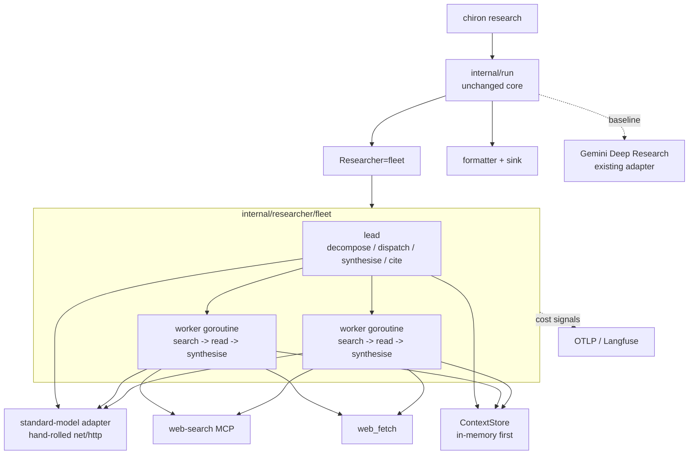

# Chiron v2 - Research-Agent Implementation Plan

## 0. Read this first

This document is the implementation-session brief for the research-agent core. It
is intentionally not a history of how the plan changed. For full release
sequencing, use `docs/V2-PLAN.md`; for the Gemini Deep Research stopgap, use
`docs/INTERACTIONS-API.md`; for project-wide constraints, use
`docs/PROPOSAL.md`, `docs/DECISIONS.md`, and `AGENTS.md`.

If documents conflict, `docs/INTERACTIONS-API.md` wins for Gemini API details,
`docs/DECISIONS.md` wins for recorded implementation decisions, and
`docs/V2-PLAN.md` wins for wave sequencing. Correct this file rather than
coding against a conflict.

The implementation target is:

- **Worker substrate:** Chiron-owned in-process goroutines, not Stirrup K8s Jobs.
- **Model substrate:** one standard frontier model through a thin, hand-rolled
  `net/http` adapter, shared by the lead and workers.
- **Worker loop:** external web only: web-search MCP plus `web_fetch`, then
  synthesis of a cited finding.
- **Fleet:** a Chiron lead orchestrator that plans, dispatches bounded workers,
  stores findings by reference, synthesises, and runs a citation pass.
- **Baseline:** the existing Gemini Deep Research adapter remains a top-level
  `--agent` path and the eval baseline. It is not routed to as a worker inside
  the fleet.
- **Scale-out:** Stirrup is deferred until the quality gate passes and scale or
  multi-model support justifies it. If adopted, it is imported later as an
  embedded engine behind the same `Researcher` seam. Do not build
  `stirrup.harness.v1`, a runner-as-harness server, or K8s worker Jobs for v2.

When this document says "worker" or "fleet", it means Chiron in-process code.

## 1. Non-negotiables

- **Do not change `internal/run`.** The run core depends only on injected
  interfaces. Worker and fleet implementations must satisfy
  `researcher.Researcher` (`Start`, `Await`, `Result`) behind the existing run
  loop.
- **Research-only by construction.** Workers have exactly two read-only network
  tools: search and fetch. They do not expose shell, file-write, edit, executor,
  workspace mutation, or permission-approval surfaces.
- **External web only.** Internal source tools are out of v2: no repo-scoped MCP,
  no Gemini `file_search`, no workspace search. Those route in later with
  Paddock/internal-source work.
- **No vendor AI SDKs.** The standard-model adapter, MCP client, Gemini stopgap,
  and any eval judge are hand-rolled `net/http`.
- **No full OpenAI Responses adapter in Chiron.** Build only the minimum
  standard-model client needed by the lead and worker. Do not add
  `docs/RESPONSES-API.md`.
- **No billable create/turn auto-retry.** A model turn may already be billed
  after an ambiguous failure. Retrying idempotent reads is fine; retrying paid
  creates/turns is not.
- **Spend visibility before spend scale.** Budget enforcement remains deferred.
  Worker and fleet calls must emit Langfuse/OTLP cost signals and enforce
  structural caps: bounded fan-out, per-worker turn limit, token/cost ceiling,
  and wall-clock timeout.
- **Secrets stay as `secret://` references.** Model keys, search keys, Langfuse
  keys, and endpoint overrides must be scrubbed from logs, traces, stderr,
  reports, and control-plane payloads.
- **HTTP hardening follows the Gemini adapter.** Bound reads, refuse cross-host
  redirects when carrying credentials, validate local endpoint overrides at the
  CLI composition root, and keep all fakes on loopback.
- **Tests do not hit the real network.** Use `httptest.Server` at the call site,
  fake model transports, and a fake search MCP.

## 2. Existing repository state to preserve

| Area | Current state | Implementation requirement |
| --- | --- | --- |
| `internal/researcher` | `Researcher` is `Start` / `Await` / `Result`. | Worker and fleet satisfy this interface without changing it. |
| `internal/researcher/fleet` | Stub returns `ErrNotImplemented`. | Replace the stub incrementally; keep errors/tests meaningful while partial work lands. |
| `internal/run` | Pure core: start -> await -> result -> format -> emit. | No changes unless a design decision is re-opened. |
| `internal/types` | Domain `Interaction`, `Output`, `Citation`, `Usage`, `Report`. | Worker/fleet map their output into these domain types, not provider wire types. |
| `internal/memory` | Local `ContextStore` seam plus `Noop`. | Add in-memory binding for Wave 4; Paddock remains Wave 6. |
| `internal/trace` | Stable v1 span/metric vocabulary. | Wave 2 reserves fleet names; Wave 3/4 populate per-worker spans and metrics. |
| `internal/secret` | `secret://` resolver and scrubber. | All new credentials use it; new backends only in their planned waves. |
| `internal/interactions` / `internal/researcher/gemini` | Gemini Deep Research stopgap. | Leave behaviour intact; use it as baseline and fallback. |

Any new material dependency or implementation decision made while coding goes in
`docs/DECISIONS.md` in the same change. Update `AGENTS.md` whenever package
ownership, security-sensitive environment variables, or test conventions change.

## 3. Target runtime shape

`Start` allocates an opaque local interaction id, starts the worker or fleet run
in-process, and returns the id immediately. `Await` waits for that local run to
finish. `Result` returns the current `types.Interaction`.

For the in-process path, crash recovery is bounded by what has already been
written to `ContextStore`; a local opaque id is not the same durable resume handle
as a stored Gemini interaction id. Do not claim `chiron get <id>` can recover an
in-process run across process death until the control-plane durability work lands.

## 4. Config and CLI surface

Extend `ResearchConfig.Agent` conservatively:

- Keep existing `deep-research` and `deep-research-max` values for the Gemini
  Deep Research stopgap/baseline.
- Add `worker` for the single in-process research loop.
- Add `fleet` for the lead orchestrator over multiple in-process workers.

The default remains the cheap, proven path until the eval gate says otherwise.
The fleet must stay opt-in until it meets or beats Gemini Deep Research on the
baseline suite.

Add only the config needed for Wave 3/4:

- Standard model endpoint/model/key reference.
- Search MCP endpoint/key reference.
- Worker caps: max turns, token/cost ceiling, timeout.
- Fleet caps: max workers and concurrency.
- Memory binding: `noop` / `inmemory` for Wave 4; `paddock-embedded` waits for
  Wave 6.

Validate endpoint overrides like `CHIRON_GEMINI_BASE_URL`: absolute `https://`
required except `http://` loopback for tests. If environment variables are added
for model/search overrides, document them in `AGENTS.md` as security-sensitive
because credentials are sent to those endpoints.

## 5. Wave 3 - single in-process worker

Goal: prove one Chiron worker can answer a research subtask through the unchanged
run core.

### Deliverables

- `internal/researcher/fleet/model`: a small, SDK-free model client for one
  standard model. It must support:
  - plain text generation for worker reasoning/synthesis;
  - provider-native structured output where available, for later lead
    decompose/cite calls;
  - usage extraction for tokens and cost signals;
  - no auto-retry of paid turns;
  - bounded request/response handling and redirect protection.
- `internal/researcher/fleet/search` or equivalent: minimal Streamable-HTTP MCP
  client for the chosen search backend. Use structured request/response parsing.
- `internal/researcher/fleet/worker.go`: bounded search -> read -> reason ->
  synthesise loop.
- Worker prompt template for external web research.
- Fake model transport and fake search MCP for CI.
- CLI/config binding for `--agent worker`.

### Worker loop

For each worker run:

1. Receive one brief containing objective, output format, source guidance, and
   boundaries.
2. Ask the model for the next action or final synthesis.
3. If the action is search, call the search MCP and feed structured results back
   into the model.
4. If the action is fetch, call `web_fetch` for known URLs and feed bounded page
   content back into the model.
5. Stop when the model emits a final finding, or when turn/token/cost/time caps
   stop the loop.
6. Return a finding containing concise prose, cited URLs, usage, and status.

The worker must not expose generic tools to the model. It dispatches only the two
known read-only actions above. Unknown or side-effecting actions fail the worker
and are pinned by tests.

### Mapping to Chiron types

For `--agent worker`, map the final finding to one `types.Interaction`:

- status from the worker outcome;
- final text as the report body candidate;
- cited URLs as `types.Citation`s;
- usage from model/search counters;
- diagnostic status detail when caps or errors stop the loop.

The normal formatter and sinks then produce the report. Do not add a separate
reporting path.

### Acceptance criteria

- `chiron research --agent worker --query "..."` runs with fake model/search
  servers and produces a cited Markdown report through `internal/run`.
- Tests prove no paid model turn is auto-retried.
- Tests prove the worker has no write/exec/tool escape surface.
- Search/fetch/model credentials are scrubbed from logs, traces, stderr, and
  error paths.
- Gemini Deep Research tests still pass unchanged.

## 6. Wave 4 - fleet orchestrator and in-memory ContextStore

Goal: implement `Researcher=fleet`: a lead orchestrator over bounded in-process
workers, with findings by reference and an eval gate against Gemini Deep
Research.

### Deliverables

- `internal/researcher/fleet/lead.go`: lead control flow for decompose,
  dispatch, collect, synthesise, and cite.
- `internal/researcher/fleet/router.go`: external-web-only routing. Every
  subtask goes to the in-process worker. The Gemini stopgap is not a routing
  target.
- `internal/researcher/fleet/synthesise.go` and `cite.go` or equivalent:
  final report synthesis and citation pass.
- `internal/memory/inmemory.go`: in-process `ContextStore` implementation with
  content-addressed `Put`/`Get`, `OpenSession`, TTL/GC suitable for tests, and
  either simple in-memory `Remember`/`Recall` or explicit `ErrNotImplemented`
  behaviour recorded in `DECISIONS.md`.
- Eval-vs-baseline suite and judge.
- CLI/config binding for `--agent fleet`.

### Lead flow

1. Open a `ContextStore` session for the run.
2. Decompose the user question into 3-5 briefs. Each brief must include:
   objective, output format, source guidance, and boundaries.
3. Persist the plan by reference.
4. Dispatch briefs to worker goroutines under hard fan-out and concurrency caps.
5. As each worker completes, store the full finding by reference and return only
   the reference plus metadata to the lead.
6. Read references back for synthesis. Do not pass large worker payloads through
   multiple model stages when a reference will do.
7. Synthesis produces the report body.
8. Citation pass attributes claims to cited sources and emits the deduplicated
   `types.Citation` list the formatter expects.
9. Return a single `types.Interaction` to the run core.

### Spend and observability

Populate the Wave 2 fleet vocabulary:

- decompose span;
- per-worker delegate spans with worker id, brief id, status, turn count, token
  counts, search count, and estimated cost signal;
- synthesise span;
- cite span;
- run-level rollups.

Transport emission remains best effort. A failed progress event must not fail a
paid run.

### Acceptance criteria

- `chiron research --agent fleet --query "..."` runs with fake model/search
  servers and produces a cited Markdown report through `internal/run`.
- Workers run in parallel with bounded concurrency.
- Findings pass by reference through `ContextStore`; the synthesised report cites
  sources from multiple workers.
- Every spend-safety rule in this document is tested.
- The fleet has no write/execute surface.
- Eval can compare `--agent fleet` against the Gemini Deep Research baseline.
- The fleet is not made default until the eval suite meets or beats the
  baseline.

## 7. Eval gate

The quality question is the central risk: can the homegrown external-web agent
match Gemini Deep Research?

Build a representative suite of external-research questions. For each question,
run:

- candidate: `--agent fleet`;
- baseline: existing Gemini Deep Research path (`deep-research` or
  `deep-research-max`, depending on the benchmark tier).

Judge coverage, citation validity, faithfulness, and usefulness of synthesis. If
`stirrup-eval` has an LLM judge ready, use it. If not, build a small Chiron-side
judge as another hand-rolled `net/http` standard-model call so the gate is not
blocked on a Stirrup change.

The multi-worker fleet remains opt-in until this gate passes. The cheap path
remains the default.

## 8. Testing requirements

Required test fakes:

- Fake model server with scripted text and structured-output responses.
- Fake search MCP server over `httptest.Server`; lifecycle owned at the call
  site.
- Fake `web_fetch` responses with bounded bodies, redirects, and error cases.
- In-memory `ContextStore` tests for content addressing, missing refs, namespace
  isolation, and session close/TTL behaviour.
- Golden Markdown reports for worker-only and fleet outputs.

Required test cases:

- No real network.
- Table-test loop variable named `tt`.
- No paid-turn auto-retry.
- Cross-host redirects refused for credential-bearing clients.
- Unknown/side-effecting tool request fails the worker.
- Caps stop runaway workers deterministically.
- Partial worker failure is represented in the final interaction without losing
  completed findings.
- Trace/span scrub tests prove no model/search/Langfuse credential leaks.
- Existing Gemini, formatter, sink, and run-core tests stay green.

Run at least `just test` before handing off implementation changes; use `just ci`
for wave completion.

## 9. Deferred explicitly

Do not implement these as part of the research-agent core:

- `stirrup.harness.v1`, remote HarnessService, K8s Job provisioning, pinned
  Stirrup worker images, or runner RBAC.
- Stirrup engine import. The future engine path is described in
  `docs/STIRRUP-ENGINE-PROPOSAL.md`, but v2 must stand without it.
- Multi-provider routing or multi-provider keyless federation.
- Internal-source tools: repo MCP, Gemini `file_search`, workspace search.
- Budget enforcement, Stint integration, or financial attribution fixes.
- New managed deep-research providers.
- Full OpenAI Responses documentation or adapter surface.
- Paddock binding before Wave 6.
- Control-plane submission/history or GKE deployment work, except where the
  research-agent code needs to preserve the `Researcher` and `Transport` seams.

## 10. Implementation checklist

Use this checklist when starting a coding session:

1. Confirm Wave 2 observability is present before real model spend. If not, use
   only fakes.
2. Extend config and CLI agent validation for `worker` and `fleet`.
3. Build the standard-model adapter with fake transport first.
4. Build search MCP and `web_fetch` clients with fake servers first.
5. Implement `--agent worker` through `internal/run`.
6. Add in-memory `ContextStore`.
7. Implement lead decomposition, bounded dispatch, findings by reference,
   synthesis, and citation pass.
8. Populate trace names and cost signals.
9. Add eval-vs-baseline harness.
10. Update `AGENTS.md` and `docs/DECISIONS.md` for package map, security-sensitive
    vars, dependencies, model/search choices, and any new config semantics.
11. Run `just test`; run `just ci` for a completed wave.

## 11. References

- `docs/V2-PLAN.md` - broader v2 wave plan. Research-agent implementation is
  Waves 3-4; Wave 2 observability gates real spend.
- `docs/V2-AMENDS.md` - amendments that define the prove-first, external-web,
  in-process direction.
- `docs/STIRRUP-ENGINE-PROPOSAL.md` - deferred scale-out option only.
- `docs/PROPOSAL.md` - project principles and v1/v2 seam model.
- `docs/INTERACTIONS-API.md` - normative for the Gemini Deep Research stopgap.
- `docs/PADDOCK.md` - future durable `ContextStore`/blob plane.
- `docs/DECISIONS.md` - record implementation decisions as code lands.
