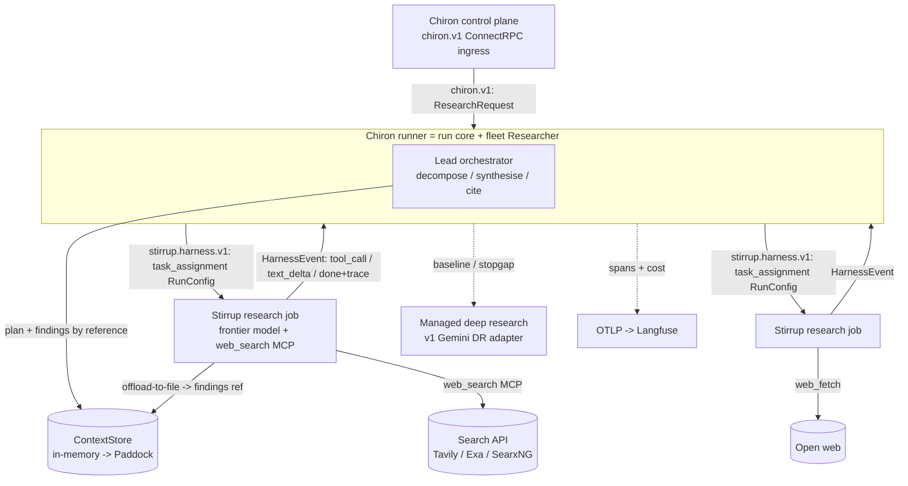

# Chiron v2 — the research-agent core

## 0. Why this document exists

`docs/V2-PLAN.md` (2026-06-21) drifted on its researcher core: it made *managed
deep-research products* (Gemini Deep Research, then OpenAI `o3`/`o4-mini-deep-research`)
the `Researcher`, and deferred Stirrup entirely. That inverts the suite's stated v2 goal.
The working principle is:

> Chiron coordinates agents that run **standard frontier models** (GPT-5.4/5.5, Claude,
> …), building **our own research agents** (targeting any frontier model) on **Stirrup**.
> The Gemini/OpenAI managed research agents were always a **stopgap** before that agent
> existed.

So the de-drifted target is: **Chiron's own multi-agent research agent, built on Stirrup,
external-web-only for v2, producing reports as good as the managed agents currently do —
with the managed agents kept only as a stopgap worker and the quality baseline.** This
document designs that agent, grounded in Stirrup's actual contract (read from
`github.com/rxbynerd/stirrup` on 2026-06-22, `main`). `docs/V2-PLAN.md` then re-seats its
researcher waves on it (§11); the service scaffolding it already describes — ConnectRPC
control plane, transport, Langfuse observability, Paddock, GKE/WIF, spend-safety — is
sound and unchanged.

Precedence is unchanged (`INTERACTIONS-API.md` > `DECISIONS.md` > `PROPOSAL.md`); this
design sits beside `V2-PLAN.md` below them. Any Stirrup contract detail it cites is
**confirmed by spike before code** — Stirrup is a separate, evolving project and this
document is not normative for it.

## 1. The drift, precisely

| Decision | V2-PLAN.md (2026-06-21) said | This design says |
| --- | --- | --- |
| What runs the research | Managed deep-research models (`o3`/`o4-mini-deep-research`, Gemini DR) as the `Researcher` | A **Stirrup research-mode job on a standard frontier model + a web-search tool** is the worker; Chiron orchestrates |
| Amend 1 ("OpenAI Responses API + WIF") | Read as OpenAI's *deep-research* models via Responses | Read as the **standard-model** Responses path (GPT-5.4/5.5) — exactly Stirrup's `openai-responses` provider with credential federation |
| Stirrup | Deferred entirely (conflated with internal sources) | **The harness the agent is built on** — un-deferred. Only the internal *source tools* (`file_search`/MCP-over-repos) defer |
| Amend 6 ("same content as Gemini produces") | Read as "keep calling Gemini" | Read as a **quality bar** met by our own agent, with Gemini DR as the measured baseline |
| Managed deep-research | The production backend | A **stopgap worker + the eval baseline** (author's choice) |

Note this is more than reverting the 2026-06-21 revision: `PROPOSAL §6` and the
2026-06-14 draft *also* routed **external** research to managed Gemini DR (Stirrup only
for internal). The corrected target makes the homegrown Stirrup web-research agent the
**primary** external worker — which neither prior draft planned, and which is the genuine
hard problem of v2.

## 2. What Stirrup already gives us (grounded inventory)

Read from Stirrup `main`, 2026-06-22. This is the leverage; Chiron builds the thin layer
above it.

- **A read-only research mode, structurally enforced.** `RunConfig.mode = "research"` is
  "read-only; investigates questions without side effects" — one of four read-only modes
  (`planning` (the CLI default), `review`, `research`, `toil`); only `execution` is
  read/write. Stirrup's own `ValidateRunConfig` requires read-only modes to use a
  `permission_policy` of `deny-side-effects` or `ask-upstream`, and a `ToolsConfig.built_in`
  list that **excludes write tools**. This *is* Chiron's "research-only, structurally"
  non-negotiable — enforced upstream, not just asserted
  (`proto/harness/v1/harness.proto`, `RunConfig.mode` / `PermissionPolicyConfig` /
  `ToolsConfig`).
- **Five hand-rolled provider adapters, no SDKs** (`docs/providers.md`): `anthropic`
  (Messages), `bedrock` (ConverseStream), `openai` (Chat Completions, configurable
  baseURL), **`openai-responses`** (`POST /v1/responses`), `gemini` (Vertex AI). Selected
  via `provider.type`; a `providers` map plus `ModelRouterConfig` (`model_router`) lets one
  job mix cheap/expensive models and lets the lead run different workers on different
  models. This is "target any frontier model" — already built, already no-vendor-SDK.
- **A two-tier credential-federation layer** (`docs/credential-federation.md`):
  `TokenSource` (e.g. `gke-metadata`, `aws-irsa`, `azure-imds`, `github-actions-oidc`) →
  `credential.Source` (`static`, `gcp-workload-identity[-federation]`, **`anthropic-wif`**,
  **`azure-workload-identity`**, `web-identity` for Bedrock). Keyless auth to every
  provider from GKE is a solved Stirrup capability — directly answering amend 1's WIF
  requirement (see §7).
- **MCP tool connections** (`ToolsConfig.mcp_servers`, `MCPServerConfig`): Streamable-HTTP
  MCP servers, tools namespaced `mcp_{server}_{tool}`, bearer auth via `secret://`. This
  is how the web-search tool attaches (§4).
- **`offload-to-file` context strategy** (`ContextStrategyConfig.type`): old messages
  written to a file and replaced with a pointer — the native hook for
  findings-by-reference into Paddock (§6.3).
- **Per-job structural budgets**: `max_turns` (1–100), `max_token_budget` (≤50M),
  `max_cost_budget` USD (≤100), `timeout` (1–3600s). Per-worker spend ceilings come for
  free even though Chiron defers its own budgeting (§9).
- **`spawn_agent`** built-in: a research job can fan out its own sub-agents (a fan-out
  option, §5).
- **An eval framework** (`docs/eval.md`, `stirrup-eval`): HCLv2 suites, judges, a trace
  lakehouse, regression/drift diffing. The home for the "match Gemini-DR" baseline (§8).
- **The harness wire contract** (`proto/harness/v1/harness.proto`,
  `service HarnessService { rpc RunTask(stream HarnessEvent) returns (stream ControlEvent) }`):
  the harness dials a control plane outbound, receives a `task_assignment` (a `RunConfig`),
  streams `text_delta`/`tool_call`/`tool_result`/`done(trace)` back. Chiron drives Stirrup
  over this (§5), Buf-generated, never `go mod` imported (amend 4).

## 3. What Stirrup does NOT give us — the hard centre

**Stirrup has no web-search tool, and its providers' built-in search is intentionally off.**

- `ToolsConfig.built_in` is `read_file, write_file, search_replace, apply_diff, edit_file,
  list_directory, grep_files, find_files, run_command, web_fetch, spawn_agent`. There is a
  `web_fetch` (HTTP GET of a known URL) but **no `web_search`** (query → ranked results).
- Stirrup's `openai-responses` adapter explicitly **excludes** the provider built-in
  `web_search`/`file_search` tools, and the `gemini` adapter excludes `google_search`
  (tracked as Stirrup issue #93): "the harness manages its own conversation history and
  does not delegate to server-side state" (`docs/providers.md`).
- Stirrup's research-mode system prompt (`harness/internal/prompt/systemprompts/
  research.md`) is **codebase-oriented** — "read-only access to the workspace… explore the
  codebase… cite file paths and line numbers… fetch URLs". That is internal research; it
  is not a web-research agent.

So the thing the managed deep-research products give you out of the box — **iterative web
search** (issue a query, read ranked results, follow leads, repeat) — is exactly what
Chiron must supply to Stirrup. This is the centre of v2, and it is why the managed agents
are a sensible stopgap while it is built. It is a tool-and-prompt problem, not a new agent
loop (Stirrup is the loop).

**Resolution (lead candidate): a web-search MCP server.** Stand up (or adopt) a
Streamable-HTTP MCP server fronting a search API (Tavily / Exa / Brave / SerpAPI / a
self-hosted SearxNG), attach it via `ToolsConfig.mcp_servers`, and pair it with `web_fetch`
for page reads and a Chiron-authored research system prompt (`system_prompt_override` or a
`composed` prompt builder) that drives the search→read→synthesise loop. Alternatives —
a native `web_search` tool contributed upstream to Stirrup, or temporarily using a
provider's built-in search where available — are the spike SP-A options (§10). This choice
is the single highest-leverage decision in v2.

## 4. Topology — three contracts, one runner in the middle



Three proto contracts are in play, and the **runner sits in the middle of two of them**:

1. `chiron.v1` (existing) — Chiron control plane ↔ Chiron runner. The runner is the
   **client** (outbound dial). Unchanged from `V2-PLAN.md` Wave 1.
2. `stirrup.harness.v1` (**new to Chiron**) — Chiron runner ↔ Stirrup research workers.
   The Stirrup harness dials outbound, so the **runner is the `HarnessService` server**:
   it accepts a worker's `ready`, sends a `task_assignment` (the research `RunConfig`),
   and consumes `HarnessEvent`s. Generated into Chiron with **Buf from Stirrup's proto**,
   never `go mod` imported (amend 4).
3. Paddock (D4) — structural/embedded `ContextStore`. Unchanged.

The runner being a `chiron.v1` client *and* a `stirrup.harness.v1` server is the clean
shape: Chiron schedules onto runners; runners schedule onto Stirrup jobs.

## 5. The research agent

### 5.1 Lead orchestrator (Chiron)

The lead is Chiron's pure-function control flow with model judgement at the decision
points — the v1 ethos ("use the LLM only when judgement is needed") applied to research:

1. **Decompose** the question into 3–5 worker briefs, each with the four Anthropic fields
   (*objective, output format, source guidance, boundaries*). Persist the plan to the
   `ContextStore` by reference.
2. **Dispatch** one Stirrup research job per brief (§5.2), bounded by the fan-out ceiling.
3. **Collect** each worker's findings *by reference* (§6.3) as they complete.
4. **Synthesise** the references into one report, then a **citation pass** producing the
   deduplicated `types.Citation` list the formatter already expects.

The lead's three judgement calls (decompose, synthesise, cite) are themselves
frontier-model calls. SP-C (§10) decides whether each is **a Stirrup `planning`/`research`
job with a Chiron-authored prompt** (so Chiron hand-rolls *zero* model adapters — strongest
"leverage Stirrup" + "no vendor SDK") or **a thin hand-rolled Chiron adapter** to one
standard model. Lean: lead-as-Stirrup-jobs, because Stirrup already owns the adapters,
credential federation, retries, and tracing; Chiron keeps only the orchestration control
flow and the prompts.

### 5.2 Worker = a Stirrup research job

Each worker is one `RunConfig` sent as a `task_assignment`:

```
RunConfig{
  mode:             "research",                      // read-only, structurally
  prompt:           <the worker brief>,
  provider:         { type: "openai-responses" | "anthropic" | "gemini", ... },  // any frontier model
  tools: {
    built_in:       ["web_fetch"],                    // external-only: no workspace; NO write_file/run_command/edit_*
    mcp_servers:    [{ name: "search", uri: <web-search MCP>, api_key_ref: "secret://SEARCH_API_KEY" }],
  },
  permission_policy:{ type: "deny-side-effects" },    // required for read-only mode
  context_strategy: { type: "offload-to-file", max_tokens: ... },  // -> findings by reference (§6.3)
  max_turns, max_token_budget, max_cost_budget, timeout,            // per-worker structural caps
  system_prompt_override | prompt_builder:"composed", // Chiron's web-research prompt
}
```

The worker loops search→read→reason→synthesise inside Stirrup, emitting `tool_call`
(`mcp_search_*`, `web_fetch`) and `text_delta`, and finishes with `done` carrying a
`RunTrace`. Chiron reads the worker's synthesised finding plus its cited URLs.

### 5.3 Research-only proof

The invariant holds by construction and is asserted in tests: `mode:"research"` +
`permission_policy:"deny-side-effects"` + a `built_in` list with no write/exec tools +
no `executor:"local"`/`"container"` (use `"api"` read-only or none) + the Rule of Two
(`RuleOfTwoConfig`). A `permission_request` event from a worker is then a **defect** — a
worker tried to reach a side-effecting tool — and a test fails the run on it. Chiron never
sends `permission_response{allowed:true}` to a research worker.

## 6. Standard-model targeting, auth, and findings-by-reference

### 6.1 Any frontier model

`provider.type` per job selects the model; the lead may run different workers on different
models (`providers` map + `model_router`). Default standard models: GPT-5.4/5.5 via
`openai-responses`, Claude via `anthropic`, Gemini-Pro via `gemini`. No managed
deep-research model appears here — those are §8 only.

### 6.2 Keyless auth (amend 1, grounded)

Stirrup's credential federation supplies keyless auth from GKE. Amend 1's "OpenAI Responses
via WIF" is resolved (author's choice) to **Azure OpenAI / Foundry Responses +
`azure-workload-identity`** — the wire-compatible `/openai/v1/responses` surface with an
Entra-ID bearer, *available in Stirrup today with no upstream change*. OpenAI-direct
Responses + a new `openai-wif` credential source (per OpenAI's GKE
Workload-Identity-Federation guide — a `gke-metadata` OIDC token exchanged for a
short-lived OpenAI token) is kept only as an **optional future alternative**, since it
needs a small addition to Stirrup's credential layer. Anthropic uses `anthropic-wif`;
Gemini uses `gcp-workload-identity` on Vertex — both keyless today. No static key in the
cluster, matching `V2-PLAN.md` Wave 7. SP-D (§10) is therefore a configuration confirmation
of the Azure path, not an open vendor choice.

### 6.3 Findings by reference

Map Stirrup's `offload-to-file` context strategy onto Paddock's blob plane: a worker's
large outputs are written once, content-addressed, and the worker returns a lightweight
`Reference` (the Anthropic "subagent-output-to-filesystem" pattern). The lead reads
references, never payloads, avoiding the multi-stage "game of telephone". In-memory
`ContextStore` first (D4), Paddock embedded later. SP-E (§10) confirms the offload-target
interop.

## 7. Managed deep research — stopgap worker + eval baseline

Per the author's choice, the managed agents are kept, demoted:

- **Stopgap — a top-level alternative researcher.** The existing v1
  `internal/researcher/gemini` Deep Research adapter stays selectable as its own
  `--agent gemini-deep-research` (exactly as in v1): a whole-run fallback while the
  homegrown agent matures. It is deliberately **not** a per-subtask worker the lead routes
  to — keeping it out of the fleet avoids a router branch and keeps the eval comparison
  (§8) clean. A run is either the homegrown Stirrup fleet or the managed stopgap, never a
  mix.
- **Eval baseline.** It is the yardstick. Amend 6's "the same sort of content as Gemini's
  research agents currently produce" becomes a literal, testable target: the homegrown
  agent's report is judged against the Gemini-DR report on the same question.

The managed adapter is reused as-is; v2 adds **no** new managed-deep-research provider
(the OpenAI `o*-deep-research` path from the drifted plan is dropped).

## 8. Quality bar and evaluation

The homegrown agent's risk is quality, not plumbing. Make it measurable with `stirrup-eval`
(the proposal already delegates evaluation to Stirrup):

- An eval suite of representative external-research questions; for each, run both the
  Chiron homegrown agent (`--agent fleet`, which contains no managed-DR worker — §7 — so
  the comparison is clean) and the Gemini-DR baseline (`--agent gemini-deep-research`).
- Judge on coverage, citation count/validity, and faithfulness — needing an **LLM-judge**
  suite judge (SP-F confirms availability in `stirrup-eval`; `docs/eval.md` lists
  `test-command`/`file-exists`/`file-contains`/`composite`, so an llm-judge may need adding
  upstream). **Fallback if it cannot land in `stirrup-eval` in time:** a Chiron-side judge
  (a hand-rolled `net/http` call scoring the two reports) so the v2 quality gate is never
  blocked on a Stirrup PR.
- **Gate:** the homegrown agent is not the default until it meets or beats the baseline on
  the suite. Until then the cheap single-call path (one Stirrup research job, or the
  managed stopgap) stays default; the multi-worker fleet is opt-in. This is the honest
  reading of "produce the same content as Gemini does".

## 9. Spend safety (budgeting still deferred — amend 2)

Budget *enforcement/attribution* stays deferred (`V2-PLAN.md` D6). But the homegrown design
*improves* the spend-safety floor for free:

- **Per-worker structural caps come from Stirrup**: each research job carries
  `max_turns`/`max_token_budget`/`max_cost_budget`/`timeout`; a runaway worker self-
  terminates (`stop_reason: budget_exceeded`/`timeout`). The lead's bounded fan-out × these
  per-job caps is a hard, if coarse, ceiling — without Chiron building any budgeting.
- **No create auto-retry / early id emission / poll-resilient await** carry over per worker
  (`V2-PLAN.md` §4); a Stirrup job's `run_id` is the per-worker resume handle.
- **Visibility over enforcement (amend 7)**: every worker's tokens/cost flow to Langfuse,
  per-worker and rolled up — the interim control, now richer because Stirrup emits its own
  OTel trace per job.

## 10. Spikes (these gate the re-seated waves)

These revive and refocus the prior `S2`/`S3` (Stirrup research-mode contract; routing),
which the drifted plan wrongly deferred.

| Spike | Question | Output |
| --- | --- | --- |
| **SP-A** (the big one) | **Web-search tool.** MCP search server (which API: Tavily/Exa/Brave/SearxNG) vs a native `web_search` contributed to Stirrup vs a provider built-in stopgap. Confirm Stirrup research mode + MCP + `web_fetch` can sustain an iterative search→read→synthesise loop of Gemini-DR-grade. | The worker `ToolsConfig` + research prompt; the search backend decision recorded in `DECISIONS.md`. |
| **SP-B** | **Stirrup dispatch.** Chiron as `HarnessService` server (Buf, amend 4) spawning Stirrup jobs that dial in — job provisioning on GKE (pre-warmed pool vs per-run Job), and the `task_assignment`/event mapping. | The runner↔worker integration shape; a faked-harness test harness. |
| **SP-C** | **Lead substrate.** Lead judgement calls as Stirrup `planning`/`research` jobs (zero Chiron model adapters) vs a thin hand-rolled adapter; and Chiron-level fan-out vs Stirrup `spawn_agent`. | The lead implementation decision. |
| **SP-D** | **Azure OpenAI Responses + `azure-workload-identity` (chosen, §6.2):** confirm the project can register the Azure OpenAI/Foundry resource and Entra-ID workload-identity mapping, and that Stirrup's `azure-workload-identity` source binds it keylessly. OpenAI-direct + `openai-wif` is a recorded future alternative only. | The (configuration) auth binding for the OpenAI standard-model path; closes amend 1 with no Stirrup change. |
| **SP-E** | **Findings-by-reference interop.** Stirrup `offload-to-file` target → Paddock blob plane (and the in-memory store first). | The `ContextStore`↔Stirrup offload binding. |
| **SP-F** | **Eval judge.** Does `stirrup-eval` offer an LLM-judge for report-quality-vs-baseline, or must one be added? | The baseline eval suite + judge. |

SP-A, SP-B, SP-C have no spend and run first; they define the worker and the dispatch.
**Cross-repo rule:** where a spike's resolution would require a change in Stirrup (a native
`web_search` for SP-A, an `openai-wif` source for SP-D, an llm-judge for SP-F), prefer the
Chiron-only option (a search MCP, the Azure path, a Chiron-side judge respectively) so the
v2 critical path is never blocked on an upstream Stirrup release.

## 11. Impact on docs/V2-PLAN.md (what re-seats)

The hybrid plan: keep `V2-PLAN.md`'s scaffolding, re-seat its researcher core on this
design. Concretely, when `V2-PLAN.md` is revised:

- **D2** → researcher = Chiron lead orchestrating **Stirrup research jobs on standard
  frontier models + a web-search tool**; managed deep research demoted to a top-level
  stopgap researcher + the eval baseline (§7). Drop the `o3`/`o4-mini-deep-research`
  bindings — and with them Chiron's hand-rolled `internal/researcher/openai` adapter and
  `docs/RESPONSES-API.md`, which **are not built**: Stirrup owns the `openai-responses`
  provider adapter, so there is no Chiron OpenAI adapter to write or document. The OpenAI
  standard-model path is Azure OpenAI + `azure-workload-identity` via Stirrup (§6.2).
- **D3** (await) stays poll-first for the managed stopgap and the `chiron.v1` stream;
  worker await is the `stirrup.harness.v1` event stream (`done`/`error`), not provider
  polling — so the runner holds a live harness stream per worker, and the §9 / `V2-PLAN.md`
  §4 "a broken event stream never aborts a paid run" rule extends to that worker stream.
- **D5** → un-defer Stirrup (it is the harness); defer only internal *source tools*
  (`file_search`/repo-MCP). External web research via Stirrup is *in* v2. This **re-affirms
  `PROPOSAL §6`'s `Researcher = stirrup-fleet`** (which the drifted plan wrongly marked
  superseded); the transport is still ConnectRPC (D8).
- **D8** → gains a **second Buf target**, `stirrup.harness.v1`, generated alongside
  `chiron.v1`. The module wiring belongs in Wave 1 (the proto/codegen wave); the server
  implementation lands in Wave 3.
- **Spikes** → replace S1's OpenAI-deep-research framing with SP-A…SP-F here; S2 (Paddock)
  stays.
- **Wave 1** → adds the `stirrup.harness.v1` Buf module and generated server stubs to the
  proto/codegen deliverables (implementation deferred to Wave 3).
- **Wave 3** → "standard-model + Stirrup-harness integration": implement the
  runner-as-`HarnessService`-server, dispatch one research `RunConfig`, wire the web-search
  MCP (SP-A), and bind the credential-federation auth (Azure OpenAI + `azure-workload-
  identity`, `anthropic-wif`, Gemini; SP-D). Add a **faked Stirrup harness** as a
  first-class test artefact (the no-real-network fake, parallel to the faked Gemini/OpenAI
  clients). The v1 Gemini DR adapter is retained unchanged as the top-level stopgap +
  baseline; **no Chiron OpenAI adapter and no `RESPONSES-API.md`** are created.
- **Wave 4** → the fleet's workers are Stirrup research jobs; the router is external-web-only
  and never routes to the managed stopgap (which is top-level, §7); acceptance gains the
  eval-vs-baseline gate (§8) and the research-only proof (§5.3).
- **Waves 2, 5, 6** (Langfuse observability, control plane, Paddock) — unchanged in shape;
  Wave 5's advertised `researchers` capability list is
  `["research","fleet","gemini-deep-research"]` (single Stirrup worker, the fleet, and the
  managed stopgap; each maps to an `--agent`).
- **Wave 7** → GKE/auth/durability unchanged in shape, with two additions: the OpenAI path
  is Azure OpenAI + `azure-workload-identity` via Stirrup (not a hand-rolled token
  exchange), and v2 now ships and versions a **Stirrup worker image** the runner dispatches
  jobs to (provisioning model — pre-warmed pool vs per-run Job — is SP-B). Webhook
  completion applies to the managed stopgap only; workers complete over the harness stream.

## 12. References

- `github.com/rxbynerd/stirrup` (read 2026-06-22, `main`): `proto/harness/v1/harness.proto`
  (`RunConfig`, `ToolsConfig`, `MCPServerConfig`, `ContextStrategyConfig`,
  `PermissionPolicyConfig`, `HarnessService`); `docs/providers.md`;
  `docs/credential-federation.md`; `docs/eval.md`;
  `harness/internal/prompt/systemprompts/research.md`; `harness/harnessapi/harnessapi.go`.
- `docs/V2-PLAN.md` — the v2 implementation plan whose researcher core this re-seats.
- `docs/PROPOSAL.md` §6 — the Stirrup-fleet vision (external-via-managed-DR there is the
  stopgap this design replaces).
- `docs/PADDOCK.md` — the `ContextStore`/blob plane for findings-by-reference.
- Anthropic, *How we built our multi-agent research system* (2025-06-13),
  https://www.anthropic.com/engineering/multi-agent-research-system — the web-only
  orchestrator-worker pattern this agent follows, on standard models.
